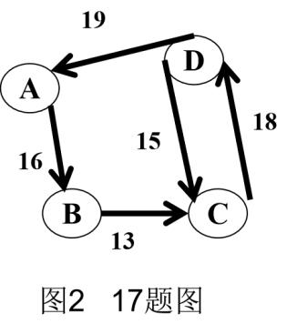

# DS-2023-17

## 1. 原题

一个有向图 $G$ 如图 $2$ 所示：使用单源点最短路径算法 $Dijkstra$ 求解图 $G$ 中 $A$ 点到其他各点的最短路径，要求给出计算过程。

## 2. 答案

按 Dijkstra 算法求得 $A$ 到各顶点的最短路径长度与路径：

| 终点 | 最短路径长度 | 最短路径 |
|---|---|---|
| $B$ | $16$ | $A\to B$ |
| $C$ | $29$ | $A\to B\to C$ |
| $D$ | $47$ | $A\to B\to C\to D$ |

（$d(A)=0$，路径为 $A$ 自身。）

## 3. 题目分析

- 已知：$4$ 个顶点 $A,B,C,D$ 的**有向**带权图，$5$ 条弧及其权值（由图 $2$ 判读）：

| 弧 | 权 |
|---|---|
| $A\to B$ | $16$ |
| $B\to C$ | $13$ |
| $C\to D$ | $18$ |
| $D\to C$ | $15$ |
| $D\to A$ | $19$ |

- 目标：以 $A$ 为源点，求到其余各顶点的最短路径，并**给出计算过程**（即逐趟的 $S$ 集合、距离数组 $d$ 与前驱数组 $path$）；
- 关键约束：
  1. 所有权值为正（$13,15,16,18,19$），满足 Dijkstra 的适用前提；
  2. 图为**有向**：$D\to A$、$D\to C$ 不能反向使用，故"$C$ 到 $D$ 的弧 $18$"与"$D$ 到 $C$ 的弧 $15$"是两条不同的弧，不能误当作无向边取小者；
  3. 从 $A$ 出发的可达性：$A\to B\to C\to D$ 依次可达，$A$ 无弧直接指向 $C$、$D$，故初值 $d(C)=d(D)=\infty$；
- 命题意图：考查 Dijkstra 的**逐趟松弛过程**（选最小、入集、更新邻接点），特别是"入集后不再更新"这一贪心不变量，以及用前驱数组回溯路径的规范表达。

## 4. 核心考点

核心考点：
DS04.04.02 最短路径（Dijkstra 算法：$S$ 集合扩张、$d[v]$ 与 $path[v]$ 的更新条件、按 $path$ 回溯路径）

辅助考点：
DS04.01 图的基本概念（有向图的弧与邻接点、可达性——决定哪些顶点初值为 $\infty$）
DS04.02.02 邻接表法（"松弛 $u$ 的邻接点"即遍历 $u$ 的邻接表，本题按出边表执行）

解释：本题不作代码要求，只要求"计算过程"，其本质是在纸面上模拟 Dijkstra 的循环不变量：每趟从未入集顶点中取 $d$ 最小者入集，此时 $d$ 已为最终最短路径长度；随后对其出边逐条松弛。整个过程依赖"边权非负"与"有向图只用出边"两条 DS04.01 的基本事实。

## 5. 解题思路

1. **先整理出边表**（相当于邻接表）：$A:\,B(16)$；$B:\,C(13)$；$C:\,D(18)$；$D:\,A(19),\,C(15)$——注意 $A$ 只有一条出边，$D$ 有两条；
2. **写初值**：$d(A)=0$，$A$ 的邻接点 $B$ 得 $16$，其余 $C,D$ 为 $\infty$；前驱 $path(B)=A$；
3. **循环不变量**：每趟在 $V\setminus S$ 中选 $d$ 最小者 $u$ 入集（$d(u)$ 即为最终值，因为任何绕道未入集点的路径长度都不会更短——权值非负）；
4. **只对出边松弛**：若 $d[u]+w(u,v)<d[v]$ 才更新 $d[v]$ 并置 $path[v]=u$，否则保持；
5. **共 $3$ 趟**（$n-1=3$）后 $V\setminus S=\varnothing$，算法结束；
6. **按 $path$ 回溯路径**：$path(D)=C$、$path(C)=B$、$path(B)=A$ ⟹ $A\to B\to C\to D$；
7. 复核：把 $A$ 到每个顶点的**所有**简单路径列出求和，与算法结果比对（本题图小、无负权，可穷举）。

## 6. 详细解答

### 第一步：初值（$S=\{A\}$）

$$d(A)=0,\quad d(B)=16,\quad d(C)=\infty,\quad d(D)=\infty$$
$$path(A)=\text{NULL},\;path(B)=A,\;path(C)=\text{NULL},\;path(D)=\text{NULL}$$

### 第二步：逐趟计算过程

| 趟 | 选中的 $u$（$\min d$） | 入集后 $S$ | 松弛检查 | $d(A)$ | $d(B)$ | $d(C)$ | $d(D)$ | $path$ 变化 |
|---|---|---|---|---|---|---|---|---|
| 初 | — | $\{A\}$ | $A\to B:0+16=16$ | $0$ | $16$ | $\infty$ | $\infty$ | $path(B)=A$ |
| 1 | $B$（$16$） | $\{A,B\}$ | $B\to C:16+13=29<\infty$ ✓ | $0$ | $16$ | $29$ | $\infty$ | $path(C)=B$ |
| 2 | $C$（$29$） | $\{A,B,C\}$ | $C\to D:29+18=47<\infty$ ✓ | $0$ | $16$ | $29$ | $47$ | $path(D)=C$ |
| 3 | $D$（$47$） | $\{A,B,C,D\}$ | $D\to A:47+19=66>0$ ✗；$D\to C:47+15=62>29$ ✗ | $0$ | $16$ | $29$ | $47$ | 无变化 |

每趟"选中"的依据（$V\setminus S$ 中取 $d$ 最小）：
- 第 1 趟候选 $\{B(16),C(\infty),D(\infty)\}$ → 选 $B$；
- 第 2 趟候选 $\{C(29),D(\infty)\}$ → 选 $C$；
- 第 3 趟候选 $\{D(47)\}$ → 选 $D$；
- 第 3 趟后 $S=V$，结束。

第 3 趟两条松弛均失败，说明 $D$ 的两条出边不可能改进已定值，$d(A),d(C)$ 保持 ✓（这正是"入集后不再修改"不变量的体现）。

### 第三步：由 $path$ 数组回溯路径

- $B$：$path(B)=A$ ⟹ $A\to B$，长度 $16$；
- $C$：$path(C)=B\to$ $path(B)=A$ ⟹ $A\to B\to C$，长度 $16+13=29$；
- $D$：$path(D)=C\to path(C)=B\to path(B)=A$ ⟹ $A\to B\to C\to D$，长度 $16+13+18=47$。

### 第四步：穷举全部路径复核（第二方法）

从 $A$ 出发的简单路径只有唯一一条链（$A$ 只有出边 $A\to B$，$B$ 只有 $B\to C$，$C$ 只有 $C\to D$；含环的走法 $D\to A$、$D\to C$ 会重复顶点且只会增加长度）：

| 终点 | 可选路径 | 长度 | 最短 |
|---|---|---|---|
| $B$ | $A\to B$ | $16$ | $16$ ✓ |
| $C$ | $A\to B\to C$ | $29$ | $29$ ✓ |
| $C$（绕环） | $A\to B\to C\to D\to C$ | $16+13+18+15=62$ | 非最短，且 $C$ 重复 ✓ 与第 3 趟松弛失败一致 |
| $D$ | $A\to B\to C\to D$ | $47$ | $47$ ✓ |
| $A$（绕环） | $A\to B\to C\to D\to A$ | $16+13+18+19=66$ | $d(A)=0$ 更优 ✓ |

穷举结果与算法逐趟结果完全一致 ✓。

## 7. 选项分析

不适用（综合应用题——算法过程作图/列表题）。

## 8. 考场标准答案

出边表：$A\!:\!B(16)$；$B\!:\!C(13)$；$C\!:\!D(18)$；$D\!:\!A(19),C(15)$。

初值：$d(A)=0,\;d(B)=16,\;d(C)=d(D)=\infty$；$S=\{A\}$。

| 趟 | 选中 | 更新 | $d(A)$ | $d(B)$ | $d(C)$ | $d(D)$ |
|---|---|---|---|---|---|---|
| 1 | $B$ | $d(C)=16+13=29$，$path(C)=B$ | $0$ | $16$ | $29$ | $\infty$ |
| 2 | $C$ | $d(D)=29+18=47$，$path(D)=C$ | $0$ | $16$ | $29$ | $47$ |
| 3 | $D$ | $D\to A:66>0$、$D\to C:62>29$，均不改 | $0$ | $16$ | $29$ | $47$ |

最短路径：$d(B)=16$，$A\to B$；$d(C)=29$，$A\to B\to C$；$d(D)=47$，$A\to B\to C\to D$。

时间复杂度：$O(\vert V\vert^2)$（邻接矩阵实现，$n$ 趟选最小 + 松弛）；空间 $O(\vert V\vert)$。

## 9. 易错点

1. **把有向图当无向图**：若误将 $D\to C(15)$ 当作 $C\to D$ 也可用 $15$，会得到 $d(D)=29+15=44$，与正确值 $47$ 不符——$C$ 的出边只有权 $18$ 的那条；
2. **误以为 $A$ 可直接到 $D$**：$D\to A$ 的箭头指向 $A$，反向不可用，故初值 $d(D)=\infty$ 而不是 $19$；
3. **选点顺序错**：第 2 趟若不看 $d$ 值而按字母序选 $D$（此时 $d(D)=\infty$），会把不可达的中间状态固化，违反"取最小"的贪心规则；
4. **松弛忘记比较**：第 3 趟必须写出"$66>0$、$62>29$ 故不更新"，只写"检查 $D$ 的邻接点"而无判据，过程分不完整；
5. **路径只给长度不给顶点序列**：题面要求"最短路径"，须同时给 $d$ 值与顶点序列。

## 10. 一句话规律

Dijkstra 手工题的定式：**先抄出边表 → 写初值 → 每趟"取最小入集、只沿出边松弛、不满足判据就不改"三件事全部落笔 → 最后用 $path$ 链回溯路径**；有向图务必只用出边，收尾再用穷举路径自查。

## 11. 关联知识

- DS04.04.02：Dijkstra 要求权值非负；若出现负权须改用 Floyd 或 SPFA 类算法，本库涉及多源点对最短路径的题按 Floyd 三段式递推作答；
- DS04.04.02：本图从 $A$ 出发的最短路径树为链 $A\to B\to C\to D$，与图的生成树不同——$D\to A$、$D\to C$ 两条弧在树中不使用；
- DS04.02.02：若以邻接表实现，"松弛 $u$ 的邻接点"恰为遍历 $u$ 的边表，总复杂度 $O(\vert V\vert+\vert E\vert)$ 每趟，合计 $O(\vert V\vert\cdot\vert E\vert)$（未用优先队列时）；
- 本库关联题：DS-2023-21 (3) 的 Prim 算法同样要求"每步给出过程"，两者书写格式一致（列表 + 每步选中的边/顶点），但 Prim 比较的是"到已选点集"的最小边，Dijkstra 比较的是"到源点"的累计长度，切勿混用判据。

## 12. 来源与可信度

- 原题来源：2023 回忆版题面篇 `真题/2023/2023重庆邮电大学802数据结构真题.md` 三、综合应用题第 17 题，图面依赖 `真题/2023/imgs/fig2.png`（图 2 17 题图）；
- 图像判读说明：已将 `fig2.png` 放大 4 倍逐条核对箭头方向与权值位置，判读结果为 $A\to B(16)$、$B\to C(13)$、$C\to D(18)$、$D\to C(15)$、$D\to A(19)$，共 $5$ 条弧。判读依据：$19$ 所在弧的箭头落在 $A$ 圆内、$18$ 所在弧的箭头落在 $D$ 圆内、$15$ 所在弧的箭头落在 $C$ 圆内、$16$ 的箭头落在 $B$、$13$ 的箭头落在 $C$。权值与弧的对应关系清晰，无跨弧歧义；因本题全部结论依赖该判读，`ocr_confidence` 记为 medium；
- 判读风险的影响范围：本题唯一敏感项是 $C\!\to\!D$ 与 $D\!\to\!C$ 两条弧“谁带 $18$、谁带 $15$”。当前判读（箭头落点＋标签就近）为 $C\!\to\!D=18$、$D\!\to\!C=15$，得 $d(D)=47$；若两者权值互换，则 $d(D)=29+15=44$，其余 $d(B)=16$、$d(C)=29$ 均不变（源点可达链 $A\!\to\!B\!\to\!C$ 与这两条弧无关）。对 $C$ 的可达方向本身则不影响结果：$D\!\to\!C$ 无论取 $15$ 还是 $18$，松弛后 $44$ 或 $62$ 均大于 $d(C)=29$，$d(C)$ 保持不变；
- 答案来源：独立推导（逐趟松弛 + 全部简单路径穷举复核，两者一致）；未编写程序；未抓取解析篇网页，仅登记其地址备查；
- 教材依据：严蔚敏、吴伟民《数据结构（C 语言版）》7.5.1 最短路径（Dijkstra 算法、$S$ 集合与 $path$ 数组的表格化过程）；
- 多来源冲突：无；争议：无；
- 最终可信度：high（数值结论），图像判读部分见上述说明。
