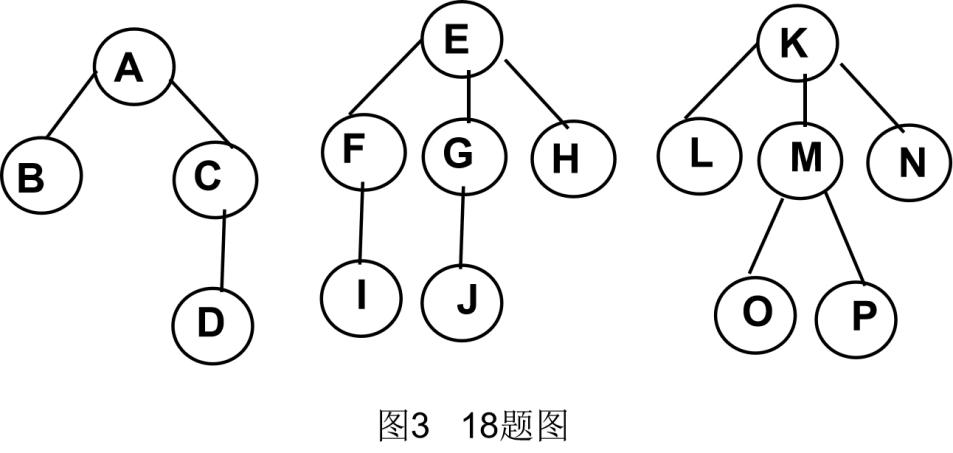

# DS-2023-18

## 1. 原题

图 $3$ 是一个有三棵树的森林。

（1）采用二叉链表（孩子兄弟表示法）来存储森林，画出该森林对应的二叉树；

（2）画出上述二叉树的后序线索树；

（3）用先序和中序分别遍历该森林，写出遍历后的结点序列。



## 2. 答案

**（1）森林对应的二叉树**（左指针＝第一个孩子，右指针＝下一个兄弟；三棵树的根依次挂在右链上）：

```
            A
          /   \
        B      E
         \    / \
         C   F   K
         /  / \  /
        D  I  G L
           / \  \
          J  H   M
               / \
              O   N
               \
                P
```

括号（广义表）写法：`A(B(,C(D,)),E(F(I,G(J,H)),K(L(,M(O(,P),N)),)))`

**（2）后序线索树**：后序遍历序列为

$$D,\;C,\;B,\;I,\;J,\;H,\;G,\;F,\;P,\;O,\;N,\;M,\;L,\;K,\;E,\;A$$

把二叉链表中 $17$ 个空指针域按"左空指前驱、右空指后继"改为线索（详见第 6 节第二步的线索表，其中仅 $D$ 的左域置为空指针 NULL，其余 $16$ 个均为线索）。

**（3）森林的遍历序列**

- 先序（先根）遍历：$A\;B\;C\;D\;E\;F\;I\;G\;J\;H\;K\;L\;M\;O\;P\;N$
- 中序（后根）遍历：$B\;D\;C\;A\;I\;F\;J\;G\;H\;E\;L\;O\;P\;M\;N\;K$

## 3. 题目分析

- 已知（由图 $3$ 判读的森林结构，$16$ 个结点、$3$ 棵树）：
  - $T_1$：$A$ 的孩子为 $B,C$；$C$ 的孩子为 $D$；
  - $T_2$：$E$ 的孩子为 $F,G,H$；$F$ 的孩子为 $I$；$G$ 的孩子为 $J$；
  - $T_3$：$K$ 的孩子为 $L,M,N$；$M$ 的孩子为 $O,P$；
  - 各结点孩子次序按图中**从左到右**排列（这是"下一个兄弟"方向的依据）；
- 目标：三问——转换作图、后序线索化作图、森林先序/中序序列；
- 关键约束：
  1. 孩子兄弟表示法的指针语义：**左＝第一个孩子，右＝右兄弟**；森林中第 $j+1$ 棵树的根是第 $j$ 棵树根的"兄弟"，故挂在右链上；
  2. 线索化针对的是**（1）所得的二叉树**，且线索口径是**后序**（不是最常见的中序）；
  3. 森林的"先序/中序"按教材定义：先序 = 依次对每棵树作先根遍历；中序 = 先中序遍历第一棵树的**子树森林**、再访问第一棵树的根、再中序遍历其余森林，且**森林的中序序列 ＝ 对应二叉树的中序序列**；
- 命题意图：一题串起"树/森林 ⇄ 二叉树"的全部对应关系——转换规则、三种序列的对应（二叉树先序 ↔ 森林先序、二叉树中序 ↔ 森林中序、二叉树后序 ↔ 森林后根遍历），并叠加线索化这一"指针再利用"的构造，考查结构变换的机械准确性。

## 4. 核心考点

核心考点：
DS03.03.02 森林与二叉树的转换（"左孩子右兄弟"的逐结点映射，多棵树根之间的右链挂接）

辅助考点：
DS03.03.01 树的存储结构（孩子兄弟表示法本身即二叉链表，是本题的存储依据）
DS03.02.04 线索二叉树（后序线索化：空左域装直接前驱、空右域装直接后继，`ltag/rtag` 标记）
DS03.03.03 树和森林的遍历（森林先序/中序定义及其与二叉树遍历的等价关系）

解释：三问共用同一棵转换后的二叉树，(1) 是 DS03.03.02 的构造口径；(2) 需要先求后序序列（DS03.02.03 的遍历）再按空域填线索（DS03.02.04）；(3) 直接落在 DS03.03.03，但正确性依赖 (1) 的转换是否规范——森林中序 = 二叉树中序这一等式只在转换正确时成立，可作自检。

## 5. 解题思路

1. **先给每棵树标"第一个孩子"和"下一个兄弟"**：这是转换的唯一原料。例如 $A$ 的第一个孩子 $B$、$B$ 的兄弟 $C$；$E$ 的第一个孩子 $F$、$F$ 的兄弟 $G$、$G$ 的兄弟 $H$；
2. **套规则**：每个结点左指针指向其第一个孩子（无孩子则空），右指针指向其下一个兄弟（无兄弟则空）；三棵树的根依次相连：$A.\mathrm{right}=E$、$E.\mathrm{right}=K$、$K.\mathrm{right}=\varnothing$；
3. **画完立刻做形态自检**：二叉树结点总数应仍为 $16$，且非空左指针数 $=$ 森林中"有孩子的结点数" $=7$（$A,C,E,F,G,K,M$），非空右指针数 $=$ 森林中"有兄弟的结点数" $=8$，二者之和 $15=$ 边数 $=16-1$ ✓；
4. **求后序序列**（左→右→根递归），再按序列给每个空域填前驱/后继——填线索前先把序列写成带编号的一行，逐结点查表，避免"前驱/后继"凭印象写错；
5. **数线索条数**：$n+1=17$ 个空域，其中 $1$ 个（后序第一个结点 $D$ 的左域）只能置 NULL，故线索 $16$ 条，与第 6 节表格逐行统计一致；
6. **森林遍历**：先序按"每棵树先根遍历依次拼接"独立算一遍，再与"二叉树先序"比对；中序按"二叉树中序"算一遍，再与森林中序定义（子树森林→根→其余森林）比对——两法一致才下笔。

## 6. 详细解答

### 第一步：(1) 森林 → 二叉树

森林中每个结点的"第一个孩子"与"下一个兄弟"如下表：

| 结点 | 第一个孩子 | 下一个兄弟 | | 结点 | 第一个孩子 | 下一个兄弟 |
|---|---|---|---|---|---|---|
| $A$ | $B$ | $E$（森林中第二棵树的根视作右兄弟） | | $H$ | 无 | （无） |
| $B$ | 无 | $C$ | | $I$ | 无 | （无） |
| $C$ | $D$ | （无） | | $J$ | 无 | （无） |
| $D$ | 无 | （无） | | $K$ | $L$ | （第三棵树根，无） |
| $E$ | $F$ | $K$（森林中第三棵树的根） | | $L$ | 无 | $M$ |
| $F$ | $I$ | $G$ | | $M$ | $O$ | $N$ |
| $G$ | $J$ | $H$ | | $N$ | 无 | （无） |
| | | | | $O$ | 无 | $P$ |
| | | | | $P$ | 无 | （无） |

按"左＝第一个孩子、右＝下一个兄弟"得二叉链表的指针表（森林中三棵树的根依次互为兄弟，故 $A.\mathrm{right}=E$、$E.\mathrm{right}=K$）：

| 结点 | 左孩子 | 右孩子 | | 结点 | 左孩子 | 右孩子 |
|---|---|---|---|---|---|---|
| $A$ | $B$ | $E$ | | $H$ | ∅ | ∅ |
| $B$ | ∅ | $C$ | | $I$ | ∅ | ∅ |
| $C$ | $D$ | ∅ | | $J$ | ∅ | ∅ |
| $D$ | ∅ | ∅ | | $K$ | $L$ | ∅ |
| $E$ | $F$ | $K$ | | $L$ | ∅ | $M$ |
| $F$ | $I$ | $G$ | | $M$ | $O$ | $N$ |
| $G$ | $J$ | $H$ | | $N$ | ∅ | ∅ |
| | | | | $O$ | ∅ | $P$ |
| | | | | $P$ | ∅ | ∅ |

**形态自检**：非空左指针 $7$ 个（$A\!\to\!B$、$C\!\to\!D$、$E\!\to\!F$、$F\!\to\!I$、$G\!\to\!J$、$K\!\to\!L$、$M\!\to\!O$）$+$ 非空右指针 $8$ 个（$A\!\to\!E$、$B\!\to\!C$、$E\!\to\!K$、$F\!\to\!G$、$G\!\to\!H$、$L\!\to\!M$、$M\!\to\!N$、$O\!\to\!P$），合计 $15$ 条边 $=n-1=16-1$ ✓（二叉树恰含 $16$ 结点、无环无孤立点）。

### 第二步：(2) 后序线索树

**(a) 求后序序列**（左子树 → 右子树 → 根）：

- $\mathrm{post}(B)=\mathrm{post}(C)\,B=(D\,C)\,B=D\,C\,B$
- $\mathrm{post}(F)=\mathrm{post}(I)\,\mathrm{post}(G)\,F=I\,(J\,H\,G)\,F=I\,J\,H\,G\,F$
- $\mathrm{post}(O)=\mathrm{post}(P)\,O=P\,O$；$\mathrm{post}(M)=\mathrm{post}(O)\,\mathrm{post}(N)\,M=P\,O\,N\,M$
- $\mathrm{post}(L)=\mathrm{post}(M)\,L=P\,O\,N\,M\,L$；$\mathrm{post}(K)=\mathrm{post}(L)\,K=P\,O\,N\,M\,L\,K$
- $\mathrm{post}(E)=\mathrm{post}(F)\,\mathrm{post}(K)\,E=I\,J\,H\,G\,F\;P\,O\,N\,M\,L\,K\,E$
- $\mathrm{post}(A)=\mathrm{post}(B)\,\mathrm{post}(E)\,A$

$$\boxed{\text{后序：}D\;C\;B\;I\;J\;H\;G\;F\;P\;O\;N\;M\;L\;K\;E\;A}$$

编号对照（用于查前驱/后继）：

| 序 | 1 | 2 | 3 | 4 | 5 | 6 | 7 | 8 | 9 | 10 | 11 | 12 | 13 | 14 | 15 | 16 |
|---|---|---|---|---|---|---|---|---|---|---|---|---|---|---|---|---|
| 结点 | $D$ | $C$ | $B$ | $I$ | $J$ | $H$ | $G$ | $F$ | $P$ | $O$ | $N$ | $M$ | $L$ | $K$ | $E$ | $A$ |

**(b) 填线索**（空左域 → 后序直接前驱；空右域 → 后序直接后继；`ltag/rtag` $=1$ 表示该域是线索）：

| 结点 | 左域（$ltag$） | 右域（$rtag$） | 说明 |
|---|---|---|---|
| $D$ | **NULL**（线索标志，域空） | → $C$（线索） | 后序首结点无前驱；末结点 $A$ 的后继不存在，但 $A$ 无空域，故全树只有这一个 NULL |
| $C$ | $D$（实孩子） | → $B$（线索） | |
| $B$ | → $C$（线索） | $C$（实孩子） | $B$ 的左线索与右孩子同为 $C$（后序中 $C$ 既是 $B$ 的前驱又是 $B$ 的右子树根） |
| $I$ | → $B$（线索） | → $J$（线索） | 叶结点，两域皆线索 |
| $J$ | → $I$（线索） | → $H$（线索） | 叶 |
| $H$ | → $J$（线索） | → $G$（线索） | 叶 |
| $G$ | $J$（实） | $H$（实） | 无线索 |
| $F$ | $I$（实） | $G$（实） | 无线索 |
| $P$ | → $F$（线索） | → $O$（线索） | 叶 |
| $O$ | → $P$（线索） | $P$（实孩子） | 与 $B$ 情形同构 |
| $N$ | → $O$（线索） | → $M$（线索） | 叶 |
| $M$ | $O$（实） | $N$（实） | 无线索 |
| $L$ | → $M$（线索） | $M$（实孩子） | 同 $B,O$ 型 |
| $K$ | $L$（实） | → $E$（线索） | |
| $E$ | $F$（实） | $K$（实） | 无线索 |
| $A$ | $B$（实） | $E$（实） | 无线索 |

**计数校验**：线索条数 $=16$，加 $1$ 个 NULL 共 $17=n+1$，与 DS03.02.02"二叉链表空链域 $n+1$"完全吻合 ✓（本题 $17$ 个空域中 $16$ 个可作线索，唯一例外是后序首结点 $D$ 的左域，因它没有前驱；后序末结点 $A$ 恰好没有空域，故不必像常规那样再留一个 NULL）。

**(c) 线索图的书写方式**：考场在原二叉树图上，把上表所有标为“线索”的指针域用虚线画出，并给该结点补 `ltag=1` 或 `rtag=1` 标记，实线孩子保持不变。举例：$D$ 的右虚线指向 $C$、$C$ 的右虚线指向 $B$、$B$ 的左虚线指向 $C$、$I$ 的左虚线指向 $B$ 且右虚线指向 $J$、$K$ 的右虚线指向 $E$，其余按上表逐条补完。

### 第三步：(3) 森林的先序与中序遍历

**先序（先根）遍历**——按定义"访问第一棵树的根 → 先序遍历其子树森林 → 先序遍历其余森林"：

- $T_1$：$A$；子树森林 $\{B,\;C(D)\}$：$B$（无孩子）→ $C$、$C$ 的子树 $D$ ⟹ $A\,B\,C\,D$
- $T_2$：$E$；子树森林 $\{F(I),G(J),H\}$：$F,I,G,J,H$ ⟹ $E\,F\,I\,G\,J\,H$
- $T_3$：$K$；子树森林 $\{L,M(O,P),N\}$：$L,M,O,P,N$ ⟹ $K\,L\,M\,O\,P\,N$

$$\text{先序序列}:\;A\;B\;C\;D\;E\;F\;I\;G\;J\;H\;K\;L\;M\;O\;P\;N$$

**中序（后根）遍历**——按定义"中序遍历第一棵树的子树森林 → 访问第一棵树的根 → 中序遍历其余森林"：

- $T_1$：子树森林 $\{B,\,C(D)\}$ 的中序 $=$ 中序$(\{\})$、$B$、中序$(\{C(D)\})$ $=B$、（$D$、$C$）$=B\,D\,C$；再访问根 $A$ ⟹ $B\,D\,C\,A$
- $T_2$：子树森林 $\{F(I),G(J),H\}$ 的中序 $=I\,F$ ‖ $J\,G\,H$ ⟹ $I\,F\,J\,G\,H$；再访问 $E$ ⟹ $I\,F\,J\,G\,H\,E$
- $T_3$：子树森林 $\{L,M(O,P),N\}$ 的中序 $=L$ ‖（$O\,P$、$M$、$N$）$=O\,P\,M\,N$ ‖ $K$ ⟹ $L\,O\,P\,M\,N\,K$

$$\text{中序序列}:\;B\;D\;C\;A\;I\;F\;J\;G\;H\;E\;L\;O\;P\;M\;N\;K$$

**交叉验证（第二方法）**：森林的先序＝对应二叉树的先序、森林的中序＝对应二叉树的中序。
- 二叉树先序（根左右，用第 6 节第一步的指针表逐点展开）：$A\to B\to C\to D$，回到 $A$ 的右子树 $E\to F\to I$、$G\to J$、$H$，再 $K\to L\to M\to O\to P$、$N$，得 $A\,B\,C\,D\,E\,F\,I\,G\,J\,H\,K\,L\,M\,O\,P\,N$ ✓ 与森林先序一致；
- 二叉树中序（左根右）：$\mathrm{in}(B)=B\,D\,C$，$\mathrm{in}(E)=\underbrace{I\,F\,J\,G\,H}_{\mathrm{in}(F)}\;E\;\underbrace{L\,O\,P\,M\,N\,K}_{\mathrm{in}(K)}$，故 $\mathrm{in}(A)=B\,D\,C\;A\;I\,F\,J\,G\,H\;E\;L\,O\,P\,M\,N\,K$ ✓ 与森林中序一致；
- 两法序列长度均为 $16$、无重复无遗漏 ✓。

## 7. 选项分析

不适用（综合应用题——作图与序列书写题）。

## 8. 考场标准答案

**(1)** 左＝第一个孩子、右＝右兄弟，三树根挂右链：

```
            A
          /   \
        B      E
         \    / \
         C   F   K
         /  / \  /
        D  I  G L
           / \  \
          J  H   M
               / \
              O   N
               \
                P
```
即 `A(B(,C(D,)),E(F(I,G(J,H)),K(L(,M(O(,P),N)),)))`

**(2)** 后序序列 $D\,C\,B\,I\,J\,H\,G\,F\,P\,O\,N\,M\,L\,K\,E\,A$；空域改线索（虚线）：

$D.\mathrm{left}=\mathrm{NULL}$，$D.\mathrm{right}\!\to\!C$；$C.\mathrm{right}\!\to\!B$；$B.\mathrm{left}\!\to\!C$；
$I.\mathrm{left}\!\to\!B,\;I.\mathrm{right}\!\to\!J$；$J.\mathrm{left}\!\to\!I,\;J.\mathrm{right}\!\to\!H$；$H.\mathrm{left}\!\to\!J,\;H.\mathrm{right}\!\to\!G$；
$P.\mathrm{left}\!\to\!F,\;P.\mathrm{right}\!\to\!O$；$O.\mathrm{left}\!\to\!P$；$N.\mathrm{left}\!\to\!O,\;N.\mathrm{right}\!\to\!M$；
$L.\mathrm{left}\!\to\!M$；$K.\mathrm{right}\!\to\!E$。共 $16$ 条线索 $+\,1$ 个 NULL $=n+1=17$ 个空域。

**(3)** 先序：$A\,B\,C\,D\,E\,F\,I\,G\,J\,H\,K\,L\,M\,O\,P\,N$
中序：$B\,D\,C\,A\,I\,F\,J\,G\,H\,E\,L\,O\;P\,M\,N\,K$

## 9. 易错点

1. **把森林中三棵树的根并列画成"兄弟链"时漏挂或错挂**：正确是 $A.\mathrm{right}=E$、$E.\mathrm{right}=K$（第二、三棵树的根依次是第一棵树根的右链），漏掉 $E.\mathrm{right}=K$ 会使 $K,L,M,N,O,P$ 六结点丢失；
2. **左右指针语义弄反**（左指兄弟、右指孩子）：那样得到的二叉树先序就不再等于森林先序，可用第 6 节第三步的等式立即查出；
3. **兄弟次序判错**：森林中"$B$ 是 $C$ 的左兄弟"，故右指针方向是 $B\to C$ 而非 $C\to B$；$M$ 的兄弟是 $N$、$L$ 的右链指向 $M$，$L\to M\to N$ 一条右链，不能倒序；
4. **后序线索化按中序口径填**：本题要求**后序**线索，前驱/后继必须取自后序序列；例如 $H$ 的后序前驱是 $J$、后继是 $G$，而中序中 $H$ 的前驱是 $G$——混用即全错；
5. **叶结点的左线索一律写成"NULL"**：后序首结点只有 $D$，它无前驱，故仅 $D$ 的左域置 NULL；其余 $16$ 个空域全部有指向，$n+1=17$ 的计数是自查手段；
6. **森林中序当成"二叉树后序"**：森林的中序遍历对应二叉树的**中序**遍历（不是后序），后序对应的是森林的**后根**遍历，三者不可混用；
7. 忘记 $O$ 的右孩子是 $P$（$P$ 是 $O$ 的右兄弟），把 $P$ 挂到 $M$ 的右链上——$M$ 的右链已被 $N$ 占用，$P$ 只能挂在 $O.\mathrm{right}$。

## 10. 一句话规律

树/森林转二叉树只有"左孩子、右兄弟"六个字，但**每次作答后都用两条等式自查**：二叉树先序 $=$ 森林先序、二叉树中序 $=$ 森林中序；线索化题则先写出遍历序列再查表填前驱后继，并用"空域数 $n+1$"核对线索条数。

## 11. 关联知识

- DS03.03.01：孩子兄弟表示法把多叉树压缩成二叉链表，代价是"失去双亲指针"——若需找双亲须加 `parent` 域（见 DS-2023-14 的三叉链表空域计数）；
- DS03.02.04：中序线索化最常见，后序线索化的特殊之处是"结点的后序前驱可能是自己的右孩子、后继可能是自己的双亲"，故不能像中序那样在遍历过程中一次成型（须先有后序序列再回填），本题 $B.\mathrm{left}\!\to\!C$、$O.\mathrm{left}\!\to\!P$、$L.\mathrm{left}\!\to\!M$ 都是"左线索指向自己的右孩子"的反直觉例子；
- DS03.03.02：逆转换规则——二叉树中"根的左子树"是第一棵树的子树森林，"沿右链下去的每个结点"依次是森林中各棵树的根；本题 (1) 的树有 $3$ 条右链跳转（$A\to E\to K$），恰好对应森林有 $3$ 棵树；
- DS03.03.03：树/森林的先根＝二叉树先序、后根＝二叉树后序、森林中序＝二叉树中序，这三条对应关系是本库"森林 ↔ 二叉树"题组的通用校验器；
- 本库关联题：DS-2024-12（树转二叉树后按右指针语义计数）、DS-2023-14（三叉链表空链域）。

## 12. 来源与可信度

- 原题来源：2023 回忆版题面篇 `真题/2023/2023重庆邮电大学802数据结构真题.md` 三、综合应用题第 18 题；森林形态取自 `真题/2023/imgs/fig3.png`（图 3 18 题图），无订正说明；
- 图像判读说明：已将 `fig3.png` 原图完整读取并核对，判读为三棵树 $T_1=A(B,C(D))$、$T_2=E(F(I),G(J),H)$、$T_3=K(L,M(O,P),N)$，共 $16$ 个结点，与图中字母 $A\sim P$ 齐全一致；各结点孩子的**左右次序**按图中水平位置取（如 $K$ 的孩子自左至右为 $L,M,N$），该次序直接决定右兄弟链方向。若个别兄弟次序在原卷中不同，则 (1)(2)(3) 的序列会相应改变，但转换与线索化的方法不变；因结论依赖图像判读，`ocr_confidence` 记为 medium；
- 答案来源：独立推导——(1) 逐结点填左右指针并用"边数 $=n-1$"校验；(2) 先递归求后序序列再查表填线索，用空域数 $n+1=17$ 校验条数；(3) 森林定义与"二叉树先序/中序"两条独立路径分别计算，结果完全一致；未编写程序；未抓取解析篇网页，仅登记其地址备查；
- 教材依据：严蔚敏、吴伟民《数据结构（C 语言版）》6.3.4 树的存储结构（孩子兄弟表示法）、6.4 森林与二叉树的转换、6.5 树和森林的遍历、6.2.3 线索二叉树（空链域再利用与 `ltag/rtag`）；
- 多来源冲突：无；争议：无（"森林的中序遍历"在教材中即指与对应二叉树中序等价的遍历，部分辅导书称之为"后根遍历"，序列相同，仅名称差异，不影响答案）；
- 最终可信度：high（方法链与双重校验一致），图像判读部分见上述说明。
