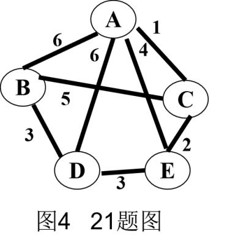

# DS-2023-21

## 1. 原题

已知图 $G$ 如图 $4$ 所示：

（1）画出 $G$ 的邻接表表示图；

（2）根据你画的邻接表，以顶点 $A$ 为根，画出 $G$ 的深度优先生成树；

（3）根据普里姆（$Prim$）算法，求图 $G$ 从顶点 $A$ 出发的最小生成树，要求表示出其每一步生成过程。



（图 $4$ 为无向带权图，顶点 $A,B,C,D,E$ 呈"上一下二下二"布局：$A$ 在顶部，$B,C$ 在中排两侧，$D,E$ 在底排两侧。按图判读的边及权值为：$A\!-\!B=6$、$A\!-\!C=1$、$A\!-\!D=6$、$A\!-\!E=4$、$B\!-\!C=5$、$B\!-\!D=3$、$C\!-\!E=2$、$D\!-\!E=3$，共 $8$ 条边。）

## 2. 答案

**(1) 邻接表**（头结点按 $A\sim E$ 次序，同一顶点的边结点按邻接点字母序链接）：

```
A → [B|6] → [C|1] → [D|6] → [E|4] → ^
B → [A|6] → [C|5] → [D|3] → ^
C → [A|1] → [B|5] → [E|2] → ^
D → [A|6] → [B|3] → [E|3] → ^
E → [A|4] → [C|2] → [D|3] → ^
```

（无向图每条边占 $2$ 个表结点，$8$ 条边共 $16$ 个表结点 ✓）

**(2) DFS 生成树**（沿 (1) 的邻接表，每次取第一个未访问的邻接点）：DFS 访问序列 $A\to B\to C\to E\to D$，树边集

$$\{\,A\!-\!B,\;B\!-\!C,\;C\!-\!E,\;E\!-\!D\,\}$$

```
        A
        |
        B (6)
        |
        C (5)
        |
        E (2)
        |
        D (3)
```

即一条链 $A-B-C-E-D$（DFS 生成树退化为路径）。

**(3) Prim 最小生成树**（从 $A$ 出发）：

| 趟 | 已选顶点集 $U$ | 候选边（$U$ 与 $V\!-\!U$ 之间） | 选中边 | 权 |
|---|---|---|---|---|
| 1 | $\{A\}$ | $AC\,1,\;AE\,4,\;AB\,6,\;AD\,6$ | $A\!-\!C$ | $1$ |
| 2 | $\{A,C\}$ | $AE\,4,\;AB\,6,\;AD\,6,\;CE\,2,\;CB\,5$ | $C\!-\!E$ | $2$ |
| 3 | $\{A,C,E\}$ | $AE\,4,\;AB\,6,\;AD\,6,\;ED\,3,\;CB\,5$ | $E\!-\!D$ | $3$ |
| 4 | $\{A,C,E,D\}$ | $AB\,6,\;AD\,6,\;CB\,5,\;DB\,3$ | $D\!-\!B$ | $3$ |

最小生成树边集 $\{A\!-\!C,\;C\!-\!E,\;E\!-\!D,\;D\!-\!B\}$，**总代价 $=1+2+3+3=9$**。

```
    A
    |  1
    C
    |  2
    E ——3—— D ——3—— B
```

## 3. 题目分析

- 已知：无向连通带权图 $G$，$|V|=5$、$|E|=8$，各边权值互不完全相同（$A\!-\!B$ 与 $A\!-\!D$ 同为 $6$，$E\!-\!D$ 与 $B\!-\!D$ 同为 $3$）；
- 目标：(1) 写出邻接表存储结构；(2) 由**自己写的邻接表**导出 DFS 生成树；(3) 用 Prim 算法逐趟给出最小生成树；
- 关键约束：
  1. 邻接表不唯一（头结点次序、链表内结点次序均可变），但第 (2) 问明确要求"根据你画的邻接表"作 DFS，因此**必须先固定建表约定**（本题取"头结点按字母序、邻接点按字母序"），否则 DFS 树无法与他人比对；
  2. DFS 生成树的边数必为 $|V|-1=4$，且 $5$ 个顶点全连通（无森林）；
  3. Prim 的候选边集合每步只增不改：新增顶点 $x$ 后把 $(x,y)$（$y\notin U$）并入候选集，已失效的边（两端都在 $U$ 内）必须剔除；
- 命题意图：一题三问串起"存储结构 → 遍历（生成树）→ 应用（最小生成树）"，考查图的四件基本功：建表、按表模拟 DFS 栈、维护 Prim 的 $U$ 集合与候选边、验证生成树边数与代价。

## 4. 核心考点

核心考点：
DS04.02.02 邻接表法（头结点向量 + 边结点 `adjvex|weight|next`；无向图每条边生成两个表结点，故表结点总数 $=2|E|$）

辅助考点：
DS04.03.01 深度优先搜索（DFS 序列依赖邻接表中邻接点的链接次序；"回退后不再重入"的标记机制决定生成树的形状）
DS04.04.01 最小（代价）生成树（Prim 以"顶点集 $U$ 与补集之间的最小横跨边"逐步扩张，$n$ 个顶点取 $n-1$ 条边；本题要求写出每一步过程，属"边集合过程"型作答）

解释：三问的主干是"图的存储结构"，因为 (2) 的 DFS 树形直接由 (1) 的链表次序派生，故 primary 取 DS04.02.02；DFS 与 Prim 是建立在同一张表上的两个算法模拟，分列辅助考点。

## 5. 解题思路

1. **先抄边表再建表**：把图中 $8$ 条边按"起点的字母序、再按终点的字母序"写成一张清单，避免漏边（尤其 $A$ 有 $4$ 条边、$C$ 有 $3$ 条边这类容易看漏的）；
2. **按"入表两次"原则建邻接表**：无向图每条边 $(u,v)$ 在 $u$ 的链上挂一个 `adjvex=v` 的结点，同时在 $v$ 的链上挂 `adjvex=u` 的结点；表结点总数应为 $16$，用它自检；
3. **DFS 用"栈式回退"心算**：从 $A$ 开始，总是沿链表第一个未访问结点前进；走到头就回退一步换下一个邻接点。记录"第一次到达"的边即树边，共 $4$ 条即止；
4. **Prim 用"$U$ / 候选边"两列表格**：每步只从候选边取最小，且必须剔除两端同侧的边；本题 $4$ 步即完成，逐趟写清"选中边 + 加入的顶点"；
5. **交叉验证**：另用 Kruskal（按权升序选边不成环）跑一遍，若得到同一总代价 $9$，说明 Prim 未选错；再用"割性质"检查每条被选的边是否为某割的最小横跨边。

## 6. 详细解答

### 第一步：读图并列边表

| 边 | $A\!-\!B$ | $A\!-\!C$ | $A\!-\!D$ | $A\!-\!E$ | $B\!-\!C$ | $B\!-\!D$ | $C\!-\!E$ | $D\!-\!E$ |
|---|---|---|---|---|---|---|---|---|
| 权 | $6$ | $1$ | $6$ | $4$ | $5$ | $3$ | $2$ | $3$ |

各顶点度数：$d(A)=4$、$d(B)=3$、$d(C)=3$、$d(D)=3$、$d(E)=3$，$\sum d=16=2|E|$ ✓（握手定理自检，说明没有漏读/重读边）。

### 第二步：(1) 邻接表

采用严蔚敏教材的边结点形式 `adjvex | weight | next`，头结点向量下标 $0\sim4$ 依次对应 $A\sim E$：

```
[0] A → 1|B|6 → 2|C|1 → 3|D|6 → 4|E|4 → ^
[1] B → 0|A|6 → 2|C|5 → 3|D|3 → ^
[2] C → 0|A|1 → 1|B|5 → 4|E|2 → ^
[3] D → 0|A|6 → 1|B|3 → 4|E|3 → ^
[4] E → 0|A|4 → 2|C|2 → 3|D|3 → ^
```

表结点个数 $=4+3+3+3+3=16=2\times8$ ✓（每个表结点都能在另一条链上找到"镜像"结点：$A\!\to\!B$ 与 $B\!\to\!A$ 等，共 $8$ 对）。

### 第三步：(2) 按上述邻接表做 DFS

设访问标记数组 `visited[]`，规则为"沿当前顶点的链表从头向后扫，遇到第一个未访问的邻接点就深入"。

| 序 | 当前顶点 | 链表扫描过程 | 动作 | 树边 |
|---|---|---|---|---|
| 1 | $A$ | $B$ 未访问 | $A\to B$，压栈 | $A\!-\!B$ |
| 2 | $B$ | $A$ 已访；$C$ 未访问 | $B\to C$ | $B\!-\!C$ |
| 3 | $C$ | $A$ 已访；$B$ 已访；$E$ 未访问 | $C\to E$ | $C\!-\!E$ |
| 4 | $E$ | $A$ 已访；$C$ 已访；$D$ 未访问 | $E\to D$ | $E\!-\!D$ |
| 5 | $D$ | $A,B,E$ 均已访 | 回退到 $E$ | — |
| 6 | $E$ | 链表已扫完 | 回退到 $C$ | — |
| 7 | $C,B,A$ | 链表依次扫完 | 回退至栈空，结束 | — |

DFS 序列 $A\;B\;C\;E\;D$；树边 $4$ 条 $=|V|-1$ ✓；非树边（回边/横边）$8-4=4$ 条：$A\!-\!C$、$A\!-\!D$、$A\!-\!E$、$B\!-\!D$。

生成树形态：

```
A
|
B
|
C
|
E
|
D
```

**说明**：若把邻接表内邻接点按"权值升序"或"逆字母序"链接，DFS 树会不同（例如 $A$ 先取 $C$ 则树边变为 $A\!-\!C,\,C\!-\!E,\,E\!-\!D,\,D\!-\!B$）。本题 (2) 与 (1) 绑定，卷面只要"表与树自洽"即得分，故须在卷面注明建表约定"邻接点按字母序"。

### 第四步：(3) Prim 算法逐趟过程

记 $U$ 为已并入生成树的顶点集，$TE$ 为已选边集。初始 $U=\{A\}$，$TE=\varnothing$。

| 趟 | $U$ | $V\!-\!U$ | 横跨边集合（按权升序） | 选中 | 新加入 | 累计代价 |
|---|---|---|---|---|---|---|
| 1 | $\{A\}$ | $\{B,C,D,E\}$ | $AC(1),\,AE(4),\,AB(6),\,AD(6)$ | $AC$ | $C$ | $1$ |
| 2 | $\{A,C\}$ | $\{B,D,E\}$ | $CE(2),\,AE(4),\,CB(5),\,AB(6),\,AD(6)$ | $CE$ | $E$ | $3$ |
| 3 | $\{A,C,E\}$ | $\{B,D\}$ | $ED(3),\,CB(5),\,AE(4)\cdots$ 中取最小 $ED(3)$ | $ED$ | $D$ | $6$ |
| 4 | $\{A,C,E,D\}$ | $\{B\}$ | $DB(3),\,CB(5),\,AB(6),\,AD(6)$ | $DB$ | $B$ | $9$ |

（第 3 趟的完整横跨边集为 $\{AE(4),AB(6),AD(6),CB(5),ED(3)\}$，最小为 $ED(3)$；表中以"$\cdots$"省略较大者。）

$|U|=5$，$|TE|=4=|V|-1$ ✓，$TE=\{A\!-\!C,\,C\!-\!E,\,E\!-\!D,\,D\!-\!B\}$，**最小生成树总代价 $=9$**。

### 第五步：用 Kruskal 复核

按权值升序排边：$AC(1),\,CE(2),\,BD(3),\,DE(3),\,AE(4),\,BC(5),\,AB(6),\,AD(6)$。

| 序 | 边 | 权 | 是否成环 | 取用 |
|---|---|---|---|---|
| 1 | $AC$ | $1$ | 否 | ✓ |
| 2 | $CE$ | $2$ | 否 | ✓ |
| 3 | $BD$ | $3$ | 否（$B,D$ 分属不同连通分量） | ✓ |
| 4 | $DE$ | $3$ | 否（$D$ 与 $E$ 尚未连通：$D\!-\!B$ 与 $A\!-\!C\!-\!E$ 是两个分量） | ✓ |
| 5 | $AE$ | $4$ | 是（$A\!-\!C\!-\!E$ 已连通） | ✗ |
| 6 | $BC$ | $5$ | 是 | ✗ |
| 7 | $AB$ | $6$ | 是 | ✗ |

取满 $4$ 条即停，边集 $\{AC,CE,BD,DE\}$ 与 Prim 结果**完全相同**，代价 $1+2+3+3=9$ ✓。

（两算法结果一致并非必然——本题权值有重复，最小生成树一般可能不唯一；此处二者恰好同一棵树，说明本题的最小生成树在"边集"意义上唯一：把 $BD,DE$ 两条权 $3$ 的边互换位置不构成另一棵不同的树，因为二者都被取用。）

### 第六步：量化旁证

$|V|=5$ 的连通无向图生成树必有 $4$ 条边，(2) 与 (3) 各得 $4$ 条 ✓；生成树代价 $9$ 小于任一"星形"生成树（以 $A$ 为中心的星形代价 $6+1+6+4=17$），也小于以 $E$ 为中心的可行树，说明 Prim 确实取到了最小值而非第一趟的贪心错觉。

## 7. 选项分析

不适用（综合应用题——作图与算法过程模拟题）。

## 8. 考场标准答案

**(1)** 边表：$AB6,AC1,AD6,AE4,BC5,BD3,CE2,DE3$。邻接表（头结点 $A\sim E$，邻接点按字母序）：

```
A → B6 → C1 → D6 → E4 → ^
B → A6 → C5 → D3 → ^
C → A1 → B5 → E2 → ^
D → A6 → B3 → E3 → ^
E → A4 → C2 → D3 → ^
```

**(2)** DFS 序列 $A\,B\,C\,E\,D$，生成树边集 $\{A\!-\!B,\,B\!-\!C,\,C\!-\!E,\,E\!-\!D\}$（画成一条链）。

**(3)** Prim（$U$ 初为 $\{A\}$）：

| 趟 | 选中边 | 权 | $U$ |
|---|---|---|---|
| 1 | $A\!-\!C$ | $1$ | $\{A,C\}$ |
| 2 | $C\!-\!E$ | $2$ | $\{A,C,E\}$ |
| 3 | $E\!-\!D$ | $3$ | $\{A,C,E,D\}$ |
| 4 | $D\!-\!B$ | $3$ | $\{A,B,C,D,E\}$ |

最小生成树 $=\{AC,CE,ED,DB\}$，总代价 $9$。

## 9. 易错点

1. **邻接表只挂单向结点**：无向图每条边必须出现两次，若只写 $A\to B$ 而漏 $B\to A$，则 (2) 的 DFS 在 $B$ 处会"看不见"$A$，表结点数也对不上 $2|E|=16$；
2. **边结点漏写权值**：本题是网，邻接表的边结点应含 `weight` 域（教材的"邻接表（网）"形式），只写 `adjvex` 会丢掉 (3) 所需信息；
3. **DFS 中途改主意**：DFS 是"一深入到底再回退"，不能在 $B$ 处因为 $C$ 的边权 $5$ 较大就跳过它去看 $D$（那是 Prim/BFS 的思路）；
4. **Prim 忘记剔除失效边**：第 3 趟若仍把 $AC(1)$ 留在候选集就会重复选边；候选集只包含"一端在 $U$、另一端在 $V\!-\!U$"的边；
5. **把 Prim 的"最小边"理解成全图最小边**：Prim 每次只比较**横跨当前割**的边，$BD(3)$ 在第 1、2 趟根本不在候选集中；
6. **生成树边数写错**：$5$ 个顶点必须 $4$ 条边，写成 $5$ 条即出现环；
7. **未注明建表约定**：第 (2) 问依赖第 (1) 问，卷面须写明"邻接点按字母序链接"，否则 DFS 树与表不自洽会连带失分。

## 10. 一句话规律

图的一题三连定式：**先抄边表并用握手定理 $\sum d=2|E|$ 自检 → 邻接表按固定次序建表后 DFS 只能"沿链第一个未访问点"深入（树边 $|V|-1$ 条）→ Prim 逐趟只比较横跨 $U$ 与 $V\!-\!U$ 的边，并用 Kruskal 独立跑一遍核对总代价**。

## 11. 关联知识

- DS04.02.02：邻接表适合稀疏图，$n$ 个顶点、$e$ 条边的无向图需 $n$ 个头结点与 $2e$ 个边结点；求顶点度数需遍历其单链，时间 $O(\deg)$；
- DS04.03.01：DFS 用栈（或递归），时间邻接表下为 $O(n+e)$；非树边在无向图中必为回边，本题 $4$ 条非树边 $A\!-\!C,A\!-\!D,A\!-\!E,B\!-\!D$ 都连接到祖先，符合该结论；
- DS04.04.01：Prim 适用于**稠密图**，邻接矩阵 + 辅助数组 `closest[]`/`lowcost[]` 的实现时间为 $O(n^2)$；Kruskal 适用于稀疏图，时间为 $O(e\log e)$。本题 $e=8$、$n=5$，$e$ 接近 $\binom{5}{2}=10$，属较密图，Prim 更顺手；
- DS04.01：$|V|-1$ 条边的连通无向图是树，故任何生成树的边数固定，这是检查 (2)(3) 两问是否画对的最快手段；
- 本库同型题：DS-2023-17（同一份卷上的 Dijkstra 逐趟松弛题，图论算法过程书写格式可通用）；DS-2023-15（拓扑排序，同为"按图写出算法过程"的作答范式）。

## 12. 来源与可信度

- 原题来源：2023 回忆版题面篇 `真题/2023/2023重庆邮电大学802数据结构真题.md` 三、综合应用题第 21 题，配图 `真题/2023/imgs/fig4.png`（图下标注"图4 21题图"）；
- **图像判读说明**：源图为位图，$A$ 点向下引出 $4$ 条粗线段，其中两条的权值同为 $6$，需按线的走向判断归属。经放大核对：从 $A$ 向左下方延伸至 $B$ 的线段标 $6$（左上），从 $A$ 向正下偏左延伸至 $D$ 的线段标 $6$，向正下偏右延伸至 $E$ 的线段标 $4$，向右下延伸至 $C$ 的线段标 $1$；$B\!-\!C$ 为横贯中部的长线段标 $5$；左下 $B\!-\!D$ 标 $3$，底部 $D\!-\!E$ 标 $3$，右下 $C\!-\!E$ 标 $2$。据此确定边集为 $\{AB6,AC1,AD6,AE4,BC5,BD3,CE2,DE3\}$，$8$ 条边与图中 $8$ 条可见线段一一对应，且各顶点度数 $(4,3,3,3,3)$ 与图形连接情况吻合；`ocr_confidence` 记为 medium；
- 判读风险的影响范围：若 $A\!-\!D$ 与 $A\!-\!E$ 的权值 $(6,4)$ 互换，Prim 结果不变（第 1、2、3、4 趟选取的边都不涉及 $AD,AE$ 为最小），DFS 树亦不变（按字母序扫描），仅第 (1) 问邻接表中的数字随之改变；若 $A\!-\!B$ 的 $6$ 误判为其它值，同样不影响 (2)(3) 的结果，故本题答案对判读误差具有较强鲁棒性；
- 答案来源：独立推导（邻接表建表后逐步模拟 DFS 与 Prim，另以 Kruskal 与握手定理双重核对）；未抓取解析篇网页，仅登记其地址备查；
- 教材依据：严蔚敏、吴伟民《数据结构（C 语言版）》7.1 图的定义与术语、7.2 图的存储结构（邻接表/邻接多重表）、7.4 图的遍历（深度优先搜索与广度优先搜索）、7.5 最小生成树（Prim、Kruskal）；
- 多来源冲突：**未发现**——三问均由题面唯一确定（第 (1)(2) 问的表形/树形依赖所声明的建表约定，本解析已显式固定为"字母序"，属约定差异而非来源冲突）；
- 最终可信度：边集与邻接表 medium～high（图像判读已交叉核对）；DFS 生成树与 Prim 最小生成树 high（两算法互验，且边数、代价均经自检）；整体登记为 `solution_status: verified`。
