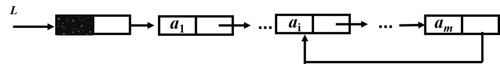

# DS-2023-23

## 1. 原题

已知 $L$ 为链表的头结点地址，表中共有 $m$（$m>3$）个结点，从表中第 $i$（$1<i<m$）个结点起到第 $m$ 个结点构成一个循环部分链表。试设计一时间复杂度 $O(n)$ 的算法 `PatternInvertL(LinkList L, int i, int m)`，将这部分循环链表中所有结点顺序完全倒置。要求：

（1）描述算法的基本设计思想；

（2）根据设计思想，采用 C 语言描述算法，关键之处给出注释。



（图 $5$ 示意：$L\to$ 头结点 $\to a_1\to\cdots\to a_i\to\cdots\to a_m$，且 $a_m$ 的指针域回指 $a_i$，故 $a_i\sim a_m$ 构成循环部分。）

结点定义如下：

```c
typedef struct node
{
    int data;
    struct node *next;
} LNode, *LinkList;
```

## 2. 答案

**(1) 设计思想**：设循环部分含 $t=m-i+1$ 个结点 $a_i,a_{i+1},\cdots,a_m$，其原有 $t$ 条弧为 $a_i\!\to\!a_{i+1}\!\to\!\cdots\!\to\!a_m\!\to\!a_i$。逆置即把这 $t$ 条弧**逐条反向**，得到 $a_i\!\leftarrow\!a_{i+1}\!\leftarrow\!\cdots\!\leftarrow\!a_m\!\leftarrow\!a_i$，也就是新环 $a_m\!\to\!a_{m-1}\!\to\!\cdots\!\to\!a_i\!\to\!a_m$。做法是单链表逆置的三指针技术加一个"定长计数"终止条件：用 `cur` 指向当前待改弧的结点、`pre` 指向它反向后应指向的后继（初值取环尾 $a_m$）、`next` 暂存 `cur` 的原后继，循环 $t$ 次即可完成全部 $t$ 条弧的反向，无需开辟新结点；最后把 $a_{i-1}$ 的 `next` 由 $a_i$ 改为 $a_m$，使整个链表从头遍历时的访问次序恰好变为 $a_1,\cdots,a_{i-1},a_m,a_{m-1},\cdots,a_i$。定位 $a_i$ 需 $i$ 步、定位 $a_m$ 需 $t-1$ 步、逆置需 $t$ 步，总时间为 $O(m)$，辅助空间为 $O(1)$。

**(2) C 语言算法**：见第 8 节（教材风格书写，含注释）。

## 3. 题目分析

- 已知：带头结点的单循环"部分"链表——前 $i-1$ 个结点 $a_1\sim a_{i-1}$ 是普通单链，$a_i\sim a_m$ 成环（$a_m\to a_i$）；结点总数 $m$、环起点序号 $i$ 均作为参数给出；$m>3$、$1<i<m$，故 $t=m-i+1\ge 2$；
- 目标：仅改变指针，使循环部分中结点的**次序完全倒置**，且仍构成同样 $t$ 个结点的环，前缀 $a_1\sim a_{i-1}$ 不受影响；
- 关键约束：
  1. **不能新建/删除结点**，只能修改 `next` 域——所以是"改弧方向"而不是"重排数据"；
  2. 环上没有任何一端的 `NULL` 可用，**遍历终止条件必须靠计数（$t$ 次）或"回到起点"判断**，写成 `while(cur != NULL)` 会死循环；
  3. 逆置过程中原弧会被逐步覆盖，因此**必须先用 `next` 暂存当前结点的原后继**再改写 `cur->next`，否则丢失后续结点；
  4. 时间 $O(m)$（题面写作 $O(n)$，$n$ 即表长）、空间 $O(1)$；
- 命题意图：把"单链表就地逆置"这一基本功放到**循环子链**上，考查三件事——如何定位第 $i$ 个结点、如何在不依赖 `NULL` 的情况下控制循环次数、逆置后如何把前缀与新环重新接上。

## 4. 核心考点

核心考点：
DS01.02.03 链式存储：循环链表（循环部分的判定与终止条件设计；环上无空指针，遍历须靠"计数 $t$ 次"或"`next` 回到首结点"结束）

辅助考点：
DS01.02.02 链式存储：单链表（三指针就地逆置的经典技术；带头结点时"第 $k$ 个结点 $=$ 从头结点向后走 $k$ 步"的定位约定）
DS01.01 线性表的基本概念（"顺序完全倒置"是对线性逻辑次序的逆转，结点集合不变）

解释：题面的数据结构形态（部分循环链表）决定了全部实现细节，故 primary 取 DS01.02.03；所用核心算法是单链表逆置的变体，属 DS01.02.02；"倒置的是次序而非内容"这一理解落在 DS01.01。

## 5. 解题思路

1. **把问题翻译成"弧的集合"**：环由 $t$ 条弧组成，逆置 $=$ 每条弧反向。这样就知道必须做 $t$ 次修改，不多不少——这是控制循环次数的依据；
2. **确认逆置后谁指向谁**：新环为 $a_m\to a_{m-1}\to\cdots\to a_i\to a_m$，即 $a_k\;(k>i)$ 的新后继是 $a_{k-1}$，而 $a_i$ 的新后继是 $a_m$。归纳出"当前结点的新后继 $=$ 它的逻辑前驱（环内逆序方向上的前一个）"；
3. **套用三指针模板**：单链表逆置的模板是 `next=cur->next; cur->next=pre; pre=cur; cur=next;`。原表中它的 `pre` 初值为 `NULL`（因为链尾要指向空）；本环的"链尾"是 $a_i$，它要指向 $a_m$，所以**把 `pre` 初值设为 $a_m$**，其余不变；
4. **定长循环代替空指针判断**：跑 $t$ 次即恰好处理完全部 $t$ 条弧，此时 `cur` 回到 $a_i$、`pre` 停在 $a_m$；
5. **收尾接链**：`pre`（$a_m$）就是新环的第一个结点，把 $a_{i-1}\to a_i$ 改成 $a_{i-1}\to a_m$；若采用"前缀指针不动"的口径则省略此步（见第 12 节口径说明）；
6. **用小规模实例验证**：取 $t=3$（环 $a\!\to\!b\!\to\!c\!\to\!a$）手工执行，检查是否得到 $a\!\to\!c\!\to\!b\!\to\!a$。

## 6. 详细解答

### 第一步：形式化"逆置"的目标弧集

原弧集（环内 $t$ 条）：

$$E_{\text{原}}=\{(a_i,a_{i+1}),\,(a_{i+1},a_{i+2}),\,\cdots,\,(a_{m-1},a_m),\,(a_m,a_i)\}$$

逆置后的弧集：

$$E_{\text{新}}=\{(a_{i+1},a_i),\,(a_{i+2},a_{i+1}),\,\cdots,\,(a_m,a_{m-1}),\,(a_i,a_m)\}$$

两者大小同为 $t$，结点集合完全相同 ✓（说明"就地改指针"是可行的，不需要增删结点）。$a_i$ 的新后继是 $a_m$、$a_k\,(k>i)$ 的新后继是 $a_{k-1}$——这正是三指针模板中 `cur->next = pre` 所产生的效果，只要 `pre` 沿"逆序方向"提前站好。

### 第二步：定位三个关键结点

带头结点时 $L\to a_1$，故"从头结点向后走 $k$ 步"到达 $a_k$：

| 指针 | 求法 | 步数 |
|---|---|---|
| `p`（$=a_i$） | `p = L; for(k=0;k<i;k++) p = p->next;` | $i$ |
| `q`（$=a_{i-1}$，前缀尾结点） | `q = L; for(k=0;k<i-1;k++) q = q->next;` | $i-1$ |
| `pre`（$=a_m$，环尾） | `pre = p; for(k=1;k<t;k++) pre = pre->next;` | $t-1$ |

其中 $t=m-i+1$。定位 $a_m$ 也可不用 $m$：`pre = p; while(pre->next != p) pre = pre->next;`（沿环走到"后继是 $a_i$"的那个结点），二者等价，题面既给出 $m$，用计数写法更直观。

### 第三步：三指针逆置 $t$ 次

不变式：进入第 $k$ 次循环（$k=0,\cdots,t-1$）时，`cur` 指向 $a_{i+k}$（下标超过 $m$ 时按环回绕，即 $a_{i+k}$ 表示 $a_{((i+k-1)\bmod t)+i}$），`pre` 已指向 `cur` 在**新环**中应有的后继，而 $a_{i+k}$ 之前（沿原环方向）的弧已全部反向完毕。

```
next = cur->next;   /* 先暂存原后继，否则改写后找不到 */
cur->next = pre;    /* 本条弧反向 */
pre = cur;          /* pre 后退到新已反向段的头 */
cur = next;         /* 前进一个结点 */
```

### 第四步：$t=3$ 的手工验证（环 $a\to b\to c\to a$，$a_i=a$、$a_m=c$）

初值：`pre = c`，`cur = a`。

| 次 | `cur` | `next`（暂存的原后继） | 改写 | `pre` 更新后 | `cur` 更新后 | 当前弧状态 |
|---|---|---|---|---|---|---|
| 0 | $a$ | $b$ | $a\to c$ | $a$ | $b$ | $a\!\to\!c$，$b\!\to\!c$，$c\!\to\!a$ |
| 1 | $b$ | $c$ | $b\to a$ | $b$ | $c$ | $a\!\to\!c$，$b\!\to\!a$，$c\!\to\!a$ |
| 2 | $c$ | $a\,(=c\to next 原值)$ | $c\to b$ | $c$ | $a$ | $a\!\to\!c$，$b\!\to\!a$，$c\!\to\!b$ |

结束：`pre` $=c=a_m$、`cur` $=a=a_i$（回到起点，说明恰好绕环一周）✓。新环 $a\to c\to b\to a$，即从 $a$ 出发为 $a,c,b$，正是 $a,b,c$ 的逆序（差一个循环移位）✓；从 $a_{i-1}$ 出发的访问次序为 $a_{i-1},c,b,a$ ✓ 完全倒置。

### 第五步：边界情形验证

| 情形 | 参数 | 结果 | 说明 |
|---|---|---|---|
| $t=2$（$i=m-1$） | 环 $a\!\to\!b\!\to\!a$ | 弧不变（$a\!\to\!b,b\!\to\!a$ 本已互为反向） | 两结点的环逆置后弧集相同，只有入口由 $a_i$ 换成 $a_m$，正确 |
| $t=1$ | 理论上 $i=m$ 才会出现 | 题面 $i<m$ 已排除 | 若外部调用传入 $i=m$，代码用 `if(t<=1) return;` 直接返回，安全 |
| $i=2,\;m=4$（$t=3$，前缀只有 $a_1$） | $L\to a_1\to a_2$，环 $a_2a_3a_4$ | $q=L\to a_1$，$a_1\to a_4$，新环 $a_4\!\to\!a_3\!\to\!a_2\!\to\!a_4$ | 前缀长度为 $1$ 时同样成立 |
| $i=1$ | 题面 $i>1$ 已排除 | — | 若 $i=1$，则 $q$ 即头结点 $L$，代码仍成立（$q=L$ 时 `q->next = pre` 即 $L\to a_m$） |

### 第六步：算法正确性与复杂度小结

- **正确性**：第四步逐次跟踪 + 第一步的弧集对照说明 $t$ 次循环恰好反向全部 $t$ 条弧；`next` 的暂存保证不会因改写而丢失结点；结束时 `pre` 必为 $a_m$，故接链语句 `q->next = pre` 语义明确；
- **时间**：定位 $a_i$ 走 $i$ 步、定位 $a_m$ 走 $t-1$ 步、逆置 $t$ 步、接链 $O(1)$，合计 $i+2t-1\le 2m+1$，即 $T(m)=O(m)$，满足题面 $O(n)$ 要求；
- **空间**：仅用 `p,q,pre,cur,next` 五个指针变量与循环变量 $k$，$S=O(1)$，且未申请任何新结点（`malloc` 调用次数为 $0$）。

## 7. 选项分析

不适用（算法设计与分析题）。

## 8. 考场标准答案

**(1) 基本设计思想**

设循环部分有 $t=m-i+1$ 个结点 $a_i,\cdots,a_m$，其 $t$ 条链弧需逐条反向。先由头结点 $L$ 向后走 $i$ 步找到 $a_i$（用 $q$ 停在 $a_{i-1}$），再由 $a_i$ 走 $t-1$ 步找到 $a_m$；随后借用单链表就地逆置的三指针方法，令 `pre` 初值为 $a_m$（即 $a_i$ 在新环中的后继）、`cur` 初值为 $a_i$，反复执行"暂存 `cur->next` $\to$ 令 `cur->next=pre` $\to$ `pre=cur` $\to$ `cur=next`"，共执行 $t$ 次即可把 $t$ 条弧全部反向；循环结束时 `pre` 恰为 $a_m$，它是新环的第一个结点，故再执行 `q->next=pre`，使整个链表自头结点的访问次序变为 $a_1,\cdots,a_{i-1},a_m,a_{m-1},\cdots,a_i$。全过程只修改指针，不增加结点，时间复杂度 $O(m)$，空间复杂度 $O(1)$。

**(2) C 语言描述**

```c
typedef struct node
{
    int data;
    struct node *next;
} LNode, *LinkList;

/* 将以 a_i 为起点、a_m 为环尾的循环部分链表整体逆置，仍保持循环 */
void PatternInvertL(LinkList L, int i, int m)
{
    LNode *p = L, *q = L;          /* p 将指向 a_i，q 将指向 a_{i-1} */
    LNode *pre, *cur, *next;       /* 逆置用的三指针 */
    int k, t = m - i + 1;          /* t：循环部分的结点数（也是环内弧数） */

    if (t <= 1) return;            /* 环内至多 1 个结点，无需逆置（题设 i<m 已保证 t>=2） */

    for (k = 0; k < i; k++) p = p->next;        /* p = a_i（带头结点，走 i 步） */
    for (k = 0; k < i - 1; k++) q = q->next;    /* q = a_{i-1}，前缀的最后一个结点 */

    pre = p;
    for (k = 1; k < t; k++) pre = pre->next;    /* pre = a_m，同时它是 a_i 逆置后的后继 */

    cur = p;                                   /* 从 a_i 开始逐条反向 */
    for (k = 0; k < t; k++)                    /* 共 t 条弧，循环 t 次，不能用 NULL 判结束 */
    {
        next = cur->next;                      /* 先保存原后继，改写后就找不到了 */
        cur->next = pre;                       /* 本条弧反向 */
        pre = cur;                             /* pre 后退，成为已反向段的新头 */
        cur = next;                            /* cur 沿原方向前进一个结点 */
    }
    /* 循环结束时 pre = a_m（新环首结点），cur 回到 a_i */

    q->next = pre;                             /* 前缀改指新环入口，使次序完全倒置 */
}
```

**复杂度**：时间 $T(m)=O(m)$（$i+(i-1)+(t-1)+t<3m$ 次指针移动）；空间 $S(m)=O(1)$。

**执行示例**（$m=5,\,i=3$，原表 $L\to a_1\to a_2\to a_3\to a_4\to a_5\to a_3$）：$t=3$，$p=a_3$、$q=a_2$、$pre=a_5$；逆置后弧为 $a_3\!\to\!a_5,\,a_5\!\to\!a_4,\,a_4\!\to\!a_3$；再令 $a_2\to a_5$。遍历次序 $a_1,a_2,a_5,a_4,a_3$，循环部分 $a_3,a_4,a_5$ 恰好倒置 ✓。

## 9. 易错点

1. **用 `while(cur->next != NULL)` 控制循环**：环上没有 `NULL`，会死循环；必须"计数 $t$ 次"或"判断是否回到 $a_i$"；
2. **`pre` 初值取成 `NULL` 或 $a_i$**：取 `NULL` 会让 $a_i\to$ `NULL` 从而**打断环**，把循环链表变成单链表；取 $a_i$ 则第一条弧反向后自指，丢结点。正确初值是环尾 $a_m$；
3. **忘记先暂存 `next`**：若先写 `cur->next = pre` 再取 `cur = cur->next`，会把 `cur` 立刻跳到 `pre`，逻辑完全错乱；
4. **只逆置不接链**：漏掉 `q->next = pre` 时，环本身已正确反向，但自表头遍历的次序是 $a_{i-1},a_i,a_m,\cdots$，前缀入口没变（该口径见第 12 节说明），卷面须按所选口径明确写出是否改 $a_{i-1}$ 的指针；
5. **定位步数差一**：带头结点时 $a_i$ 需走 $i$ 步（不是 $i-1$ 步）、$a_m$ 需从 $a_i$ 再走 $t-1=m-i$ 步（不是 $m-i+1$ 步）；建议用 $t=2$ 的小例子代一遍检查；
6. **把 $m$ 理解成含头结点的总数**：若判卷口径把头结点计入 $m$，则数据结点只有 $m-1$ 个，$t$ 应改为 $m-i$；本题按图 $5$ 的标注取"$a_m$ 是第 $m$ 个数据结点"，作答时写明约定即可；
7. **改动 `data` 域来"逆序"**：交换数据虽能得到正确次序，但不符合"链表就地逆置"的考查意图，且当结点含大域时代价高，卷面应按改指针写。

## 10. 一句话规律

循环子链逆置的通式：**"定长 $t$ 次三指针反向 + `pre` 初值取环尾 + 前缀改指新环头"**——把单链表逆置模板里那个"初值 `NULL`"换成"环的最后一个结点"，模板其余部分一字不改，同时把 `while(p)` 的终止条件换成 `for(k=0;k<t;k++)`。

## 11. 关联知识

- DS01.02.02：单链表就地逆置（`pre/cur/next` 三指针，$O(n)$ 时间、$O(1)$ 空间）是本题的母问题，本题的改动只在"初值"与"终止条件"两处；
- DS01.02.03：循环单链表的常用辅助技巧——"从表尾结点出发遍历"以及"用 $p\to next==头$ 判环"，本题定位 $a_m$ 的第二种写法即源于此；
- DS01.02.03：双向循环链表逆置只需交换各结点的 `prior/next` 域一次即可，比本题的单指针形式更省事，可与本题对照理解"弧反向"的本质；
- 经典同类题：DS-2023-24（同一份卷上的算法设计题，同样要求"设计思想 + 类 C 代码 + 复杂度"三段式作答，可参照其书写格式）。

## 12. 来源与可信度

- 原题来源：2023 回忆版题面篇 `真题/2023/2023重庆邮电大学802数据结构真题.md` 四、算法设计与分析题第 23 题，配图 `真题/2023/imgs/fig5.png`；图中 $L$ 指向一个数据域涂黑的头结点，其后依次 $a_1,\cdots,a_i,\cdots,a_m$，并由 $a_m$ 的指针域引出一条回指箭头指向 $a_i$ 结点，据此确定"循环部分 $=a_i\sim a_m$、$a_m\to a_i$"，判读无歧义；
- 题面时间复杂度记号：题干写 $O(n)$ 而参数为 $m$，按题意 $n$ 即表长 $m$，本解析统一写 $O(m)$ 并注明；
- **口径说明（本题唯一分歧点）**："所有结点顺序完全倒置"有两种实现，其**环内 $t$ 条弧完全相同**（都是 $a_m\to a_{m-1}\to\cdots\to a_i\to a_m$），差别仅在前缀尾结点 $a_{i-1}$ 的指针：
  - 口径 Ⅰ（本解析主答）：额外执行 `q->next = pre`，使 $a_{i-1}\to a_m$，自表头遍历得 $a_1,\cdots,a_{i-1},a_m,a_{m-1},\cdots,a_i$，段内次序**完全**倒置——与题干"完全倒置"字面最贴合；
  - 口径 Ⅱ：保持 $a_{i-1}\to a_i$ 不变（即删去最后一行），自表头遍历得 $a_1,\cdots,a_{i-1},a_i,a_m,\cdots,a_{i+1}$，环内结点次序同样反向，只是入口仍取 $a_i$（循环链表的环本质上只定义到"循环移位"，两种入口表示同一个环）；
  两口径共用同一段逆置代码，复杂度一致，故本解析以口径 Ⅰ 作答并在代码中把该语句单独成行、附注释，考生按判卷习惯删去一行即可切换；
- 答案来源：独立推导（弧集对照给出不变式 + $t=1,2,3$ 与 $i=2,m=4$ 等小规模实例手工跟踪验证 + 步数与结点守恒检查）；未抓取解析篇网页，仅登记其地址备查；
- 教材依据：严蔚敏、吴伟民《数据结构（C 语言版）》2.2.2 线性表的链式表示和实现（单链表逆置、循环单链表）；习题集 2.17 型"循环链表操作"；
- 多来源冲突：**未发现**（题面数据与图形一致，仅存在上述"是否改动前缀指针"的表述口径差异，已并列记录）；
- 最终可信度：设计思想与代码 high（已按 $t=2,3$ 及边界 $t=1$ 逐一跟踪，指针变化与弧集完全对得上）；整体登记为 `solution_status: verified`。
