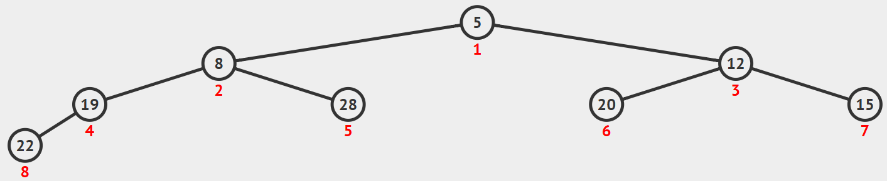

# DS-2025-14

> ⚠️ **本题不是已确认的真实考场题面。** 原始回忆资料缺失/为编者替代，以下内容为来源文章中的人为构造或替代练习（`reconstructed: true`），不计入历史考频与考纲覆盖统计。

## 1. 原题

**14、** 如图所示，有一个小根堆，当插入 $3$ 后，小根堆经过调整后为____________________。

回忆版无图，人为构造该图



> 订正说明转录：题面原文注明"回忆版无图，人为构造该图"——回忆版未保留考场原图，本图（含结点值与位置）由**编者为使题目可解而人为构造**，结点旁的红色数字 $1\sim 8$ 为堆的顺序存储下标。

**编者构造图的转录（按图中红色下标 $1\sim 8$ 逐位抄录）**：

| 下标 | 1 | 2 | 3 | 4 | 5 | 6 | 7 | 8 |
|---|---|---|---|---|---|---|---|---|
| 关键字 | $5$ | $8$ | $12$ | $19$ | $28$ | $20$ | $15$ | $22$ |

对应完全二叉树形态：根 $5$；$5$ 的左、右孩子为 $8$、$12$；$8$ 的孩子为 $19$、$28$；$12$ 的孩子为 $20$、$15$；$19$ 的左孩子为 $22$。该形态满足小根堆性质（每个结点 $\le$ 其孩子）。

## 2. 答案

插入 $3$ 并调整后，小根堆为（按数组下标 $1\sim 9$ 的层序写法）：

$$3,\;5,\;12,\;8,\;28,\;20,\;15,\;22,\;19$$

树形表示（结点旁括注数组下标）：

```
              (1)3
           /        \
       (2)5          (3)12
        /   \         /    \
    (4)8   (5)28  (6)20  (7)15
     /   \
  (8)22 (9)19
```

（下标 $8,9$ 均为下标 $4$ 结点 $8$ 的孩子：$22$ 为左、$19$ 为右；$22$ 是原堆中下标 $8$ 的老位置，未参与交换。）

## 3. 题目分析

- 已知：一个含 $8$ 个结点的小根堆（顺序存储，下标 $1\sim 8$，形态为完全二叉树）；待插入关键字 $3$；
- 目标：给出"插入 + 调整"之后的堆；
- 关键约束（口径）：
  1. **插入位置**只能是完全二叉树的下一个空位，即下标 $9$（无选择余地，这是堆与一般二叉搜索树的根本区别）；
  2. **调整方向只能是"上浮"**（`ShiftUp`/`HeapAdjust` 自下而上）：新元素只可能与"它到根的路径上的双亲"发生序性冲突，与兄弟子树无关，故不需要像建堆那样向下筛选；
  3. 小根堆语义：双亲 $\le$ 孩子，堆顶最小；
- 命题意图：考堆的**插入操作三要素**——末尾放、$\lfloor i/2\rfloor$ 找双亲、比双亲小就交换并继续，属于 DS06.07 的过程模拟层；同时用"小根堆"检验考生是否只会背"大根堆建堆"。

## 4. 核心考点

核心考点：
DS06.07 堆与堆排序（堆的定义、插入新元素后的自下而上调整）

辅助考点：
DS03.02.01 二叉树的定义及主要特征——堆是**完全二叉树**，插入位置由"层序编号连续"唯一决定；
DS03.02.02 二叉树的存储结构（顺序存储）——下标 $i$ 的双亲是 $\lfloor i/2\rfloor$、孩子为 $2i$ 与 $2i+1$，图中红色编号正是在提示这一映射

解释：本题不涉排序，只用堆的"动态插入"半边，因此归 DS06.07（考纲中堆仅出现在堆排序节下，见交叉横断说明）；能否做对取决于顺序存储下标映射是否熟练，故列两条辅助考点。

## 5. 解题思路

1. **先确认给出的图确实是小根堆**（逐条检查 $5\le8,12$；$8\le19,28$；$12\le20,15$；$19\le22$）——若题面图本身不满足堆序，则说明构造图与"小根堆"表述冲突，须先声明；本题核对通过；
2. **定插入位置**：$8$ 个结点的完全二叉树，下一个空位是下标 $9$（即结点 $22$ 的左兄弟位置，父为下标 $4$ 的 $19$）；
3. **沿双亲链上浮**：比较 $a[9]=3$ 与 $a[4]=19$ → 交换；再比较 $a[4]=3$ 与 $a[2]=8$ → 交换；再比较 $a[2]=3$ 与 $a[1]=5$ → 交换；到达下标 $1$ 停止；
4. **写结果并回验**：把最终数组按 $i=1..9$ 检查 $a[i]\le a[2i]$、$a[i]\le a[2i+1]$（存在孩子时）全部成立才算对；
5. 顺手记录"上浮路径 $9\to4\to2\to1$"，这是卷面能体现过程的关键，只写最终数组不写过程会丢步骤分。

## 6. 详细解答

### 第一步：插入

堆中已有 $8$ 个元素，$3$ 放到下标 $9$（层序最末位置，即结点 $19$ 的左孩子）：

| 下标 | 1 | 2 | 3 | 4 | 5 | 6 | 7 | 8 | 9 |
|---|---|---|---|---|---|---|---|---|---|
| 关键字 | $5$ | $8$ | $12$ | $19$ | $28$ | $20$ | $15$ | $22$ | $3$ |

此时只有可能违反"$a[4]=19 > a[9]=3$"，其余位置未动，堆序性仍成立 ⟹ 只需自下而上调整。

### 第二步：上浮（`while (i>1 && a[i] < a[i/2]) swap`）

双亲下标 $=\lfloor i/2\rfloor$。

| 轮 | 比较 | 结果 | 数组（下标 1…9） |
|---|---|---|---|
| 初始 | — | — | $5,8,12,19,28,20,15,22,\mathbf{3}$ |
| ① | $a[9]=3$ 与 $a[4]=19$ | $3<19$，交换（$i:9\to4$） | $5,8,12,\mathbf{3},28,20,15,22,19$ |
| ② | $a[4]=3$ 与 $a[2]=8$ | $3<8$，交换（$i:4\to2$） | $5,\mathbf{3},12,8,28,20,15,22,19$ |
| ③ | $a[2]=3$ 与 $a[1]=5$ | $3<5$，交换（$i:2\to1$） | $\mathbf{3},5,12,8,28,20,15,22,19$ |
| ④ | $i=1$ 已是堆顶 | 停止 | $3,5,12,8,28,20,15,22,19$ |

### 第三步：结果堆序性回验（逐结点）

| 下标 $i$ | 关键字 | 左孩子 $2i$ | 右孩子 $2i+1$ | 检查 |
|---|---|---|---|---|
| 1 | $3$ | $5$ | $12$ | $3\le5,12$ ✓ |
| 2 | $5$ | $8$ | $28$ | $5\le8,28$ ✓ |
| 3 | $12$ | $20$ | $15$ | $12\le20,15$ ✓ |
| 4 | $8$ | $19$ | — | $8\le19$ ✓ |
| 5 | $28$ | — | — | 叶 ✓ |
| 6 | $20$ | — | — | 叶 ✓ |
| 7 | $15$ | — | — | 叶 ✓ |
| 8 | $22$ | — | — | 叶 ✓ |
| 9 | $19$ | — | — | 叶 ✓ |

全部满足小根堆性质，且结点总数 $9$、下标 $1\sim 9$ 连续（仍是完全二叉树）✓

**最终答案**：$3,5,12,8,28,20,15,22,19$；树形为

```
              (1)3
           /        \
       (2)5          (3)12
        /   \         /    \
    (4)8   (5)28  (6)20  (7)15
     /   \
  (8)22 (9)19
```

父子关系由 $\lfloor i/2\rfloor$ 完全决定：$22$（下标 $8$）与 $19$（下标 $9$）**同为下标 $4$ 的结点 $8$ 的孩子**（左、右），$19$ 正是从下标 $9$ 逐层上浮、把一路上的 $8$、$5$ 依次下移后停在的位置，而 $22$ 从未移动。

### 补充：若按"下标从 0 开始"的存储约定

部分教材/实现用 $0\sim 8$ 存这 $9$ 个元素，双亲为 $\lfloor(i-1)/2\rfloor$。此时数组为 `3,5,12,8,28,20,15,22,19`，**序列与上表完全相同**，仅下标编号平移，不影响答案。

## 7. 选项分析

不适用（填空题）。

## 8. 考场标准答案

$3$ 插入到完全二叉树末尾（下标 $9$），沿双亲链 $\lfloor i/2\rfloor$ 上浮：

$$5,8,12,19,28,20,15,22,\underline{3}\to 5,8,12,\underline{3},28,20,15,22,19\to 5,\underline{3},12,8,28,20,15,22,19\to \underline{3},5,12,8,28,20,15,22,19$$

$$\boxed{3,\;5,\;12,\;8,\;28,\;20,\;15,\;22,\;19}$$

（交换了 $3$ 次，上浮路径 $9\to4\to2\to1$；调整后堆顶为 $3$。）

## 9. 易错点

1. **插入位置放错**：把 $3$ 插到"下标 $4$ 的右孩子（下标 $9$ 位置写成 $19$ 的右孩子）"之外的位置，或插到树中间再调整——堆的插入必须放在层序最后一个空位，否则破坏完全二叉树形态；
2. **调整方向做反**：对新元素作"向下筛选"（与子树比较交换），这是**删除堆顶**时的操作，插入只能向上；
3. **只上浮一层就停**：$3$ 与 $19$ 交换后停在 $i=4$，得 $5,8,12,3,28,20,15,22,19$——错，必须一路比到堆顶或"不比双亲小"为止（本题 $3$ 一路换到了根）；
4. **把小根堆当大根堆**：若按"比双亲大就交换"，$3$ 一次都不会交换，得 $5,8,12,3,\dots$ 的假堆；
5. **忘记双亲下标用 $\lfloor i/2\rfloor$ 而写成 $i/2$ 向上取整**：$i=9$ 时误取双亲为下标 $5$（结点 $28$），换错对象；
6. 画图时把下标 $8,9$ 的父子关系丢掉或错挂：两者都是下标 $4$ 结点 $8$ 的孩子（$22$ 左、$19$ 右），不是 $22$ 的孩子。

## 10. 一句话规律

堆的插入只有三步：**末尾放、$\lfloor i/2\rfloor$ 找爹、比爹小（大根堆则比爹大）就换，换到根或不再违反为止**；交换次数 $=\lfloor\log_2 n\rfloor$ 量级，最多 $O(\log n)$。

## 11. 关联知识

- DS06.07：与"插入"对偶的另一半操作是**删除堆顶**（取 $a[1]$ 后用 $a[n]$ 回填并向下筛选），本库 2022 年"建堆/各趟调整"类题即考向下筛选，两者方向相反，不可混用；
- DS03.02.02：顺序存储的下标映射 $i\leftrightarrow 2i,2i+1,\lfloor i/2\rfloor$ 是本类题的唯一计算工具，图中红色编号正是该映射的呈现；
- DS02.07：堆作为**优先队列**的实现，其入队操作即本题的"插入 + 上浮"，时间 $O(\log n)$；
- 排序应用：反复"取堆顶 + 用末尾回填 + 下沉"即堆排序的选列阶段（升序配大根堆、降序配小根堆）。

## 12. 来源与可信度

- 原题来源：2025 回忆版题面篇 `真题/2025/2025重庆邮电大学802数据结构真题.md` 二、填空题第 14 题；题面自带备注"回忆版无图，人为构造该图"；
- **构造说明与统计口径**：`fig1.png` 中的堆（$5,8,12,19,28,20,15,22$ 及结点位置）**是编者为使本题可解而人为构造的，不是真实考场图**，原卷图中究竟有哪些关键字、形态如何均无法核实。因此本文件 front matter 置 `reconstructed: true`，该题**不计入真题知识点频率统计**（与 `reports/disputed_questions.md` 中 DS-2025-14 条目一致）；解析本身按构造图正常作答，方法（插入 + 上浮）与真实原题一致，可迁移性不受影响；
- 图像判读：已完整读取 `真题/2025/imgs/fig1.png`，结点值与红色下标一一对应抄录于第 1 节表格；判读结果自洽（该形态确为合法小根堆），故未出现"构造图与题面文字冲突"的情形；
- 答案来源：独立推导——按"末尾插入 + 沿 $\lfloor i/2\rfloor$ 上浮"逐步执行得 $3,5,12,8,28,20,15,22,19$，并对全部 $9$ 个位置逐条回验堆序性；未编写程序；未抓取解析篇网页，仅登记其地址备查；
- 教材依据：严蔚敏、吴伟民《数据结构（C 语言版）》9.7 堆排序（堆的定义、`Heap` 插入与调整过程）、6.2.1 二叉树的顺序存储；
- 多来源冲突：无（构造图唯一确定答案）；争议：无实质争议，但**题面数据非考场原图**这一事实已在第 1、12 节双处声明，`ocr_confidence` 记为 low、`solution_status` 记为 derived（结论仅由独立推导得出，无法用"原卷真图"作第二来源交叉验证）；
- 最终可信度：方法 high；具体数值序列 medium（依赖构造图）。
