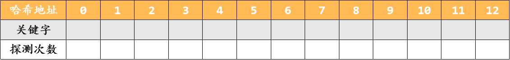

# DS-2025-16

## 1. 原题

**16、** 设散列表为 $HT[0 \cdots 12]$，即表的大小为 $m=13$。现采用双散列法解决冲突。散列函数和再散列函数分别为：

$$H_0(key)=key \% 13$$

$$H_i=(H_{i-1}+(reverse(key)+1) \% 11 +1) \% 13$$

其中 $reverse(x)$ 是将 $x$ 逆置，如：$reverse(789)=987$。

（1）若输入的关键码为 $2,8,31,20,70,59,25,28$，请画出插入这 $8$ 个关键码后得到的散列表。

（2）计算查找成功的平均查找长度 $ASL$。

（本题无订正说明；`fig2.png` 为试卷给出的待填表格，形如"哈希地址 $0\sim12$ / 关键字 / 探测次数"三行，本解析按该表格格式作答。）

## 2. 答案

**（1）插入 8 个关键码后的散列表**

| 哈希地址 | 0 | 1 | 2 | 3 | 4 | 5 | 6 | 7 | 8 | 9 | 10 | 11 | 12 |
|---|---|---|---|---|---|---|---|---|---|---|---|---|---|
| 关键字 | | $70$ | $2$ | $59$ | | $31$ | | $20$ | $8$ | $28$ | | | $25$ |
| 探测次数 | | $2$ | $1$ | $2$ | | $1$ | | $1$ | $1$ | $2$ | | | $1$ |

**（2）** $ASL_{成功}=\dfrac{1\times5+2\times3}{8}=\dfrac{11}{8}=1.375$（5 个关键码一次命中，70、59、28 各探测 2 次）。

## 3. 题目分析

- 已知：表长 $m=13$（下标 $0\sim12$）；初象 $H_0(key)=key\bmod 13$；冲突时按 $H_i=(H_{i-1}+s)\bmod 13$ 递推，步长 $s=((reverse(key)+1)\bmod 11)+1$ **只与关键字有关、探测过程中保持不变**（这正是"双散列/再散列函数法"区别于线性探测 $d_i=1,2,\cdots$ 与二次探测的关键）；插入次序即题给 $2,8,31,20,70,59,25,28$；
- 目标：填出终表 + 每个关键码的探测次数，并求查找成功的 $ASL$；
- 约束与口径：
  1. $reverse(x)$ 按十进制位逆置，末尾的 $0$ 逆置后成为前导零而消失：$reverse(20)=02=2$、$reverse(70)=07=7$（题面例子 $reverse(789)=987$ 未涉及尾零，此为本解析采用的自然数字口径，并在第 6 节验证该口径不影响结果）；
  2. 探测次数按"比较次数"计：首次落在 $H_0$ 记 $1$ 次，每多探一个地址加 $1$；
  3. 查找成功的 $ASL$ 以 $8$ 个已插入关键码为概率空间（各 $1/8$），与表长 $13$ 无关；
- 命题意图：考双散列探测序列的**机械执行 + 步长公式求值**，并要求把过程量（探测次数）沉淀为 $ASL$。与 DS-2023-19 同为"双散列"考法，但本题数据不出现探测成环，表形唯一确定。

## 4. 核心考点

核心考点：
DS05.06.02 散列表构造与 ASL 计算（按给定探测方式逐关键码插入、以探测次数计 $ASL_{成功}$）

辅助考点：
DS05.06.01 散列函数与冲突处理方法（双散列法 $H_i=(H_{i-1}+H_2(key))\bmod m$ 的递推形式与步长恒定性）
DS05.01 查找的基本概念（平均查找长度的定义、成功与失败两种口径的区别）

解释：题目分值全花在"算对每个落位"上，故主考点是构造与 ASL 计算；而"步长在探测中不变"这一双散列的本质属性属 DS05.06.01，是判卷区分点；$ASL$ 的定义本身归 DS05.01。

## 5. 解题思路

1. **先做一张"三列表"**：对 8 个关键码分别算 $H_0=key\bmod13$、$reverse(key)$、步长 $s=((reverse+1)\bmod11)+1$。把原料一次算齐，避免边插边算出错；
2. **按题给次序逐个插入**：$H_0$ 空则放（探测 $1$ 次）；否则反复 $H_i=(H_{i-1}+s)\bmod13$ 直到遇空（每探一次计数 $+1$）；
3. **冲突只发生在 $H_0$ 上**：本题只有 $70,59,28$ 三个关键码冲突，且都只需再探一次，故不存在成环风险（与 DS-2023-19 的"探测环耗尽"情形不同，无需兜底口径）；
4. **回代核对**：终表中每个非空单元的关键字必须满足"$H_0$ 或某次递推可达"，且空单元数 $=13-8=5$；
5. **算 ASL**：分子取"各关键码探测次数之和"（直接从表格"探测次数"行读取，不重新推导），分母取 $8$。

## 6. 详细解答

### 第一步：算齐原料

| 关键码 $key$ | $reverse(key)$ | $H_0=key\bmod13$ | $(reverse+1)\bmod11$ | 步长 $s$ |
|---|---|---|---|---|
| $2$ | $2$ | $2$ | $3$ | $4$ |
| $8$ | $8$ | $8$ | $9$ | $10$ |
| $31$ | $13$ | $31-26=5$ | $14\bmod11=3$ | $4$ |
| $20$ | $02=2$ | $20-13=7$ | $3$ | $4$ |
| $70$ | $07=7$ | $70-65=5$ | $8$ | $9$ |
| $59$ | $95$ | $59-52=7$ | $96\bmod11=8$ | $9$ |
| $25$ | $52$ | $25-13=12$ | $53\bmod11=9$ | $10$ |
| $28$ | $82$ | $28-26=2$ | $83\bmod11=6$ | $7$ |

（$11$ 取模是因为步长要落在 $0\sim10$，再 $+1$ 使 $s\in[1,11]$，保证 $s\ne0$——步长为 $0$ 会原地死循环，这是 $+1$ 的作用。）

### 第二步：按序插入

1. **$2$**：$H_0=2$，空 ⟹ 放地址 $2$，探测 $1$ 次；
2. **$8$**：$H_0=8$，空 ⟹ 地址 $8$，探测 $1$ 次；
3. **$31$**：$H_0=5$，空 ⟹ 地址 $5$，探测 $1$ 次；
4. **$20$**：$H_0=7$，空 ⟹ 地址 $7$，探测 $1$ 次；
5. **$70$**：$H_0=5$，已被 $31$ 占 ⟹ $H_1=(5+9)\bmod13=14\bmod13=1$，空 ⟹ 地址 $1$，探测 $2$ 次；
6. **$59$**：$H_0=7$，已被 $20$ 占 ⟹ $H_1=(7+9)\bmod13=16\bmod13=3$，空 ⟹ 地址 $3$，探测 $2$ 次；
7. **$25$**：$H_0=12$，空 ⟹ 地址 $12$，探测 $1$ 次；
8. **$28$**：$H_0=2$，已被 $2$ 占 ⟹ $H_1=(2+7)\bmod13=9$，空 ⟹ 地址 $9$，探测 $2$ 次。

终表：

| 哈希地址 | 0 | 1 | 2 | 3 | 4 | 5 | 6 | 7 | 8 | 9 | 10 | 11 | 12 |
|---|---|---|---|---|---|---|---|---|---|---|---|---|---|
| 关键字 | | $70$ | $2$ | $59$ | | $31$ | | $20$ | $8$ | $28$ | | | $25$ |
| 探测次数 | | $2$ | $1$ | $2$ | | $1$ | | $1$ | $1$ | $2$ | | | $1$ |

### 第三步：回代核对（第二方法）

- **非空单元数** $=8$ ✓ 与关键码个数一致；空单元 $0,4,6,10,11$ 共 $5$ 个，$8+5=13$ ✓；
- **逐格反查**：$70$ 在 $1$：$H_0(70)=5$、$5+9=14\equiv1\pmod{13}$ ✓；$59$ 在 $3$：$7+9=16\equiv3$ ✓；$28$ 在 $9$：$2+7=9$ ✓；其余 $5$ 个关键码均落在自己的 $H_0$ 上（$2,8,31,20,25$ 的 $H_0$ 分别是 $2,8,5,7,12$）✓；
- **无"抢占"现象**：每个冲突关键码的第二次探测即命中空位，探测序列没有交叉覆盖，故终表由题面公式**唯一确定**；
- **尾零口径敏感性检验**：若把 $reverse(20)$ 解释为 $2$（前导零消失，本解析采用）或保留为字符串 "$02$"（数值仍是 $2$），$20$ 均在 $H_0=7$ 一次命中、根本不用步长；$reverse(70)$ 同理（$7$ 或 $07$ 数值相同），故两种读法给出的终表与 $ASL$ 完全一致，本题不受该歧义影响。

### 第四步：查找成功的 ASL

$$ASL_{成功}=\frac{1}{8}\sum_{i=1}^{8}C_i=\frac{1+1+1+1+2+2+1+2}{8}=\frac{11}{8}=1.375$$

其中 $C_i$ 即表格"探测次数"行的值（按插入次序对应 $2,8,31,20,70,59,25,28$）。

**补充（题未问，用于对照口径）**：查找失败的 ASL 需按 $H_0$ 的 $13$ 个取值（或 $11$ 个区间，取决于教材口径）统计"探测到空单元为止"的次数，比成功口径多算一次"撞到空位"的判定，本题不要求，卷面不必写。

## 7. 选项分析

不适用（综合应用题——作表与计算题）。

## 8. 考场标准答案

**(1)** 先列原料表（$H_0$ 与步长 $s$），再按 $2,8,31,20,70,59,25,28$ 次序插入，得

| 哈希地址 | 0 | 1 | 2 | 3 | 4 | 5 | 6 | 7 | 8 | 9 | 10 | 11 | 12 |
|---|---|---|---|---|---|---|---|---|---|---|---|---|---|
| 关键字 | | $70$ | $2$ | $59$ | | $31$ | | $20$ | $8$ | $28$ | | | $25$ |
| 探测次数 | | $2$ | $1$ | $2$ | | $1$ | | $1$ | $1$ | $2$ | | | $1$ |

冲突处理过程（卷面须写）：$H_0(70)=5$（占）$\to H_1=(5+9)\bmod13=1$；$H_0(59)=7$（占）$\to H_1=(7+9)\bmod13=3$；$H_0(28)=2$（占）$\to H_1=(2+7)\bmod13=9$。

**(2)** $ASL_{成功}=\dfrac{11}{8}=1.375$。

## 9. 易错点

1. **把步长写成随探测次数变化**（如误用线性探测 $+1,+2,+3$ 或 $H_i=(H_0+i\cdot s)$ 中把 $s$ 也乘 $i$）：双散列的 $s$ 由关键字唯一决定、探测中恒定，递推式 $H_i=(H_{i-1}+s)\bmod m$ 与通项 $H_i=(H_0+i\cdot s)\bmod m$ 等价，但与线性探测不等价；
2. **$reverse$ 算错**：$reverse(31)=13$、$reverse(59)=95$、$reverse(25)=52$、$reverse(28)=82$ 是两位数的**整体倒序**，不是"个位与十位相加"之类的误读；
3. **$\bmod 11$ 与 $\bmod 13$ 混用**：步长取模用 $11$，地址取模用 $13$，两处模数不同（$(reverse+1)\bmod 11$ 后 $+1$ 得 $s\in[1,11]$，再与地址相加后 $\bmod 13$）；
4. **忘记外层还要 $\bmod 13$**：$H_1=(5+9)=14$ 必须回绕成 $1$，写成"地址 $14$ 越界"或漏掉回绕即全错；
5. **$ASL$ 分母取表长 $13$**：查找成功的 $ASL$ 分母是**记录个数 $8$**，表长 $13$ 只用于失败口径；
6. **探测次数少算一次**：首次落位也算 $1$ 次比较，冲突后再探 $1$ 次应记 $2$（不是 $1$）；
7. 插入次序被打乱（如按关键码大小排序后插入）：散列表构造与**输入次序有关**，必须按题给次序。

## 10. 一句话规律

双散列题的通用解法：**先做一张"$H_0$、步长 $s$"原料表，再按输入次序递推 $H_i=(H_{i-1}+s)\bmod m$，把每个关键码的探测次数写进表格最后一行**——$ASL_{成功}$ 就是把那一行求和除以记录数，无需重算。

## 11. 关联知识

- DS05.06.01：双散列（再散列函数法）的探测增量为 $d_i=i\cdot H_2(key)$，与线性探测 $d_i=i$、二次探测 $d_i=i^2,-i^2$ 并列；其优点是消除"一次聚集（同义词堆积）"，代价是探测完整性依赖 $\gcd(s,m)=1$（本库 DS-2023-19 因 $\gcd(6,10)=2$ 出现探测成环，本题 $m=13$ 为素数且 $s\le11<13$，故 $\gcd(s,13)=1$ 恒成立，探测序列必能遍历全表，不存在放不进去的关键码）；
- DS05.01：$ASL$ 的成功/失败口径差异，失败口径按"查找区间 + 表长"计，通常大于成功口径；
- DS05.06.02：装填因子 $\alpha=8/13\approx0.62$，本题冲突仅 $3$ 次、每次 $1$ 步即解，与 $\alpha$ 较低相符——装填因子越大冲突越多，这是本类题的"结论解释器"；
- 与本库 DS-2023-19（$m=10$、双散列、探测成环）、DS-2019-26 与 DS-2021-28（线性探测建表与 $ASL$）、DS-2018-28（线性探测与链地址法对比）构成“散列构造”题组，可对照三种探测法的差别；冲突与同义关键字的定义见 DS-2015-35。

## 12. 来源与可信度

- 原题来源：2025 回忆版题面篇 `真题/2025/2025重庆邮电大学802数据结构真题.md` 三、综合应用题第 16 题；`真题/2025/imgs/fig2.png` 已完整读取，为试卷原生的待填表格（三行：哈希地址 $0\sim12$、关键字、探测次数），本解析第 2、6、8 节均按该表格式作答；题面无订正说明；
- 答案来源：独立推导——逐关键码计算 $H_0$、$reverse$、步长 $s$ 并递推落位；另以"逐格反查探测公式 + 非空单元数 $8$/空单元数 $5$ + 尾零口径敏感性检验"三项复核（后台另用脚本按同一公式模拟插入，结果与本解析表格逐项一致）；未抓取解析篇网页，仅登记其地址备查；
- 教材依据：严蔚敏、吴伟民《数据结构（C 语言版）》8.6 散列表（散列函数、处理冲突的双散列/再散列函数法、平均查找长度计算）；
- 多来源冲突：无；争议：无（唯一潜在歧义 $reverse(20),reverse(70)$ 的尾零处理已在第 6 节第三步证明不影响结果）；
- 最终可信度：high。
