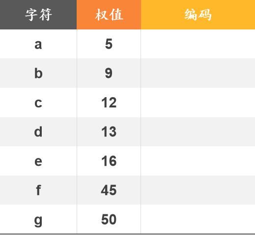

# DS-2025-17

## 1. 原题

**17、** 给定字符 $a$ 到 $g$，它们的权值分别如下：$\color{red}{a:5,b:9,c:12,d:13,e:16,f:45,g:50}$

（1）请根据给定的字符及其对应的权值，使用哈夫曼编码算法构建一棵哈夫曼树。要求在每次合并两个结点时，确保左结点的权值小于等于右结点的权值。

（2）根据哈夫曼树的结构，写成每个字符的哈夫曼编码，要求左结点为 $0$，右结点为 $1$，填出下表中的对应编码。



（本题无订正说明；`fig3.png` 为试卷给出的待填表，两列表头为"字符 / 权值"，第三列为"编码"，行依次是 $a:5$、$b:9$、$c:12$、$d:13$、$e:16$、$f:45$、$g:50$。）

## 2. 答案

**（1）哈夫曼树**（结点标"权值"，叶结点标字符；左 $\le$ 右）

```
                         [150]
                    /            \
               [55]               [95]
             /     \            /      \
         [25]     [30]       f:45     g:50
         /  \     /   \
     c:12  d:13 [14]  e:16
                /   \
             a:5    b:9
```

**（2）哈夫曼编码表**

| 字符 | 权值 | 编码 | 码长 |
|---|---|---|---|
| $a$ | $5$ | $0100$ | $4$ |
| $b$ | $9$ | $0101$ | $4$ |
| $c$ | $12$ | $000$ | $3$ |
| $d$ | $13$ | $001$ | $3$ |
| $e$ | $16$ | $011$ | $3$ |
| $f$ | $45$ | $10$ | $2$ |
| $g$ | $50$ | $11$ | $2$ |

带权路径长度 $WPL=369$；树共 $13$ 个结点（$7$ 个叶、$6$ 个度为 $2$ 的分枝结点，无度为 $1$ 的结点）。

## 3. 题目分析

- 已知：$7$ 个字符及其权值 $5,9,12,13,16,45,50$；
- 目标：(1) 构造哈夫曼树；(2) 按"左 $0$ 右 $1$"读出各字符前缀码；
- 关键约束（题面已明确的口径）：
  1. **每次取权值最小的两棵树合并**（哈夫曼算法的贪心选择）；
  2. **左结点权值 $\le$ 右结点权值**（题面强制，决定同层左右次序）；
  3. **左分支记 $0$、右分支记 $1$**（题面强制，决定编码的具体 0/1 形态）；
- 需要自行约定的口径：当"最小两棵"中存在权值相同的候选（本题合并过程中出现同为 $14$ 的新结点与 $12,13$ 等并存的情况）时，本解析按"先产生的结点视为较小/靠左"的稳定次序处理；同时**同一层内左右子树交换、或 $0/1$ 定义整体互换**都会得到不同的编码串，但 $WPL$ 与码长分布不变——这是本题的"答案不唯一但指标唯一"之处；
- 命题意图：考哈夫曼算法的**贪心执行 + 编码读取**，并用"左 $\le$ 右""左 $0$ 右 $1$"两条硬约束把形态与编码压成唯一，便于阅卷；隐含的自检工具是 $WPL$ 的两种算法。

## 4. 核心考点

核心考点：
DS03.04.01 哈夫曼树与哈夫曼编码（贪心合并构造、$WPL$ 计算、前缀编码的读取）

辅助考点：
DS03.01 树的基本概念（路径与路径长度按"层数"计、$n$ 个叶的哈夫曼树共 $2n-1$ 个结点且无度为 $1$ 的结点）

解释：构造与编码是 DS03.04.01 的核心动作；而"结点总数 $2n-1$"、"路径长度 $=$ 所在层数（根为第 $1$ 层时路径长 $=$ 层数 $-\,0$，本题按分支数计码长）"这类结构性核对属 DS03.01 的概念层，是本题自查的手段而非考查目标。

## 5. 解题思路

1. **把权值写成有序表**，每轮从表头取两个最小值合并，把和**插回有序位置**——用"始终保持升序"的写法比每次全表扫描更不易错；
2. 每轮记录：取出的两棵、新结点权、剩余集合（第 6 节的表就是这张过程表，卷面必须写，否则 (1) 问无步骤分）；
3. **合并时执行"左 $\le$ 右"**：先取出的（较小者）作左孩子，后取出的作右孩子；
4. 树成后**自根向下标 0/1**（左 $0$ 右 $1$），到叶的路径串即编码；
5. **用两条独立公式核对 $WPL$**：① $\sum$ 叶权 × 码长；② $\sum$ 全部分枝结点（内部结点）的权。两值相等才说明树形与码长读得一致；
6. 结构核对：叶数 $7$ ⟹ 总结点 $2\times7-1=13$；权最小的 $a,b$ 码长最长（$4$），权最大的 $f,g$ 码长最短（$2$）——"权大码短"是哈夫曼树的必然性质，若读出相反结果说明树形有误。

## 6. 详细解答

### 第一步：(1) 贪心合并过程

初始森林（按权升序）：$5(a),\;9(b),\;12(c),\;13(d),\;16(e),\;45(f),\;50(g)$

| 轮 | 取出的两棵（左 $\le$ 右） | 新结点权 | 合并后剩余集合（升序） |
|---|---|---|---|
| ① | $5(a)$、$9(b)$ | $14$ | $12(c),\,13(d),\,14,\,16(e),\,45(f),\,50(g)$ |
| ② | $12(c)$、$13(d)$ | $25$ | $14,\,16(e),\,25,\,45(f),\,50(g)$ |
| ③ | $14$、$16(e)$ | $30$ | $25,\,30,\,45(f),\,50(g)$ |
| ④ | $25$、$30$ | $55$ | $45(f),\,50(g),\,55$ |
| ⑤ | $45(f)$、$50(g)$ | $95$ | $55,\,95$ |
| ⑥ | $55$、$95$ | $150$ | $150$（仅剩一棵，结束） |

每轮均满足"左结点权 $\le$ 右结点权"：$5\le9$、$12\le13$、$14\le16$、$25\le30$、$45\le50$、$55\le95$ ✓

**父子关系表**（由上表自顶向下还原；根为第 $1$ 层，路径长度 $=$ 分支数 $=$ 层数 $-\,1$）：

| 结点 | 权 | 左孩子 | 右孩子 | 所在层 | 路径长度（码长） |
|---|---|---|---|---|---|
| 根 | $150$ | $55$ | $95$ | $1$ | — |
| $55$ | $55$ | $25$ | $30$ | $2$ | — |
| $95$ | $95$ | $f(45)$ | $g(50)$ | $2$ | — |
| $25$ | $25$ | $c(12)$ | $d(13)$ | $3$ | — |
| $30$ | $30$ | $14$ | $e(16)$ | $3$ | — |
| $14$ | $14$ | $a(5)$ | $b(9)$ | $4$ | — |
| 叶 $f$ | $45$ | 无 | 无 | $3$ | $2$ |
| 叶 $g$ | $50$ | 无 | 无 | $3$ | $2$ |
| 叶 $c$ | $12$ | 无 | 无 | $4$ | $3$ |
| 叶 $d$ | $13$ | 无 | 无 | $4$ | $3$ |
| 叶 $e$ | $16$ | 无 | 无 | $4$ | $3$ |
| 叶 $a$ | $5$ | 无 | 无 | $5$ | $4$ |
| 叶 $b$ | $9$ | 无 | 无 | $5$ | $4$ |

```
                         [150]
                    /            \
               [55]               [95]
             /     \            /      \
         [25]     [30]       f:45     g:50
         /  \     /   \
     c:12  d:13 [14]  e:16
                /   \
             a:5    b:9
```

**结构核对**：分枝结点 $6$ 个（$14,25,30,55,95,150$）$+$ 叶 $7$ 个 $=13=2\times7-1$ ✓；每个分枝结点度数都是 $2$，无度为 $1$ 的结点 ✓（哈夫曼树必有此性质）。

### 第二步：(2) 读编码（左分支记 0、右分支记 1）

自根向每个叶写路径串：

- $c$：$150\xrightarrow{0}55\xrightarrow{0}25\xrightarrow{0}c$ ⟹ $000$
- $d$：$150\xrightarrow{0}55\xrightarrow{0}25\xrightarrow{1}d$ ⟹ $001$
- $a$：$150\xrightarrow{0}55\xrightarrow{1}30\xrightarrow{0}14\xrightarrow{0}a$ ⟹ $0100$
- $b$：$150\xrightarrow{0}55\xrightarrow{1}30\xrightarrow{0}14\xrightarrow{1}b$ ⟹ $0101$
- $e$：$150\xrightarrow{0}55\xrightarrow{1}30\xrightarrow{1}e$ ⟹ $011$
- $f$：$150\xrightarrow{1}95\xrightarrow{0}f$ ⟹ $10$
- $g$：$150\xrightarrow{1}95\xrightarrow{1}g$ ⟹ $11$

| 字符 | $a$ | $b$ | $c$ | $d$ | $e$ | $f$ | $g$ |
|---|---|---|---|---|---|---|---|
| 权值 | $5$ | $9$ | $12$ | $13$ | $16$ | $45$ | $50$ |
| 编码 | $0100$ | $0101$ | $000$ | $001$ | $011$ | $10$ | $11$ |

**前缀性质核对**：码长集合 $\{4,4,3,3,3,2,2\}$，任一编码都不是另一编码的前缀（$00$ 不是任何码；$000,001$ 互不前缀；$01$ 非码字、$011$ 与 $0100/0101$ 在第 3 位分岔；$10,11$ 同层分岔）✓ 满足前缀码要求。
**Kraft 不等式核对**：$\sum 2^{-l_i}=2\times2^{-4}+3\times2^{-3}+2\times2^{-2}=\tfrac18+\tfrac38+\tfrac12=1$ ✓（哈夫曼树是**正则二叉树**——每个分枝结点恰有两个孩子，故 Kraft 等号必恰好成立；若算出 $<1$ 或 $>1$ 说明码长读错）。

### 第三步：WPL 的双法核对

**法一（叶权 × 码长）**：
$$WPL=5\times4+9\times4+12\times3+13\times3+16\times3+45\times2+50\times2$$
$$=20+36+36+39+48+90+100=369$$

**法二（全部分枝结点权之和）**：
$$WPL=14+25+30+55+95+150=369$$

两法一致 ✓（法二的原理：每个叶的权被它到根路径上的每个分枝结点各统计一次，恰等于"权 × 路径长"）。

### 第四步：编码唯一性说明（口径声明）

题面用"左 $\le$ 右"和"左 $0$ 右 $1$"两条约束把答案钉死，本解析严格照此执行。仍需知道：
- 本题六轮取出的两棵子树权值**互不相等**（$5<9$、$12<13$、$14<16$、$25<30$、$45<50$、$55<95$），且每轮"全局最小两棵"的选取也不存在并列候选，故在"左 $\le$ 右"规则下哈夫曼树形态**唯一**（若出现等权并列，则需按"新生成的结点视为靠后"等约定破平，编码串会变但 $WPL$ 与码长分布不变）；
- 若把 $0/1$ 规定整体互换（左 $1$ 右 $0$），得 $a{:}1011$、$b{:}1010$、$c{:}111$、$d{:}110$、$e{:}100$、$f{:}01$、$g{:}00$，同样是正确的哈夫曼编码——但题面已明定"左结点为 $0$、右结点为 $1$"，卷面必须按本解析写法书写。

## 7. 选项分析

不适用（综合应用题——构造与填表题）。

## 8. 考场标准答案

**(1)** 合并过程（每轮取两棵最小、左 $\le$ 右）：

$$(5,9)\!\to\!14,\quad(12,13)\!\to\!25,\quad(14,16)\!\to\!30,\quad(25,30)\!\to\!55,\quad(45,50)\!\to\!95,\quad(55,95)\!\to\!150$$

```
                         [150]
                    /            \
               [55]               [95]
             /     \            /      \
         [25]     [30]       f:45     g:50
         /  \     /   \
     c:12  d:13 [14]  e:16
                /   \
             a:5    b:9
```

$WPL=369$（$=$ 分枝结点权之和 $14+25+30+55+95+150$）。

**(2)** 编码（左 $0$ 右 $1$）：

| 字符 | 权值 | 编码 |
|---|---|---|
| $a$ | $5$ | $0100$ |
| $b$ | $9$ | $0101$ |
| $c$ | $12$ | $000$ |
| $d$ | $13$ | $001$ |
| $e$ | $16$ | $011$ |
| $f$ | $45$ | $10$ |
| $g$ | $50$ | $11$ |

## 9. 易错点

1. **合并时未保持"每轮取全局最小两棵"**：例如第 ④ 轮若误取 $45,50$（当时它们确实存在，但 $25,30$ 更小），树形即错，$WPL$ 会偏大（$>369$）——算完用法二核对即可发现；
2. **左右次序违反"左 $\le$ 右"**：第 ③ 轮 $14$ 与 $16$ 合并时把 $16$ 放左、$14$ 放右，会使 $e$ 的编码变 $010$、$a,b$ 变 $0110/0111$，与题面规则不符；
3. **把新结点当成叶再参与读码**：$14,25,30,55,95$ 是分枝结点，没有编码；
4. **把码长数成"层数"而不是分支数**：$c$ 在第 $4$ 层、路径长度（码长）是 $3$；$a$ 在第 $5$ 层、码长 $4$。若把层数直接当码长，$WPL$ 会整体多算 $\sum w_i=150$（得 $519$），双法核对时立即能发现；
5. **忘写 $WPL$ 或只写一个数不写过程**：$WPL$ 是本题的实质校验量，双法各算一次最省时间；
6. **编码不满足前缀性质**：把 $a$ 误写成 $010$（与 $e=011$ 同层但少一位）会造成译码歧义，写完务必逐条查"谁是谁的前缀"。

## 10. 一句话规律

哈夫曼题的通用套路：**权值排成升序表 → 每轮吃掉头两个、把和插回有序位 → 树成后自根标 0/1 读码 → 用"$\sum$ 叶权×码长 $=\sum$ 分枝结点权"双法核对 $WPL$"**；权大码短、权小码长是判断树形对错的第一直觉。

## 11. 关联知识

- DS03.04.01：哈夫曼树是 $n$ 个带权叶的最优二叉树，$n$ 个叶 ⟹ $2n-1$ 个结点、$n-1$ 次合并，本题 $n=7$、合并 $6$ 次、结点 $13$ 个；
- DS03.04.01（编码应用）：$m$ 个字符的哈夫曼编码是前缀码，译码时"从根出发按位下行到叶即出一个字符"，本题码长 $2\sim4$，$f,g$（合计权 $95$，约占总权 $\tfrac{95}{150}\approx63\%$）只用 $2$ 位，压缩效果最明显；
- DS03.01：路径长度按分支数计，与 DS-2025-08（哈夫曼树 $199$ 个结点求叶子数，用 $n=2n_0-1$ 得 $n_0=100$）共用"$n$ 叶 $=2n-1$ 结点"这一结构性质；
- DS06.07：哈夫曼构造中"反复取最小两棵"若用**优先队列（小根堆）**实现，每次取最小 $O(\log n)$，总时间 $O(n\log n)$，是堆作为优先队列的典型应用；
- 与本库 DS-2025-15（BST 定形后作图、线索化、转森林）同属"按规则机械作图并自校验"的题型，两题对照练习可覆盖三、综合应用题的作图类要求；

## 12. 来源与可信度

- 原题来源：2025 回忆版题面篇 `真题/2025/2025重庆邮电大学802数据结构真题.md` 三、综合应用题第 17 题；权值 $a{:}5,b{:}9,c{:}12,d{:}13,e{:}16,f{:}45,g{:}50$ 在正文中以红字列出，逐字转录；`真题/2025/imgs/fig3.png` 已完整读取，为试卷给出的"字符 / 权值 / 编码"三列待填表，行序与本解析一致；题面无订正说明；
- 答案来源：独立推导——按"每轮取两棵最小 + 左 $\le$ 右"完成 $6$ 轮合并，自根读取得码；$WPL$ 用"叶权 × 码长"与"分枝结点权之和"两种独立方法计算，均为 $369$；另核对结点数 $13=2\times7-1$、前缀性质与 Kraft 不等式；后台另以最小堆模拟同一贪心过程，编码表与本解析逐字符一致；未抓取解析篇网页，仅登记其地址备查；
- 教材依据：严蔚敏、吴伟民《数据结构（C 语言版）》6.7 哈夫曼树及哈夫曼编码（构造步骤、WPL 定义、前缀编码规定"左 0 右 1"）；
- 多来源冲突：无；争议：无（哈夫曼树在"左 $\le$ 右"约束下形态唯一，各轮取出的两棵权值互不相等，不存在等权并列引起的形态分歧；若阅卷采用 $0/1$ 互换的编码，属同一答案的等价写法，已在第 6 节第四步声明）；
- 最终可信度：high。
