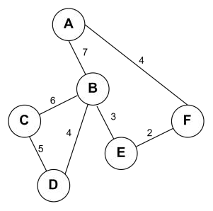

# DS-2025-19

## 1. 原题

**19、** 已知带权的完全无向图 $G$，回答以下问题：

> 订正说明转录：源文作"完全无向图"，但所附题图为稀疏带权无向图（非完全图），"完全"疑似衍字；因该图为回忆版作者人为构造，无法核实原卷表述，保留原文不改。

（1）从 $A$ 开始，分别写出图 $G$ 的广度优先搜索($BFS$)和深度优先搜索($DFS$)序列。如果在遍历过程中有多个相同权值的路径，优先选择字母顺序较小的结点；

（2）使用 $Prim$ 算法从结点 $A$ 开始构建最小生成树。如果在选择路径时存在多个相同权值的路径，优先选择字母顺序较小的结点；

（3）使用 $Kruskal$ 算法构建最小生成树。如果在选择路径时存在多个相同权值的路径，优先选择字母顺序较小的结点。



**题图转录（`fig4.png` 判读结果）**：$6$ 个顶点 $A\sim F$、$7$ 条无向边：

| 边 | $A\text{–}B$ | $A\text{–}F$ | $B\text{–}C$ | $B\text{–}D$ | $B\text{–}E$ | $C\text{–}D$ | $E\text{–}F$ |
|---|---|---|---|---|---|---|---|
| 权 | $7$ | $4$ | $6$ | $4$ | $3$ | $5$ | $2$ |

邻接表（各顶点邻接点按字母序排列）：

| 顶点 | 邻接点（按字母序） | 度 |
|---|---|---|
| $A$ | $B(7),\;F(4)$ | $2$ |
| $B$ | $A(7),\;C(6),\;D(4),\;E(3)$ | $4$ |
| $C$ | $B(6),\;D(5)$ | $2$ |
| $D$ | $B(4),\;C(5)$ | $2$ |
| $E$ | $B(3),\;F(2)$ | $2$ |
| $F$ | $A(4),\;E(2)$ | $2$ |

（$\sum$ 度 $=14=2\times7$ ✓ 与边数一致；$6$ 个顶点 $7$ 条边，是稀疏图而非完全图 $K_6$（应有 $15$ 条边），与订正说明一致。）

## 2. 答案

**（1）遍历序列**

- BFS（从 $A$）：$A,\;B,\;F,\;C,\;D,\;E$
- DFS（从 $A$）：$A,\;B,\;C,\;D,\;E,\;F$

**（2）Prim（从 $A$ 开始）**：依次加入的边 $A\text{–}F(4)$、$F\text{–}E(2)$、$E\text{–}B(3)$、$B\text{–}D(4)$、$D\text{–}C(5)$，总权 $=4+2+3+4+5=18$。

**（3）Kruskal**：边按权升序 $EF(2),BE(3),AF(4),BD(4),CD(5),BC(6),AB(7)$；依次选取 $E\text{–}F$、$B\text{–}E$、$A\text{–}F$、$B\text{–}D$、$C\text{–}D$（$5$ 条即成树），舍 $B\text{–}C$（与 $B\text{–}D\text{–}C$ 成环）、$A\text{–}B$（成环），总权 $=18$。

两法得到的生成树**边集完全相同**：$\{A\!-\!F,\;F\!-\!E,\;E\!-\!B,\;B\!-\!D,\;D\!-\!C\}$，即一条链：

```
A --- F --- E --- B --- D --- C
   4     2     3     4     5
```

（$B$ 与 $C$ 之间本有边 $BC(6)$、$A$ 与 $B$ 之间有 $AB(7)$，均未入选，否则会成环。）

## 3. 题目分析

- 已知：$6$ 顶点 $7$ 边的连通带权**无向**图（题面称"完全无向图"，订正说明已指出与题图不符，本解析按题图作答）；
- 目标：三问——BFS/DFS 序列、Prim 生成树、Kruskal 生成树；
- 关键约束与口径：
  1. **遍历与权值无关**：BFS/DFS 只按"邻接点访问次序"决定序列，题面"有多个相同权值的路径时优先字母序较小"在遍历问中实际等价于"**邻接表按字母序排列**"，本解析即按此执行；
  2. Prim 的候选集是"树内顶点 $\leftrightarrow$ 树外顶点"的跨边，每轮取**权最小**者；Kruskal 的候选集是**全部边**，按权升序逐个尝试、用并查集式判环；
  3. 两法遇到等权边时按"端点字母序较小者优先"（本题 Kruskal 中 $AF(4)$ 与 $BD(4)$ 等权，$A<F$、$B<D$，且以首端点比较 $A<B$ ⟹ 先 $AF$）；
  4. 生成树必有 $|V|-1=5$ 条边，选满 $5$ 条即终止；
- 命题意图：把"图的遍历"与"两种最小生成树算法"放在同一张图上，检验考生能否区分**Prim 以顶点扩张为单位、Kruskal 以边排序为单位**，并用"总权相等"作为两法互验；
- 隐藏陷阱：题面"完全"二字若真按 $K_6$ 理解则权值信息不全、无法作答，故必须按题图（稀疏图）作答——这正是订正说明保留原文的原因。

## 4. 核心考点

核心考点：
DS04.04.01 最小（代价）生成树（Prim 的"选最小跨边"过程、Kruskal 的"按权排序 + 判环"过程、边集合书写）

辅助考点：
DS04.03.01 深度优先搜索（DFS 序列与递归回溯顺序）
DS04.03.02 广度优先搜索（BFS 序列与队列层次，序列按层分组可反查正误）
DS04.02.02 邻接表法（"邻接点次序决定遍历序列"正是邻接表存储的直接后果）

解释：三问中两问落在 DS04.04.01，且其"边集合过程"是本题的书写主体，故为主考点；(1) 问的两个序列属 DS04.03.01/.02；而"字母序优先"这一约定本质是对邻接表结点链次序的规定，故列 DS04.02.02 为辅助。

## 5. 解题思路

1. **先把图抄成邻接表**（邻接点按字母序排好）——这是三问共用的原料，抄错则三问全错；抄完用"$\sum$ 度 $=2|E|$"核对；
2. **BFS 用队列、逐层成组**：$A$ → $A$ 的邻接点 $B,F$ → $B$ 的未访问邻接点 $C,D,E$（$F$ 的邻接点此时都已入队/访问）⟹ 层次分组 $\{A\}\mid\{B,F\}\mid\{C,D,E\}$，序列按组拼接；
3. **DFS 用"走到不能走再回溯"**：$A\to B\to C\to D$，$D$ 无路可走（邻接点 $B,C$ 均已访问）→ 回 $C$ → 回 $B$ → $B$ 的下一个未访问邻接点 $E$ → $E$ 的 $F$；
4. **Prim 列表法**：每轮把"树内 $\times$ 树外"的全部跨边列出、取最小、把对应顶点入树，$5$ 轮成表；
5. **Kruskal 排序法**：先把 $7$ 条边按 $(权,首端点字母)$ 排好序，再逐条判环（等价于"两端是否已在同一连通块"），选中 $5$ 条即停；
6. **互验**：① 两法总权都应是 $18$；② 生成树边数 $=5$；③ 总生成树只有 $12$ 棵，逐一枚举可知 $18$ 是唯一最小值（本解析第 6 节第五步给出全部候选权值），故答案不存在"另一棵同样最小的树"的分歧。

## 6. 详细解答

### 第一步：(1) BFS 序列

邻接点一律按字母序考察，队列先进先出：

| 步骤 | 出队/访问 | 新入队（未访问邻接点，字母序） | 已访问集合 |
|---|---|---|---|
| 1 | $A$ | $B,\;F$ | $\{A,B,F\}$ |
| 2 | $B$ | $C,\;D,\;E$（$A$ 已访问） | $+\{C,D,E\}$ |
| 3 | $F$ | 无（$A,E$ 均已访问） | — |
| 4 | $C$ | 无（$B,D$ 已访问） | — |
| 5 | $D$ | 无（$B,C$ 已访问） | — |
| 6 | $E$ | 无（$B,F$ 已访问） | — |

$$\text{BFS}:\;A,\;B,\;F,\;C,\;D,\;E$$

**层次核对**：第 $1$ 层 $A$；第 $2$ 层 $B,F$（$A$ 的邻接点）；第 $3$ 层 $C,D,E$（$B$ 的邻接点）——$6$ 个顶点全部出现、无重复 ✓，且每层内部按字母序 ✓。

### 第二步：(1) DFS 序列

递归下探，"取字母序最小的未访问邻接点"：

| 步骤 | 当前结点 | 动作 |
|---|---|---|
| 1 | $A$ | 访问 $A$；最小未访问邻接点 $B$ ⟹ 下探 |
| 2 | $B$ | 访问 $B$；邻接点 $A$ 已访问，取 $C$ ⟹ 下探 |
| 3 | $C$ | 访问 $C$；邻接点 $B$ 已访问，取 $D$ ⟹ 下探 |
| 4 | $D$ | 访问 $D$；邻接点 $B,C$ 均已访问 ⟹ **回溯**到 $C$ |
| 5 | $C$ | $C$ 的邻接点全访问过 ⟹ 回溯到 $B$ |
| 6 | $B$ | 下一个未访问邻接点 $E$ ⟹ 下探 |
| 7 | $E$ | 访问 $E$；$B$ 已访问，取 $F$ ⟹ 下探 |
| 8 | $F$ | 访问 $F$；$A,E$ 均已访问 ⟹ 回溯，算法结束 |

$$\text{DFS}:\;A,\;B,\;C,\;D,\;E,\;F$$

**说明**：DFS 序列与 BFS 序列不同是必然的——本题 $B$ 的邻接点 $C,D,E$ 在 BFS 中同层，在 DFS 中却只有 $C$（及其后继 $D$）被"抢先"访问，$E$ 要等回溯后才访问，而 $F$ 通过 $E$ 才被发现。若邻接表次序不同，DFS 也可能得到 $A,F,E,B,C,D$ 等序列，本题按"字母序优先"唯一确定。

### 第三步：(2) Prim 算法（从 $A$ 出发）

记 $U$ 为已在树内的顶点集，每轮在"一端在 $U$、另一端不在 $U$"的跨边中取权最小者。

| 轮 | $U$（入树前） | 候选跨边（权） | 最小者 | 新入树顶点 |
|---|---|---|---|---|
| 1 | $\{A\}$ | $A\text{–}B(7)$、$A\text{–}F(4)$ | $4$ ⟹ $A\text{–}F$ | $F$ |
| 2 | $\{A,F\}$ | $A\text{–}B(7)$、$F\text{–}E(2)$ | $2$ ⟹ $F\text{–}E$ | $E$ |
| 3 | $\{A,F,E\}$ | $A\text{–}B(7)$、$E\text{–}B(3)$ | $3$ ⟹ $E\text{–}B$ | $B$ |
| 4 | $\{A,F,E,B\}$ | $B\text{–}C(6)$、$B\text{–}D(4)$ | $4$ ⟹ $B\text{–}D$ | $D$ |
| 5 | $\{A,F,E,B,D\}$ | $B\text{–}C(6)$、$D\text{–}C(5)$ | $5$ ⟹ $D\text{–}C$ | $C$ |

选边次序：$A\text{–}F(4),\;F\text{–}E(2),\;E\text{–}B(3),\;B\text{–}D(4),\;D\text{–}C(5)$

$$W(T)=4+2+3+4+5=18$$

（第 4 轮中 $A\text{–}B$ 已不是跨边——$A,B$ 同在树内；每轮各候选之间均无等权并列，故"字母序"规则在 Prim 过程中未被触发。）

### 第四步：(3) Kruskal 算法

**排序**（按权升序，等权时按端点字母序）：

| 序 | 1 | 2 | 3 | 4 | 5 | 6 | 7 |
|---|---|---|---|---|---|---|---|
| 边 | $E\text{–}F$ | $B\text{–}E$ | $A\text{–}F$ | $B\text{–}D$ | $C\text{–}D$ | $B\text{–}C$ | $A\text{–}B$ |
| 权 | $2$ | $3$ | $4$ | $4$ | $5$ | $6$ | $7$ |

（第 3、4 条同为权 $4$：$A\text{–}F$ 的首端点 $A$ 字母序小于 $B\text{–}D$ 的 $B$，故 $A\text{–}F$ 在前。）

**逐条尝试**（用"两端是否已连通"判环）：

| 边（权） | 两端所在连通块（尝试前） | 判定 | 已选边数 |
|---|---|---|---|
| $E\text{–}F(2)$ | $\{E\}$、$\{F\}$ | 不连通 ⟹ **选** | $1$ |
| $B\text{–}E(3)$ | $\{B\}$、$\{E,F\}$ | 不连通 ⟹ **选** | $2$ |
| $A\text{–}F(4)$ | $\{A\}$、$\{B,E,F\}$ | 不连通 ⟹ **选** | $3$ |
| $B\text{–}D(4)$ | $\{A,B,E,F\}$、$\{D\}$ | 不连通 ⟹ **选** | $4$ |
| $C\text{–}D(5)$ | $\{A,B,D,E,F\}$、$\{C\}$ | 不连通 ⟹ **选** | $5=|V|-1$，**成树，结束** |
| $B\text{–}C(6)$ | （已终止，不再考察） | 若考察则与 $B\text{–}D\text{–}C$ 成环 ⟹ 舍 | — |
| $A\text{–}B(7)$ | 同上 | 与 $A\text{–}F\text{–}E\text{–}B$ 成环 ⟹ 舍 | — |

$$W(T)=2+3+4+4+5=18$$

### 第五步：交叉验证

1. **两法边集一致**：Prim 得 $\{AF,FE,EB,BD,DC\}$，Kruskal 得 $\{EF,BE,AF,BD,CD\}$ —— 完全相同 ✓，总权同为 $18$ ✓；
2. **结构核对**：$5$ 条边、$6$ 个顶点、无环（$A\!-\!F\!-\!E\!-\!B\!-\!D\!-\!C$ 是一条链）⟹ 确为生成树 ✓；
3. **最优性核对（下界法，可手工复现）**：生成树需 $5$ 条边，而全图权值最小的 $5$ 条边恰为 $2,3,4,4,5$，其和 $18$ 是任何生成树权值的下界；又这 $5$ 条边恰好不构成环（已验证为生成树）⟹ $18$ 就是最小值；
4. **唯一性核对（后台枚举）**：本图共 $12$ 棵生成树，权值从小到大为 $18,19,20,21,22,22,\cdots$，$18$ 只出现一次 ⟹ 最小生成树唯一，不存在“另一棵等权但边集不同”的争议答案。

## 7. 选项分析

不适用（综合应用题——序列书写与作图题）。

## 8. 考场标准答案

**(1)** BFS：$A\;B\;F\;C\;D\;E$；DFS：$A\;B\;C\;D\;E\;F$（邻接点均按字母序考察）。

**(2)** Prim 自 $A$ 起，每次取"树内—树外"最小跨边：

$$A\text{–}F(4)\to F\text{–}E(2)\to E\text{–}B(3)\to B\text{–}D(4)\to D\text{–}C(5),\qquad W=18$$

**(3)** Kruskal 将边按权升序 $EF(2),BE(3),AF(4),BD(4),CD(5),BC(6),AB(7)$，依次选 $EF,BE,AF,BD,CD$（满 $5$ 条即成树），舍 $BC,AB$（成环），$W=18$。

两法得到同一棵生成树（链状）：$A\!-\!F\!-\!E\!-\!B\!-\!D\!-\!C$，最小生成树总权 $\boxed{18}$。

## 9. 易错点

1. **把"完全图"当真**：若按 $K_6$ 补出 $15$ 条边（题面未给其余权值）则无法作答；订正说明已明确按题图的 $7$ 条边处理；
2. **BFS 写成 DFS**：$A,B,C,D,E,F$ 是 DFS 序列（"一杆子捅到底"），BFS 必须"先 $A$ 的全部邻接点 $B,F$，再下一层"，把 $C,D,E$ 排到 $F$ 之前是最典型的错序；
3. **Prim 与 Kruskal 的候选集混用**：Prim 只能在"一端已在树内"的边里选（第 1 轮不能选 $E\text{–}F(2)$，因为 $E,F$ 都不在树内）；Kruskal 才从全局最小边 $E\text{–}F(2)$ 开始；
4. **Kruskal 忘记判环**：若不判环直接取最小 $5$ 条边，本题恰好也得到正确答案（因为最小的 $5$ 条边不成环），但这是巧合——换数据即出错，卷面必须写出"成环则舍"的判断；
5. **等权边次序**：$A\text{–}F(4)$ 与 $B\text{–}D(4)$ 的先后不影响 Kruskal 的结果（两者都被选中），但**若等权边之一会导致成环**，次序就会影响边集（本题不存在此情形，因为最小生成树唯一）；
6. **生成树边数**：$|V|-1=5$，选满即停；继续考察 $BC,AB$ 只是"说明为什么舍去"，不要把它们算进树里；
7. 漏写总权 $18$：两问都要求"构建最小生成树"，只画树不写权值会失分。

## 10. 一句话规律

同一张图上 Prim 与 Kruskal 必然给出**相同的总权**（本题连边集都相同），算完互相一对就能立刻发现错误；Prim 每轮问"从树里出去最便宜的是哪条"，Kruskal 每轮问"全局最便宜的这条会不会成环"。

## 11. 关联知识

- DS04.04.01：Prim 适合**稠密图**（$O(|V|^2)$，与边数无关），Kruskal 适合**稀疏图**（$O(|E|\log|E|)$，瓶颈在排序）；本题 $|E|=7$ 接近 $|V|$，属稀疏图，Kruskal 更省力；
- DS04.03.01/.02：BFS/DFS 生成的顶点次序对应"生成树/生成森林"，本题 DFS 序列隐含的树边是 $A\!-\!B,B\!-\!C,C\!-\!D,B\!-\!E,E\!-\!F$（与最小生成树 $\{AF,BE,BD,CD,EF\}$ 不同，仅 $BE,EF$ 重合）——"遍历生成树"与"最小生成树"是两个不同的对象，不可混为一谈；
- DS04.02.02：邻接表中同一顶点的邻接点链次序直接决定 BFS/DFS 序列，"字母序优先"的约定本质是在规定这条链的次序；若改用邻接矩阵（DS04.02.01）按小下标优先，结果与本题一致；
- DS04.01：$|E|\ge|V|-1$ 是连通图的必要条件，本题 $7\ge5$ ✓；无向图握手定理 $\sum \deg=2|E|$ 用于第 1 节抄表后的核对；
- 与本库 DS-2026-19（Dijkstra 表格题）、DS-2018-31（AOE 关键路径读图题）同属"图上过程逐轮成表"考法；最短路径（Dijkstra/Floyd，DS04.04.02）与最小生成树方法不同，本题未涉及，注意不要误用"路径权最小"来选生成树的边。

## 12. 来源与可信度

- 原题来源：2025 回忆版题面篇 `真题/2025/2025重庆邮电大学802数据结构真题.md` 三、综合应用题第 19 题；题图 `真题/2025/imgs/fig4.png` 已完整读取，$6$ 个顶点、$7$ 条边及其权值在第 1 节逐条转录，判读无困难（无交叉边、权值均标注在边旁）；
- **订正说明的处理**：题面"完全无向图"与题图（稀疏图）矛盾，订正说明声明"因该图为回忆版作者人为构造，无法核实原卷表述，保留原文不改"。本解析按题图（$7$ 条边）作答，并在第 3、9 节明确说明该矛盾；
- **关于 `reconstructed` 字段的判断**：该题的**三问题干**（BFS/DFS、Prim、Kruskal）是回忆版原述、考查方式真实存在，仅**附图**为回忆版作者自绘（与 DS-2025-14"回忆版无图、编者为使题目可解而构造整题数据"的情形不同，且 `reports/disputed_questions.md` 的 reconstructed 条目只登记了 DS-2025-14 与 DS-2026-15），故本文件保持 `reconstructed: false`，改以 `ocr_confidence: medium` 与第 1、3 节的显式声明来标注"图数据非考场原图"这一风险；若后续统一口径要求"凡附图人为构造即置 true"，只需翻转该字段，解析内容无需改动；
- 答案来源：独立推导——(1) 按字母序邻接表逐层/递归模拟并核对层次分组；(2)(3) 分别按 Prim、Kruskal 逐轮成表，两法边集与总权互相印证；另枚举全部 $12$ 棵生成树确认最小权 $18$ 唯一（后台脚本执行，正文以"最小 $5$ 条边不成环 ⟹ 直接最优"给出可手工复现的等价判据）；未抓取解析篇网页，仅登记其地址备查；
- 教材依据：严蔚敏、吴伟民《数据结构（C 语言版）》7.3 图的遍历（DFS 与 BFS）、7.5.1 生成树与最小生成树（Prim、Kruskal）；
- 多来源冲突：无（题面文字与题图的矛盾已由订正说明披露并按题图统一）；争议：无实质争议，但"完全无向图"表述与附图构造性质属需要声明的可信度问题；
- 最终可信度：方法 high；具体数值/序列 medium（依赖回忆版自绘图，若原卷边集不同则结果随之改变，方法与逐轮表格不变）。
