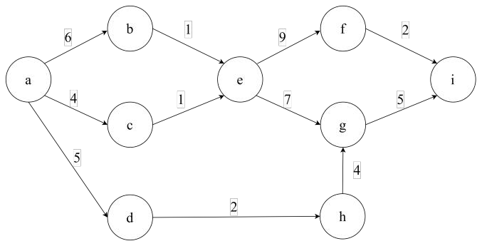

# DS-2025-20

## 1. 原题

**20、** 给定一个 $AOE$ 网，请回答以下问题：

（1）计算每个事件的最早发生时间($ve$)和最晚发生时间($vl$)；

（2）计算每个活动的最早开始时间($e$)和最迟开始时间($l$)；

（3）确定关键路径。

（本题无订正说明。）

**题图转录（`fig5.png` 判读结果）**：$9$ 个事件（顶点）$a\sim i$，源点 $a$（只有出弧）、汇点 $i$（只有入弧）；$11$ 条活动弧（权值为活动持续时间）：

| 活动 | $\langle a,b\rangle$ | $\langle a,c\rangle$ | $\langle a,d\rangle$ | $\langle b,e\rangle$ | $\langle c,e\rangle$ | $\langle d,h\rangle$ |
|---|---|---|---|---|---|---|
| 权 | $6$ | $4$ | $5$ | $1$ | $1$ | $2$ |

| 活动 | $\langle e,f\rangle$ | $\langle e,g\rangle$ | $\langle f,i\rangle$ | $\langle g,i\rangle$ | $\langle h,g\rangle$ | — |
|---|---|---|---|---|---|---|
| 权 | $9$ | $7$ | $2$ | $5$ | $4$ | — |

（图中 $d\to h$ 为底部水平弧、$h\to g$ 为竖直向上弧，$e\to g$ 与 $h\to g$ 同时汇入 $g$；各顶点入度/出度核对：$\sum$ 入度 $=\sum$ 出度 $=11$ ✓，源点 $a$ 入度 $0$、汇点 $i$ 出度 $0$ ✓，无弧交叉，判读无歧义。）

活动编号按题面"每个活动"约定，取弧的列出次序：$a_1\langle a,b\rangle$、$a_2\langle a,c\rangle$、$a_3\langle a,d\rangle$、$a_4\langle b,e\rangle$、$a_5\langle c,e\rangle$、$a_6\langle d,h\rangle$、$a_7\langle e,f\rangle$、$a_8\langle e,g\rangle$、$a_9\langle f,i\rangle$、$a_{10}\langle g,i\rangle$、$a_{11}\langle h,g\rangle$。

## 2. 答案

**（1）各事件的 $ve$ 与 $vl$**（工期 $T=ve(i)=19$）：

| 事件 | $a$ | $b$ | $c$ | $d$ | $e$ | $f$ | $g$ | $h$ | $i$ |
|---|---|---|---|---|---|---|---|---|---|
| $ve$ | $0$ | $6$ | $4$ | $5$ | $7$ | $16$ | $14$ | $7$ | $19$ |
| $vl$ | $0$ | $6$ | $6$ | $8$ | $7$ | $17$ | $14$ | $10$ | $19$ |

**（2）各活动的 $e$ 与 $l$**：

| 活动 | 弧 | 权 | $e$ | $l$ | $l-e$ | 关键活动 |
|---|---|---|---|---|---|---|
| $a_1$ | $\langle a,b\rangle$ | $6$ | $0$ | $0$ | $0$ | **是** |
| $a_2$ | $\langle a,c\rangle$ | $4$ | $0$ | $2$ | $2$ | 否 |
| $a_3$ | $\langle a,d\rangle$ | $5$ | $0$ | $3$ | $3$ | 否 |
| $a_4$ | $\langle b,e\rangle$ | $1$ | $6$ | $6$ | $0$ | **是** |
| $a_5$ | $\langle c,e\rangle$ | $1$ | $4$ | $6$ | $2$ | 否 |
| $a_6$ | $\langle d,h\rangle$ | $2$ | $5$ | $8$ | $3$ | 否 |
| $a_7$ | $\langle e,f\rangle$ | $9$ | $7$ | $8$ | $1$ | 否 |
| $a_8$ | $\langle e,g\rangle$ | $7$ | $7$ | $7$ | $0$ | **是** |
| $a_9$ | $\langle f,i\rangle$ | $2$ | $16$ | $17$ | $1$ | 否 |
| $a_{10}$ | $\langle g,i\rangle$ | $5$ | $14$ | $14$ | $0$ | **是** |
| $a_{11}$ | $\langle h,g\rangle$ | $4$ | $7$ | $10$ | $3$ | 否 |

**（3）关键路径**：

$$a \to b \to e \to g \to i,\qquad 6+1+7+5=19$$

由 $4$ 个关键活动 $a_1,a_4,a_8,a_{10}$ 首尾相接而成，是唯一的一条关键路径，工程工期为 $19$。

## 3. 题目分析

- 已知：$9$ 个事件、$11$ 条活动弧的 $AOE$ 网（有向、无环，源点 $a$、汇点 $i$）；
- 目标：三问层层递进——事件参数 $ve/vl$ → 活动参数 $e/l$ → 关键路径；
- 关键约束与口径：
  1. $ve(\text{源})=0$；$ve(w)=\max\{ve(v)+w(v,w)\}$（**按拓扑序、取 max**，"最早发生"须等所有前置活动都完成）；
  2. $vl(\text{汇})=ve(\text{汇})=T$；$vl(v)=\min\{vl(w)-w(v,w)\}$（**按逆拓扑序、取 min**）；
  3. 活动 $a=\langle v,w\rangle$ 的 $e(a)=ve(v)$（挂在**尾**事件上）、$l(a)=vl(w)-w(a)$（挂在**头**事件上）——这两个公式的下标错位是本题最容易出错的地方；
  4. 关键活动判据 $e(a)=l(a)$（即余量 $l-e=0$）；关键路径 $=$ 从源到汇全部由关键活动串成的路径，其长度 $=T$；
  5. 一个事件是关键事件（$ve=vl$）不一定使它的每条入弧都是关键活动（如 $g$：$ve(g)=vl(g)=14$，但入弧 $a_{11}$ 余量为 $3$）；反之关键活动的两端必是关键事件；
- 命题意图：这是本库 DS04.04.04 的标准"全参数计算"考法（同型题见 DS-2018-31），三问分别对应"顶点表—弧表—路径结论"三个答题版面，考查递推方向（max/min、拓扑/逆拓扑）是否清楚；
- 图较小（$11$ 条弧），可完整列表，不存在 DS-2018-31 那样的读图歧义。

## 4. 核心考点

核心考点：
DS04.04.04 关键路径（$ve/vl$ 的双向递推、$e(a)=ve(\text{尾})$ 与 $l(a)=vl(\text{头})-w(a)$ 的换算、$e=l$ 判关键活动、关键活动首尾相接得关键路径、工期 $=ve(\text{汇})$）

辅助考点：
DS04.04.03 拓扑排序（$ve$ 必须按拓扑序递推、$vl$ 按逆拓扑序递推，本题拓扑序为 $a,b,c,d,e,h,f,g,i$）
DS04.02.02 邻接表法（$AOE$ 网在教材中以"边表结点含 adjvex 与 weight"的邻接表存储，逐弧列表即其手工形式）

解释：三问全部落在关键路径这一个知识点上，主考点唯一；但"按什么顺序算"这件事本质是拓扑排序（DS04.04.03），卷面若先写出拓扑序再算 $ve$，过程分更稳；弧表管理属存储结构层面，列为辅助。

## 5. 解题思路

1. **先抄弧集**（$11$ 条，一条不漏），并用 $\sum$ 入度 $=\sum$ 出度 $=$ 弧数自检；
2. **求拓扑序**：反复摘除入度为 $0$ 的顶点，得 $a,b,c,d,e,h,f,g,i$——它同时保证后面"求 $ve$ 时所有前驱已算完、求 $vl$ 时所有后继已算完"；
3. **正向求 $ve$（取 max）**：源点置 $0$，沿拓扑序逐个顶点把"$ve(\text{尾})+\text{权}$"送给各后继，后继取到当前值更大者才更新；汇点的 $ve$ 就是工期 $T$；
4. **反向求 $vl$（取 min）**：汇点置 $T$，按逆拓扑序逐个顶点用"$vl(\text{头})-\text{权}$"更新前驱，前驱取更小者；
5. **逐弧套公式**：对 $11$ 条弧各算 $e=ve(\text{尾})$、$l=vl(\text{头})-w$、余量 $l-e$，余量 $0$ 者标为关键活动；
6. **把关键活动连成路**：从 $a$ 出发沿关键活动走，能一路到 $i$ 的那条即关键路径；
7. **交叉验证**（两条独立校核，见第 6 节第五步）：① 关键路径长度必须等于 $T$；② 枚举全部 $5$ 条源汇路径取最长，最长者必须与第 (3) 问答案一致；③ 每个顶点若 $ve=vl$，则它至少处在一关键活动上（端点情形除外）。

## 6. 详细解答

### 第一步：求拓扑序

各顶点入度：$a:0,\ b:1,\ c:1,\ d:1,\ e:2,\ f:1,\ g:2,\ h:1,\ i:2$。

按"队列式 Kahn 算法、同时可选时取字母序最小"执行：

| 步骤 | 摘除顶点 | 删其出弧后的入度变化 | 队列内容（摘除后） |
|---|---|---|---|
| 1 | $a$ | $b:1\to0$，$c:1\to0$，$d:1\to0$ | $b,c,d$ |
| 2 | $b$ | $e:2\to1$ | $c,d$ |
| 3 | $c$ | $e:1\to0$（入队） | $d,e$ |
| 4 | $d$ | $h:1\to0$（入队） | $e,h$ |
| 5 | $e$ | $f:1\to0$（入队），$g:2\to1$ | $h,f$ |
| 6 | $h$ | $g:1\to0$（入队） | $f,g$ |
| 7 | $f$ | $i:2\to1$ | $g$ |
| 8 | $g$ | $i:1\to0$（入队） | $i$ |
| 9 | $i$ | — | 空，算法结束 |

$9$ 个顶点全部摘除 ⟹ 确为有向无环图，$AOE$ 网合法 ✓。

（第 3、4 步中 $c$ 与 $d$ 的次序可交换，拓扑序不唯一；本解析取 $a,b,c,d,e,h,f,g,i$，**$ve/vl$ 的结果与拓扑序的具体选择无关**，只要满足前驱先于后继即可。）

拓扑序列：$a,\ b,\ c,\ d,\ e,\ h,\ f,\ g,\ i$。

### 第二步：(1) 正向求 $ve$（按拓扑序、取 max）

| 顶点 | 计算式 | $ve$ |
|---|---|---|
| $a$ | 源点，规定 | $0$ |
| $b$ | $ve(a)+6=6$ | $6$ |
| $c$ | $ve(a)+4=4$ | $4$ |
| $d$ | $ve(a)+5=5$ | $5$ |
| $e$ | $\max\{ve(b)+1,\ ve(c)+1\}=\max\{7,5\}$ | $7$ |
| $h$ | $ve(d)+2=7$ | $7$ |
| $f$ | $ve(e)+9=16$ | $16$ |
| $g$ | $\max\{ve(e)+7,\ ve(h)+4\}=\max\{14,11\}$ | $14$ |
| $i$ | $\max\{ve(f)+2,\ ve(g)+5\}=\max\{18,19\}$ | $19$ |

$$T=ve(i)=19$$

（$e$ 处取 $\max$ 的含义：事件 $e$ 要等 $b\to e$ 与 $c\to e$ **都**完成，故被较慢的那条（经 $b$，$7$）卡住；$i$ 处 $19>18$ 说明关键路径走 $g$ 一侧。）

### 第三步：(1) 逆向求 $vl$（按逆拓扑序、取 min）

初值：$vl(i)=T=19$，其余置 $+\infty$，按 $i,g,f,h,e,d,c,b,a$ 回推：

| 顶点 | 计算式 | $vl$ |
|---|---|---|
| $i$ | 汇点，$=ve(i)$ | $19$ |
| $g$ | $vl(i)-5=14$ | $14$ |
| $f$ | $vl(i)-2=17$ | $17$ |
| $h$ | $vl(g)-4=10$ | $10$ |
| $e$ | $\min\{vl(f)-9,\ vl(g)-7\}=\min\{8,7\}$ | $7$ |
| $d$ | $vl(h)-2=8$ | $8$ |
| $c$ | $vl(e)-1=6$ | $6$ |
| $b$ | $vl(e)-1=6$ | $6$ |
| $a$ | $\min\{vl(b)-6,\ vl(c)-4,\ vl(d)-5\}=\min\{0,2,3\}$ | $0$ |

$vl(a)=0$ 与 $ve(a)=0$ 吻合 ✓（源点的 $vl$ 必为 $0$，这是回推过程最常见的自检点）。

**$ve$ 与 $vl$ 对照**（$ve=vl$ 者为关键事件）：

| 事件 | $a$ | $b$ | $c$ | $d$ | $e$ | $f$ | $g$ | $h$ | $i$ |
|---|---|---|---|---|---|---|---|---|---|
| $ve$ | $0$ | $6$ | $4$ | $5$ | $7$ | $16$ | $14$ | $7$ | $19$ |
| $vl$ | $0$ | $6$ | $6$ | $8$ | $7$ | $17$ | $14$ | $10$ | $19$ |
| $vl-ve$ | $0$ | $0$ | $2$ | $3$ | $0$ | $1$ | $0$ | $3$ | $0$ |

关键事件：$a,b,e,g,i$；非关键事件：$c,d,f,h$。

### 第四步：(2) 逐弧求 $e$ 与 $l$

公式：$e(a_k)=ve(\text{尾顶点})$，$l(a_k)=vl(\text{头顶点})-w(a_k)$。

| 活动 | 弧 | $w$ | $e=ve(\text{尾})$ | $l=vl(\text{头})-w$ | $l-e$ |
|---|---|---|---|---|---|
| $a_1$ | $\langle a,b\rangle$ | $6$ | $ve(a)=0$ | $vl(b)-6=6-6=0$ | $0$ ★ |
| $a_2$ | $\langle a,c\rangle$ | $4$ | $ve(a)=0$ | $vl(c)-4=6-4=2$ | $2$ |
| $a_3$ | $\langle a,d\rangle$ | $5$ | $ve(a)=0$ | $vl(d)-5=8-5=3$ | $3$ |
| $a_4$ | $\langle b,e\rangle$ | $1$ | $ve(b)=6$ | $vl(e)-1=7-1=6$ | $0$ ★ |
| $a_5$ | $\langle c,e\rangle$ | $1$ | $ve(c)=4$ | $vl(e)-1=7-1=6$ | $2$ |
| $a_6$ | $\langle d,h\rangle$ | $2$ | $ve(d)=5$ | $vl(h)-2=10-2=8$ | $3$ |
| $a_7$ | $\langle e,f\rangle$ | $9$ | $ve(e)=7$ | $vl(f)-9=17-9=8$ | $1$ |
| $a_8$ | $\langle e,g\rangle$ | $7$ | $ve(e)=7$ | $vl(g)-7=14-7=7$ | $0$ ★ |
| $a_9$ | $\langle f,i\rangle$ | $2$ | $ve(f)=16$ | $vl(i)-2=19-2=17$ | $1$ |
| $a_{10}$ | $\langle g,i\rangle$ | $5$ | $ve(g)=14$ | $vl(i)-5=19-5=14$ | $0$ ★ |
| $a_{11}$ | $\langle h,g\rangle$ | $4$ | $ve(h)=7$ | $vl(g)-4=14-4=10$ | $3$ |

关键活动 $4$ 条：$a_1,a_4,a_8,a_{10}$。

（注意 $a_7\langle e,f\rangle$ 与 $a_9\langle f,i\rangle$ 的余量都只有 $1$，路径 $a\to b\to e\to f\to i$ 长 $18$，只比关键路径短 $1$，$f$ 一侧极易被误判为关键，必须靠 $e\ne l$ 排除。）

### 第五步：(3) 关键路径与交叉验证

把 $4$ 条关键活动按端点串联：

$$a \xrightarrow{a_1(6)} b \xrightarrow{a_4(1)} e \xrightarrow{a_8(7)} g \xrightarrow{a_{10}(5)} i$$

长度 $=6+1+7+5=19=T$ ✓（关键路径长度必须等于工期，这是最硬的校核）。

**枚举全部源汇路径核对（第二方法）**：

| 路径 | 长度 |
|---|---|
| $a\to b\to e\to g\to i$ | $6+1+7+5=19$ ★ 最长 |
| $a\to b\to e\to f\to i$ | $6+1+9+2=18$ |
| $a\to c\to e\to g\to i$ | $4+1+7+5=17$ |
| $a\to c\to e\to f\to i$ | $4+1+9+2=16$ |
| $a\to d\to h\to g\to i$ | $5+2+4+5=16$ |

（$a$ 有 $3$ 条出弧，$e$ 有 $2$ 条入弧、$g$ 有 $2$ 条入弧，故源汇路径共 $2+2+1=5$ 条，与上表条数一致 ✓。）最长者为 $19$ 且**唯一**，与"关键活动串联"法结论一致 ⟹ 关键路径唯一。

**第三条校核**：非关键活动 $a_5\langle c,e\rangle$ 的余量 $l-e=2$，恰等于其尾事件 $c$ 的 $vl(c)-ve(c)=2$ ✓；而 $a_2\langle a,c\rangle$ 余量 $2$ 也等于 $c$ 的事件余量，说明"$c$ 这一支"整体被压缩 $2$ 个单位——两条弧的余量沿路径传递一致，符合 $e/l$ 定义。

## 7. 选项分析

不适用（综合应用题——参数计算与结论作图题）。

## 8. 考场标准答案

**(1)** 拓扑序 $a,b,c,d,e,h,f,g,i$；$ve$ 正向取 max、$vl$ 反向取 min（$vl(i)=ve(i)=19$）：

| 事件 | $a$ | $b$ | $c$ | $d$ | $e$ | $f$ | $g$ | $h$ | $i$ |
|---|---|---|---|---|---|---|---|---|---|
| $ve$ | $0$ | $6$ | $4$ | $5$ | $7$ | $16$ | $14$ | $7$ | $19$ |
| $vl$ | $0$ | $6$ | $6$ | $8$ | $7$ | $17$ | $14$ | $10$ | $19$ |

**(2）** $e(a_k)=ve(\text{尾})$、$l(a_k)=vl(\text{头})-w$：

$e$ 依次 $0,0,0,6,4,5,7,7,16,14,7$；$l$ 依次 $0,2,3,6,6,8,8,7,17,14,10$；余量 $l-e$ 依次 $0,2,3,0,2,3,1,0,1,0,3$。
关键活动：$a_1\langle a,b\rangle,\ a_4\langle b,e\rangle,\ a_8\langle e,g\rangle,\ a_{10}\langle g,i\rangle$。

**(3)** 关键路径 $\boxed{a\to b\to e\to g\to i}$，长度（工期）$\boxed{19}$，唯一。

## 9. 易错点

1. **$e$ 与 $l$ 的挂载顶点搞反**：$e(a)=ve(\text{尾})$ 用**起点**、$l(a)=vl(\text{头})-w$ 用**终点并要减去权**。若把 $l$ 也写成 $vl(\text{尾})$，则 $a_1$ 会算成 $0-6=-6$，一算就露馅，务必用"负余量不可能存在"来报警；
2. **$ve$ 取 max、$vl$ 取 min 记反**：$ve$ 是"等所有前驱都完成"⟹ 最大；$vl$ 是"不能耽误任何后继"⟹ 最小。记反后 $vl(a)$ 不会是 $0$，可用这一点自查；
3. **$vl$ 初值取 $0$ 而不是 $T$**：$vl(\text{汇})=ve(\text{汇})=19$，若取 $0$ 则整张 $vl$ 表全负；
4. **不按拓扑序算 $ve$**：例如先算 $g$ 再算 $h$，会把 $ve(g)$ 错写成 $11$（只用了 $h$ 一侧）；先写拓扑序再算，是最省事的防错手段；
5. **把"关键事件"当"关键活动"**：$g$ 是关键事件（$ve=vl=14$），但入弧 $a_{11}\langle h,g\rangle$ 余量 $3$，不是关键活动；判据只能落在 $e=l$ 上；
6. **漏掉"多入弧顶点"的另一支**：$e,f,g,i$ 中 $e,g,i$ 都是两条入弧，求 $ve$ 时必须两支都参与 $\max$；只算第一条入弧是本题最常见的数值错误（$ve(e)$ 若只用 $c$ 一侧得 $5$，后续 $ve(g)$ 变 $12$、工期变 $17$，一路错到底）；
7. **关键路径写成"路径上顶点最多"或"弧数最多"**：关键路径只看**权值和最大**，本题最长路径恰含 $4$ 条弧，而 $a\to d\to h\to g\to i$ 有 $4$ 条弧但长度只 $16$；
8. **忘记回答工期**：第 (3) 问"确定关键路径"应同时给出路径与长度 $19$（工期），只写顶点序列会扣分。

## 10. 一句话规律

关键路径三步走：**拓扑序上正向取 max 得 $ve$，逆拓扑序上反向取 min 得 $vl$，然后逐弧套"$e=ve(\text{尾})$、$l=vl(\text{头})-w$"，凡 $e=l$ 的弧串起来就是关键路径**；算完用"关键路径长度 $=$ 工期 $=ve(\text{汇})$"和"$vl(\text{源})=0$"两处各核一次。

## 11. 关联知识

- DS04.04.03 拓扑排序：$ve$ 的递推次序就是拓扑序，若图有环则拓扑排序不能完成、$ve/vl$ 无从定义（本库 DS-2014-19、DS-2023-15 练的正是"先拓扑再算时间"这一前置技能）；
- DS04.04.01/DS04.04.02：三者都叫"带权图上的贪心/递推"，但目标不同——最小生成树是"权和最小的**树**"（本库 DS-2025-19）、最短路径是"源到各点**路径**最短"（DS-2026-19）、关键路径是"源到汇**路径最长**"，"最长"与"最短"恰好相反，不可混用算法；
- DS04.02.02 邻接表：$AOE$ 网在程序中以带 `weight` 域的邻接表存储，求 $ve$ 即"沿出弧松弛取 max"，与拓扑排序（DS-2024-04 的 `count==vexnum` 判环）可在同一趟扫描中完成；
- AOV 与 AOE 的区别：AOV 网顶点表示活动、弧表示先后（DS04.04.03）；AOE 网**弧**表示活动、顶点表示事件，弧权是活动持续时间（本库 DS-2019-10、DS-2021-12 考过这两个概念的辨析）；
- 与本库 DS-2018-31（多关键路径、读图有歧义）与 DS-2020-11（同型 AOE 计算题）为同一考法；本题弧集清晰、关键路径唯一，可作为该知识点的基础范式。

## 12. 来源与可信度

- 原题来源：2025 回忆版题面篇 `真题/2025/2025重庆邮电大学802数据结构真题.md` 三、综合应用题第 20 题；题图 `真题/2025/imgs/fig5.png` 已完整读取，$9$ 个顶点、$11$ 条弧及其端点与权值在第 1 节逐条转录，图中无弧交叉、无被遮挡的权值，判读不存在歧义（与 DS-2018-31 的情形不同，本题无需列不确定项）；
- 本题**无订正说明**，题面三问文字完整，不涉及编者构造或替换，故 `reconstructed: false`；
- 答案来源：独立推导——按"拓扑序求 $ve$ → 逆拓扑序求 $vl$ → 逐弧算 $e/l$"三段式手工完成，并另用"枚举全部 $5$ 条源汇路径取最长"独立复核关键路径与工期，两法结论一致；同时核对 $vl(a)=0$、$\sum$ 入度 $=\sum$ 出度 $=11$、关键路径长度 $=ve(i)=19$ 三处结构不变式；未抓取解析篇网页，仅登记其地址备查；
- 教材依据：严蔚敏、吴伟民《数据结构（C 语言版）》7.5.3 关键路径（AOE 网、$ve/vl$、$e/l$、关键活动）；
- 多来源冲突：无。活动编号 $a_1\sim a_{11}$ 是本解析为书写表格所设的记号（题面只说"每个活动"，未给编号），若按其他次序编号，各行的 $e/l$ 数值不变，仅表中行序不同，不影响关键活动集合与关键路径；
- 最终可信度：high（方法与数值均由两条独立路径验证，图数据判读无歧义）。
