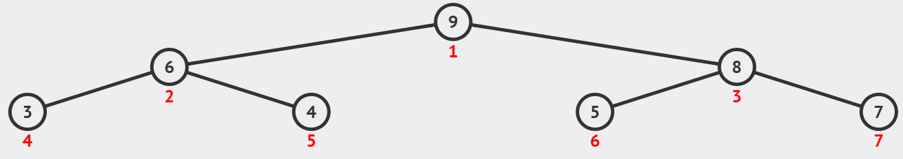

# DS-2026-15

> ⚠️ **本题不是已确认的真实考场题面。** 原始回忆资料缺失/为编者替代，以下内容为来源文章中的人为构造或替代练习（`reconstructed: true`），不计入历史考频与考纲覆盖统计。

## 1. 原题

**15、** 题型可参考 25 年第 14 题填空题回忆版

AI 生成类似题目：

给定一个大根堆 $[9,6,8,3,4,5,7]$ ，当插入元素 $10$ 后，大根堆经过调整后，需要的比较次数为____________________。



> 订正说明转录：卷面此处**无"订正说明"，而是编者构造备注**——原文写"题型可参考 25 年第 14 题填空题回忆版 / AI 生成类似题目"，即回忆版未保留 2026 考场该空的原题，本题面（含数据 $[9,6,8,3,4,5,7]$ 与插入元素 $10$）是**编者为复刻 DS-2025-14 的考查点而构造（AI 生成）的替换题**。

**`fig1.png` 的转录**（结点旁红色数字为堆的顺序存储下标 $1\sim 7$，与题面数组一致）：

| 下标 | 1 | 2 | 3 | 4 | 5 | 6 | 7 |
|---|---|---|---|---|---|---|---|
| 关键字 | $9$ | $6$ | $8$ | $3$ | $4$ | $5$ | $7$ |

对应完全二叉树形态：根 $9$；$9$ 的左右孩子 $6$、$8$；$6$ 的孩子 $3$、$4$；$8$ 的孩子 $5$、$7$。逐条检查"双亲 $\ge$ 孩子"：$9\ge 6,8$；$6\ge 3,4$；$8\ge 5,7$，确为合法**大根堆**，图与数组表述自洽。

## 2. 答案

比较次数 $=3$（同时交换 $3$ 次）；调整后的大根堆为

$$10,\;9,\;8,\;6,\;4,\;5,\;7,\;3$$

## 3. 题目分析

- 已知：含 $7$ 个元素的大根堆（顺序存储，下标 $1\sim 7$，形态为完全二叉树）；待插入关键字 $10$；
- 目标：给出"插入 + 调整"过程中**关键字比较的次数**（本题问的是次数，不是最终堆，但两者应在同一过程中一并写出）；
- 关键约束（口径）：
  1. 插入位置只能是层序最后一个空位，即下标 $8$（$=\lfloor 8/2 \rfloor = 4$ 号结点 $3$ 的左孩子），无选择余地；
  2. 调整方向只能**自下而上上浮**：新元素只可能与"它到根路径上的双亲"冲突，与兄弟子树无关，不需要向下筛选；
  3. 大根堆语义：双亲 $\ge$ 孩子，堆顶最大；
  4. "比较次数"按**关键字之间的比较**计数：每上浮一层比较一次双亲；循环条件里的下标判断（$i>1$）不计入；
- 命题意图：堆的动态插入三要素（末尾放、$\lfloor i/2\rfloor$ 找双亲、比双亲大就换）+ 过程计数。

## 4. 核心考点

核心考点：
DS06.07 堆与堆排序（堆的定义、插入新元素后的自下而上调整及其比较次数）

辅助考点：
DS03.02.01 二叉树的定义及主要特征——堆是完全二叉树，插入位置由"层序编号连续"唯一确定；
DS03.02.02 二叉树的存储结构（顺序存储）——下标 $i$ 的双亲为 $\lfloor i/2 \rfloor$，本题上浮路径 $8\to 4\to 2\to 1$ 完全由该映射决定

解释：本题不涉排序，只用堆的"动态插入"半边，按交叉横断说明归 DS06.07（考纲中堆仅出现在堆排序节下）；能否数对比较次数，取决于是否清楚"每层一次比较、到根即停"。

## 5. 解题思路

1. 先确认给出的数组确实满足大根堆性质（否则"插入后调整"的前提不成立，须先声明）——本题核对通过；
2. 定插入位置：$7$ 个结点的完全二叉树，下一个空位是下标 $8$；
3. 沿双亲链上浮并**逐次计数**：$a[8]=10$ 与 $a[4]=3$ 比 → 换；$a[4]=10$ 与 $a[2]=6$ 比 → 换；$a[2]=10$ 与 $a[1]=9$ 比 → 换；此时 $i=1$ 已是堆顶，**不再作关键字比较**即终止；
4. 记录比较次数 $3$、交换次数 $3$，并写出最终数组；
5. 回验：对最终数组逐结点检查 $a[i]\ge a[2i]$、$a[i]\ge a[2i+1]$（存在孩子时），并确认下标 $1\sim 8$ 连续（仍是完全二叉树）。

## 6. 详细解答

### 第一步：末尾插入

$$a[8]=10$$

| 下标 | 1 | 2 | 3 | 4 | 5 | 6 | 7 | 8 |
|---|---|---|---|---|---|---|---|---|
| 关键字 | $9$ | $6$ | $8$ | $3$ | $4$ | $5$ | $7$ | $\mathbf{10}$ |

插入只可能破坏"$a[4]=3$ 与 $a[8]=10$"这一条父子序性，其余位置未动 ⟹ 只需向上调整。

### 第二步：上浮（`while (i>1 && a[i] > a[i/2]) swap`，双亲 $=\lfloor i/2\rfloor$）

| 轮 | 比较（关键字比较计 1 次） | 结果 | 数组（下标 $1\sim 8$） |
|---|---|---|---|
| 初始 | — | — | $9,6,8,3,4,5,7,\mathbf{10}$ |
| ① | $a[8]=10$ 与 $a[4]=3$（第 $1$ 次） | $10>3$，交换，$i:8\to 4$ | $9,6,8,\mathbf{10},4,5,7,3$ |
| ② | $a[4]=10$ 与 $a[2]=6$（第 $2$ 次） | $10>6$，交换，$i:4\to 2$ | $9,\mathbf{10},8,6,4,5,7,3$ |
| ③ | $a[2]=10$ 与 $a[1]=9$（第 $3$ 次） | $10>9$，交换，$i:2\to 1$ | $\mathbf{10},9,8,6,4,5,7,3$ |
| ④ | $i=1$ 已到堆顶 | 仅下标判断，**不比较关键字**，终止 | $10,9,8,6,4,5,7,3$ |

上浮路径 $8\to 4\to 2\to 1$，**比较 $3$ 次、交换 $3$ 次**。

### 第三步：结果回验

| 下标 $i$ | 关键字 | 左孩子 $2i$ | 右孩子 $2i+1$ | 检查 |
|---|---|---|---|---|
| 1 | $10$ | $9$ | $8$ | $10\ge 9,8$ ✓ |
| 2 | $9$ | $6$ | $4$ | $9\ge 6,4$ ✓ |
| 3 | $8$ | $5$ | $7$ | $8\ge 5,7$ ✓ |
| 4 | $6$ | $3$ | — | $6\ge 3$ ✓ |
| 5–8 | $4,5,7,3$ | — | — | 叶 ✓ |

堆序性成立、结点总数 $8$ 且下标连续 ⟹ 结果合法。树形（括号内为下标）：

```
            (1)10
          /       \
      (2)9        (3)8
      /   \       /   \
   (4)6  (5)4  (6)5  (7)7
    /
  (8)3
```

### 计数口径说明

- 本解按"**关键字比较次数**"计数，得 $3$；这与"上浮层数 $=\lfloor \log_2 8 \rfloor = 3$"一致（新元素一路换到根，取满上界）；
- 若某实现把"到达堆顶后那次循环条件判断"也算一次比较，则记 $4$——那一次只判下标 $i>1$、未比较关键字，本库不计；
- 交换次数与比较次数在本例同为 $3$（每次比较都成功导致交换）；一般情况下比较次数 $\ge$ 交换次数（最后一次比较失败只比较不交换）。

## 7. 选项分析

不适用（填空题）。

## 8. 考场标准答案

$10$ 放在下标 $8$，沿 $\lfloor i/2 \rfloor$ 与双亲依次比较：$10>3$（换）、$10>6$（换）、$10>9$（换），到堆顶停止。

$$\boxed{\text{比较次数}=3}$$

调整后大根堆：$10,9,8,6,4,5,7,3$。

## 9. 易错点

1. **插入位置放错**：把 $10$ 插到树中间或挂成 $7$ 的右孩子（下标 $8$ 只能是下标 $4$ 的左孩子）——破坏完全二叉树形态；
2. **调整方向做反**：对新元素作向下筛选，那是"删除堆顶"的操作，插入只能向上；
3. **只上浮一层就停**：得 $9,6,8,10,4,5,7,3$ 并记 $1$ 次比较——$10$ 必须一路比到堆顶或"不大于双亲"为止；
4. **把大根堆当小根堆**：按"比双亲小就交换"则 $10$ 一次都不换，得 $9,6,8,10,\dots$ 的假堆；
5. **双亲下标取错**：$\lfloor 8/2\rfloor = 4$ 正确，误写成"父 $=i/2$ 向上取整"或"孩子为 $2i-1$"会换错对象、连带数错次数；
6. **次数口径混用**：把"比较次数"答成"交换次数"或答成"调整后的堆"——本题空格问的是次数，务必按题目要求填写（堆形可作为过程写在卷面上）。

## 10. 一句话规律

堆的插入三步——**末尾放、$\lfloor i/2\rfloor$ 找爹、比爹大（小根堆则比爹小）就换**；比较次数 $=$ 实际上浮层数，最坏 $\lfloor \log_2 n \rfloor$，且"一路换到根"时恰取到该上界。

## 11. 关联知识

- DS06.07：与"插入"对偶的是**删除堆顶**（用 $a[n]$ 回填 $a[1]$ 后向下筛选，比较次数约 $2\lfloor \log_2 n\rfloor$），两者方向相反；本库 DS-2026-23 第（1）问"建初始小根堆"考的正是自某一层开始的向下筛选，可与本题对照；
- DS03.02.02：顺序存储下标映射 $i\leftrightarrow 2i,\,2i+1,\,\lfloor i/2\rfloor$ 是本题唯一计算工具，`fig1` 中的红色编号即该映射；
- DS02.07：堆实现优先队列时，入队操作就是本题的"插入 + 上浮"，时间 $O(\log n)$；
- 同型题：DS-2025-14（小根堆插入 $3$ 后写堆形，亦为 `reconstructed: true`）与本题考点一致，仅"求堆形/求次数"与堆型（大根/小根）不同，可对照练习。

## 12. 来源与可信度

- 原题来源：2026 回忆版题面篇 `真题/2026/2026重庆邮电大学802数据结构真题.md` 二、填空题第 15 题；
- **构造说明与统计口径**：卷面自述"题型可参考 25 年第 14 题填空题回忆版 / AI 生成类似题目"，即**题面数据（大根堆 $[9,6,8,3,4,5,7]$、插入元素 $10$、`fig1` 配图）均为编者构造/替换，不是 2026 考场原题**。因此本文件 front matter 置 `reconstructed: true`、`ocr_confidence: low`，该题**不计入真题知识点频率统计**（与 DS-2025-14 的处理口径一致）；解析按构造题面正常作答，方法（末尾插入 + 上浮 + 计数）与真实考点可迁移；
- 图像判读：已完整读取 `真题/2026/imgs/fig1.png`，结点值与红色下标一一对应抄录于第 1 节，判读结果与题面数组完全一致（自洽，无冲突）；
- 答案来源：独立推导——逐步执行上浮并计数得 $3$ 次比较、$3$ 次交换，最终堆 $10,9,8,6,4,5,7,3$ 已逐结点回验堆序性；另用后台程序按同一算法模拟复核（比较 $3$、交换 $3$、堆序性通过），正文推导不依赖程序；未抓取解析篇网页，仅登记其地址备查；
- 教材依据：严蔚敏、吴伟民《数据结构（C 语言版）》9.7 堆排序（堆的定义、插入新元素的调整过程）、6.2.1 二叉树的顺序存储；
- 多来源冲突：无（构造数据唯一确定答案）；争议：无实质争议，仅"比较次数是否计入末次下标判断"存在口径差异，已在第 6、9 节声明采用口径（不计）；
- 最终可信度：方法 high；具体数值 medium（依赖编者构造的堆数据，非考场原卷）。
