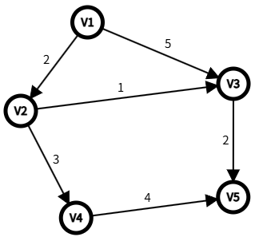
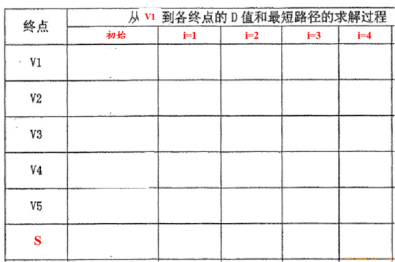

# DS-2026-19

## 1. 原题

给定一个有向图，利用 $Dijkstra$ 算法求以 $V_1$ 作为源点的最短路径。

> 订正说明转录：源文"从 $V1$ 作为源点"句式杂揉，已修正为"以 $V_1$ 作为源点"。图读法：弧 $V_1\to V_2(2)$、$V_1\to V_3(5)$、$V_2\to V_3(1)$、$V_2\to V_4(3)$、$V_3\to V_5(2)$、$V_4\to V_5(4)$。

## 2. 答案

| 终点 | 最短距离 | 最短路径 |
|---|---|---|
| V2 | 2 | V1→V2 |
| V3 | 3 | V1→V2→V3 |
| V4 | 5 | V1→V2→V4 |
| V5 | 5 | V1→V2→V3→V5 |

## 3. 题目分析

- 已知：5 顶点 6 弧的带权有向图（权值均为正）；
- 目标：源点 $V_1$ 到其余各点最短路径，**按 fig3 表格格式**（行：V1~V5 与 S；列：初始、i=1..4）给出迭代过程；
- 关键约束：每轮只允许"从 $V\setminus S$ 中选 $D$ 最小者入 $S$，再用它松弛"；
- 命题意图：考 Dijkstra 的**逐轮表格化执行过程**（本库 2015-45、2016-41、2020-34 均为同型题，属重复考查过的题型）。

## 4. 核心考点

核心考点：
DS04.04.02 最短路径（Dijkstra 单源）

辅助考点：
DS04.02.01 邻接矩阵法（读图建立各点邻接权）

解释：本题不写代码，考的是模拟算法每一轮 $D$、$path$、$S$ 的变化，属 TRACE+计算复合。

## 5. 解题思路

1. 从源点出发写初始 $D$（直接邻接的弧权，其余 $\infty$）；
2. 每轮：取未定集合中 $D$ 最小者 $u$ 入 $S$ → 对 $u$ 的每条出弧 $(u,w)$ 做 $D[w]=\min(D[w],D[u]+cost(u,w))$；
3. 松弛时同步记录 $path[w]=u$，最后由 $path$ 回溯写路径。

## 6. 详细解答

记 $D(V_k)/path(V_k)$，初始 $S=\{V_1\}$（$V_1$ 距离 0 已定）：

| 终点 | 初始 | i=1 选V2 | i=2 选V3 | i=3 选V4 | i=4 选V5 |
|---|---|---|---|---|---|
| V1 | 0 / − | 0（入S） | — | — | — |
| V2 | 2 / V1 | **2 / V1**（入S） | 2 | 2 | 2 |
| V3 | 5 / V1 | 3 / V2（松弛 2+1） | **3 / V2**（入S） | 3 | 3 |
| V4 | ∞ | 5 / V2（松弛 2+3） | 5 / V2 | **5 / V2**（入S） | 5 |
| V5 | ∞ |  | 5 / V3（松弛 3+2） | 5 / V3（5+4=9 不优） | **5 / V3** |
| S | {V1} | {V1,V2} | +V3 | +V4 | +V5 |

逐步说明：
- **i=1**：$V\setminus S$ 中 $D$ 最小为 $V_2(2)$，入 $S$；松弛 $V_2\to V_3:2+1=3<5$ 改，$V_2\to V_4:2+3=5$ 入表；
- **i=2**：最小 $V_3(3)$，入 $S$；松弛 $V_3\to V_5:3+2=5$ 入表；
- **i=3**：$V_4,V_5$ 并列 5，按顶点号取 $V_4$，入 $S$；松弛 $V_4\to V_5:5+4=9>5$ 不改；
- **i=4**：$V_5$ 入 $S$，结束。

**复核**（枚举 $V_1$ 出发的全部路径）：$V_1V_2V_3V_5=2+1+2=5$；$V_1V_2V_4V_5=2+3+4=9$；$V_1V_3V_5=5+2=7$；$V_1V_2V_3=3$；$V_1V_3=5$；$V_1V_2V_4=5$。各终点最小值与表一致 ✓。

## 7. 选项分析

不适用（综合应用题）。

## 8. 考场标准答案

按第 6 节表格逐列填写（初始列 + 4 个松弛轮次列），每列注明"本轮选取的顶点"；最后单独写出结论：

$$d(V_2)=2,\;d(V_3)=3,\;d(V_4)=5,\;d(V_5)=5$$
路径：$V_1V_2$；$V_1V_2V_3$；$V_1V_2V_4$；$V_1V_2V_3V_5$。

## 9. 易错点

1. 初始列漏写 $D(V_1)=0$ 或把 $S$ 列忘填；
2. 只更新 $D$ 不更新 $path$，最后路径写不出（$V_3$ 从 $V_1$ 直连 5 被改判为经 $V_2$ 的 3，$path$ 必须同步改）；
3. $V_4$、$V_5$ 距离并列时选取顺序与结论无关，但**必须选满 4 轮**并逐轮成表。

## 10. 一句话规律

Dijkstra 表格题：每轮"一选（未定中最小）二松弛（改 D 必改 path）三入 S"，四轮五列填完，路径沿 path 反向回溯。

## 11. 关联知识

- Dijkstra 不适用带负权弧（本库 2015-45、2016-41、2020-34 均为同型题）；
- 所有点对最短路径用 Floyd（2022-30、2024-18），二者勿混用。

## 12. 来源与可信度

- 原题来源：2026 回忆版题面篇（订正说明：题干句式已修）；
- 答案来源：独立推导 + 全路径枚举复核一致；
- 教材依据：严蔚敏《数据结构（C 语言版）》7.5.3 最短路径（Dijkstra，教材表 7-2 同格式）；
- 多来源冲突：无；争议：无；
- 最终可信度：high。
