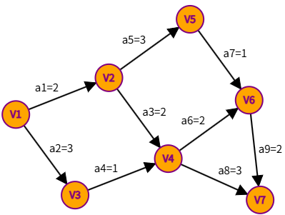
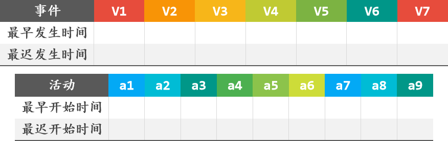

# DS-2026-20

## 1. 原题

**20、** 给定一个 $AOE$ 网，完成表格，要求给出计算过程，并给出关键路径。

> 订正说明转录：源文作"要求给出将计算过程"，衍字"将"，据题意删去。
>
> 另：本大题卷首备注"回忆版综合应用题的序列、图不一定与考试一致"（见 DS-2026-16 第 1 节转录），本题图形按卷面 `fig4`、`fig5` 作答。

**`fig4.png` 的转录（$AOE$ 网：顶点表示事件，有向边表示活动，边上数值为活动持续时间）**

| 活动 | $a_1$ | $a_2$ | $a_3$ | $a_4$ | $a_5$ | $a_6$ | $a_7$ | $a_8$ | $a_9$ |
|---|---|---|---|---|---|---|---|---|---|
| 弧（尾→头） | $V_1\to V_2$ | $V_1\to V_3$ | $V_2\to V_4$ | $V_3\to V_4$ | $V_2\to V_5$ | $V_4\to V_6$ | $V_5\to V_6$ | $V_4\to V_7$ | $V_6\to V_7$ |
| 持续时间 | $2$ | $3$ | $2$ | $1$ | $3$ | $2$ | $1$ | $3$ | $2$ |

源图标注依次为 $a1=2$、$a2=3$、$a3=2$、$a4=1$、$a5=3$、$a6=2$、$a7=1$、$a8=3$、$a9=2$，$7$ 个事件、$9$ 条弧，源点 $V_1$、汇点 $V_7$。

**`fig5.png` 的转录（待填表格结构）**

表一（事件）：列 $V_1,V_2,V_3,V_4,V_5,V_6,V_7$，行"最早发生时间""最迟发生时间"；
表二（活动）：列 $a_1,a_2,a_3,a_4,a_5,a_6,a_7,a_8,a_9$，行"最早开始时间""最迟开始时间"。

## 2. 答案

**表一 事件的最早/最迟发生时间**

| 事件 | $V_1$ | $V_2$ | $V_3$ | $V_4$ | $V_5$ | $V_6$ | $V_7$ |
|---|---|---|---|---|---|---|---|
| 最早发生 $ve$ | $0$ | $2$ | $3$ | $4$ | $5$ | $6$ | $8$ |
| 最迟发生 $vl$ | $0$ | $2$ | $3$ | $4$ | $5$ | $6$ | $8$ |

**表二 活动的最早/最迟开始时间**

| 活动 | $a_1$ | $a_2$ | $a_3$ | $a_4$ | $a_5$ | $a_6$ | $a_7$ | $a_8$ | $a_9$ |
|---|---|---|---|---|---|---|---|---|---|
| 最早开始 $e$ | $0$ | $0$ | $2$ | $3$ | $2$ | $4$ | $5$ | $4$ | $6$ |
| 最迟开始 $l$ | $0$ | $0$ | $2$ | $3$ | $2$ | $4$ | $5$ | $5$ | $6$ |
| 时间余量 $l-e$ | $0$ | $0$ | $0$ | $0$ | $0$ | $0$ | $0$ | $1$ | $0$ |

**工程工期 $=ve(V_7)=8$；关键活动为 $a_1,a_2,a_3,a_4,a_5,a_6,a_7,a_9$（只有 $a_8$ 非关键，余量 $1$）；关键路径 $3$ 条：**

$$V_1\to V_2\to V_4\to V_6\to V_7\;(a_1a_3a_6a_9),\quad V_1\to V_3\to V_4\to V_6\to V_7\;(a_2a_4a_6a_9),\quad V_1\to V_2\to V_5\to V_6\to V_7\;(a_1a_5a_7a_9)$$

三者长度均为 $8$。

## 3. 题目分析

- 已知：$7$ 事件 $9$ 活动的 $AOE$ 网（边权为正、无环，源点 $V_1$、汇点 $V_7$）；
- 目标：按 `fig5` 的两张表填出 $ve/vl$ 与 $e/l$，写出计算过程并给出关键路径；
- 关键约束（四个公式，缺一不可）：
  1. $ve(\text{源点})=0$；$ve(w)=\max\limits_{(v,w)\in E}\{ve(v)+w(v,w)\}$，按**拓扑有序**顺序自左向右推；
  2. $vl(\text{汇点})=ve(\text{汇点})$；$vl(v)=\min\limits_{(v,w)\in E}\{vl(w)-w(v,w)\}$，按**逆拓扑有序**自右向左推；
  3. 活动 $a=\langle v,w\rangle$ 的最早开始 $e(a)=ve(v)$（弧尾事件一发生即可开始）；
  4. 最迟开始 $l(a)=vl(w)-w(v,w)$（不能耽误弧头事件的最迟发生）；$l(a)=e(a)$ 者为**关键活动**；
- 命题意图：考关键路径的"两张表四公式"流程化计算，并检验"关键路径可能不止一条""所有事件 $ve=vl$ 时仍可能有非关键活动"这两个易被忽略的事实。

## 4. 核心考点

核心考点：
DS04.04.04 关键路径（$AOE$ 网、$ve/vl$、$e/l$、时间余量与关键活动/关键路径）

辅助考点：
DS04.04.03 拓扑排序——$ve$ 的递推必须按拓扑有序进行，本题的一个合法拓扑序为 $V_1,V_2,V_3,V_4,V_5,V_6,V_7$，$vl$ 则按其逆序推进

解释：$ve$/$vl$ 是"事件"层面的量，$e$/$l$ 是"活动"层面的量，两套量之间的桥梁就是 $e(a)=ve(\text{尾})$、$l(a)=vl(\text{头})-w$；本题表格正是按这个层次排布的。

## 5. 解题思路

1. **先把图读成弧表**（第 1 节转录表），逐条核对"尾、头、权"，读错一条整表皆错；
2. **确认拓扑有序列**：$V_1$ 入度 $0$，$V_7$ 出度 $0$；按编号顺序检查每条弧都从前指向后（$V_2\to V_4$、$V_3\to V_4$、$V_4\to V_6$、$V_5\to V_6$、$V_6\to V_7$、$V_4\to V_7$ 均满足"尾编号 $<$ 头编号"），故 $V_1\sim V_7$ 的自然编号序即为拓扑有序，可直接顺推；
3. **正向求 $ve$**：每个事件取"所有进入它的弧的 $ve(\text{尾})+w$"的**最大值**（最早也要等最慢的那条完成）；
4. **反向求 $vl$**：汇点 $vl=ve=8$；每个事件取"所有流出它的弧的 $vl(\text{头})-w$"的**最小值**（不能拖累任何后继）；
5. **算 $e,l$**：$e(a)=ve(\text{尾})$、$l(a)=vl(\text{头})-w$，差值为 $0$ 者标为关键活动；
6. **串关键路径**：从源点出发，只走关键活动，枚举到汇点的有向路径；
7. **复核**：把所有"源点到汇点"的路径长度逐一列出，最长者长度应等于 $ve(V_7)$，且其上的活动恰为全部关键活动。

## 6. 详细解答

### 第一步：$ve$（正向，取 max）

$ve(V_1)=0$。

| 事件 | 计算式（进入该事件的弧） | $ve$ |
|---|---|---|
| $V_1$ | 源点 | $0$ |
| $V_2$ | $ve(V_1)+a_1=0+2$ | $2$ |
| $V_3$ | $ve(V_1)+a_2=0+3$ | $3$ |
| $V_4$ | $\max\{ve(V_2)+a_3,\;ve(V_3)+a_4\}=\max\{2+2,\;3+1\}=\max\{4,4\}$ | $4$ |
| $V_5$ | $ve(V_2)+a_5=2+3$ | $5$ |
| $V_6$ | $\max\{ve(V_4)+a_6,\;ve(V_5)+a_7\}=\max\{4+2,\;5+1\}=\max\{6,6\}$ | $6$ |
| $V_7$ | $\max\{ve(V_4)+a_8,\;ve(V_6)+a_9\}=\max\{4+3,\;6+2\}=\max\{7,8\}$ | $8$ |

工程工期 $=ve(V_7)=8$。注意 $V_4$、$V_6$ 两处是"两条入弧相等"的巧合（都是 $4$ 与 $4$、$6$ 与 $6$），不影响后续。

### 第二步：$vl$（反向，取 min）

$vl(V_7)=ve(V_7)=8$。

| 事件 | 计算式（流出该事件的弧） | $vl$ |
|---|---|---|
| $V_6$ | $vl(V_7)-a_9=8-2$ | $6$ |
| $V_5$ | $vl(V_6)-a_7=6-1$ | $5$ |
| $V_4$ | $\min\{vl(V_6)-a_6,\;vl(V_7)-a_8\}=\min\{6-2,\;8-3\}=\min\{4,5\}$ | $4$ |
| $V_3$ | $vl(V_4)-a_4=4-1$ | $3$ |
| $V_2$ | $\min\{vl(V_4)-a_3,\;vl(V_5)-a_5\}=\min\{4-2,\;5-3\}=\min\{2,2\}$ | $2$ |
| $V_1$ | $\min\{vl(V_2)-a_1,\;vl(V_3)-a_2\}=\min\{2-2,\;3-3\}=\min\{0,0\}$ | $0$ |

$vl(V_1)=0$ 与源点定义一致 ✓（自检通过）。本题 $7$ 个事件全部满足 $ve=vl$。

### 第三步：活动的 $e$ 与 $l$

$e(a)=ve(\text{弧尾})$，$l(a)=vl(\text{弧头})-w(a)$：

| 活动 | 弧 | $w$ | $e=ve(\text{尾})$ | $l=vl(\text{头})-w$ | $l-e$ | 关键？ |
|---|---|---|---|---|---|---|
| $a_1$ | $V_1\to V_2$ | $2$ | $0$ | $2-2=0$ | $0$ | ✓ |
| $a_2$ | $V_1\to V_3$ | $3$ | $0$ | $3-3=0$ | $0$ | ✓ |
| $a_3$ | $V_2\to V_4$ | $2$ | $2$ | $4-2=2$ | $0$ | ✓ |
| $a_4$ | $V_3\to V_4$ | $1$ | $3$ | $4-1=3$ | $0$ | ✓ |
| $a_5$ | $V_2\to V_5$ | $3$ | $2$ | $5-3=2$ | $0$ | ✓ |
| $a_6$ | $V_4\to V_6$ | $2$ | $4$ | $6-2=4$ | $0$ | ✓ |
| $a_7$ | $V_5\to V_6$ | $1$ | $5$ | $6-1=5$ | $0$ | ✓ |
| $a_8$ | $V_4\to V_7$ | $3$ | $4$ | $8-3=5$ | $1$ | ✗ |
| $a_9$ | $V_6\to V_7$ | $2$ | $6$ | $8-2=6$ | $0$ | ✓ |

### 第四步：串关键路径

从 $V_1$ 出发沿关键活动走到 $V_7$：

- $V_1\xrightarrow{a_1}V_2\xrightarrow{a_3}V_4\xrightarrow{a_6}V_6\xrightarrow{a_9}V_7$，长 $2+2+2+2=8$ ✓
- $V_1\xrightarrow{a_2}V_3\xrightarrow{a_4}V_4\xrightarrow{a_6}V_6\xrightarrow{a_9}V_7$，长 $3+1+2+2=8$ ✓
- $V_1\xrightarrow{a_1}V_2\xrightarrow{a_5}V_5\xrightarrow{a_7}V_6\xrightarrow{a_9}V_7$，长 $2+3+1+2=8$ ✓

三条路径长度均等于工期 $8$，且其活动集并起来恰为全部 $8$ 个关键活动 ✓。

### 第五步：独立复核（枚举全部源→汇路径）

| 路径 | 长度 |
|---|---|
| $V_1V_2V_4V_7$ | $2+2+3=7$ |
| $V_1V_2V_4V_6V_7$ | $2+2+2+2=8$ |
| $V_1V_2V_5V_6V_7$ | $2+3+1+2=8$ |
| $V_1V_3V_4V_7$ | $3+1+3=7$ |
| $V_1V_3V_4V_6V_7$ | $3+1+2+2=8$ |

最长 $=8=ve(V_7)$ ✓；两条长度 $7$ 的路径都只经过 $a_8$ 这一条非关键活动，与"$a_8$ 余量 $1$"完全吻合 ✓。

**结论**：工期 $8$；关键活动 $a_1,a_2,a_3,a_4,a_5,a_6,a_7,a_9$；关键路径 $3$ 条（见上）。$a_8$ 有 $1$ 个时间单位的机动时间，压缩它不会缩短工期。

## 7. 选项分析

不适用（综合应用题）。

## 8. 考场标准答案

填 `fig5` 两张表（内容同第 2 节），并在表旁写出过程：

$$ve(V_1)=0,\ ve(V_2)=2,\ ve(V_3)=3,\ ve(V_4)=\max\{2+2,3+1\}=4,\ ve(V_5)=5,\ ve(V_6)=\max\{4+2,5+1\}=6,\ ve(V_7)=\max\{4+3,6+2\}=8$$
$$vl(V_7)=8,\ vl(V_6)=6,\ vl(V_5)=5,\ vl(V_4)=\min\{6-2,8-3\}=4,\ vl(V_3)=3,\ vl(V_2)=2,\ vl(V_1)=0$$
$$e(a)=ve(\text{尾}),\quad l(a)=vl(\text{头})-w(a),\quad l(a)=e(a)\ \text{者为关键活动}$$

关键路径（$3$ 条，长度均为 $8$）：

$$V_1V_2V_4V_6V_7,\qquad V_1V_3V_4V_6V_7,\qquad V_1V_2V_5V_6V_7$$

## 9. 易错点

1. **$ve$ 取 min、$vl$ 取 max**：方向口诀是"最早发生要等最慢的入弧（max），最迟发生要迁就最早的出弧（min）"，取反则全表皆错；
2. **$l(a)$ 误写成 $vl(\text{尾})$ 或漏减权值 $w$**：$l(a)=vl(\text{头})-w$，"$e$ 看尾、$l$ 看头"；
3. **汇点 $vl$ 不取 $ve(V_7)$ 而取 $0$**：$AOE$ 网必须令 $vl(\text{汇})=ve(\text{汇})$ 才能反推；
4. **漏拓扑序前提**：若图不能拓扑排序（有环），$AOE$ 网本身不合法，$ve$ 递推会陷入循环；
5. **只写一条关键路径**：本题有 $3$ 条，"关键活动并集"不等于"一条路径"，只写 $V_1V_2V_4V_6V_7$ 会丢分；
6. **误以为 $ve=vl$ 的事件之间所有活动都关键**：事件 $V_4,V_7$ 都满足 $ve=vl$，但连接它们的 $a_8$ 余量为 $1$、非关键——关键与否由**活动**的 $l-e$ 判定，不能只看两端事件；
7. 把 $a_8$ 的余量写成 $2$：$l(a_8)=vl(V_7)-w=8-3=5$，$e(a_8)=ve(V_4)=4$，差为 $1$。

## 10. 一句话规律

$AOE$ 关键路径四步定式：**正拓扑 $\max$ 求 $ve$、逆拓扑 $\min$ 求 $vl$、$e$ 挂尾 $l$ 挂头减权、$l=e$ 者串成路**；结论必用"枚举全部源→汇路径，最长者即关键路径"回验一遍。

## 11. 关联知识

- DS04.04.03：$ve$ 的递推顺序即拓扑有序序列，$AOE$ 与 $AOV$ 共用同一套拓扑前提；
- DS04.04.04：关键路径可能有多条，**只缩短其中一条不会缩短工期**；关键活动组成的是"从源点到汇点的所有最长路径的并"；
- DS04.04.02：与最短路径（Dijkstra，本卷 DS-2026-19）对照记忆——$AOE$ 求的是"最长路径决定工期"，最短路径求"最短距离"，两者取 max/min 的方向相反；
- 本库同型题：DS-2025-20、DS-2018-31 均为 $AOE$ 网"顶点表 + 弧表 + 路径结论"的全参数计算题，答题版面与本卷一致，可对照练习；DS-2019-10（关键路径即从源点到汇点的最长路径这一概念辨析）、DS-2020-11（在 $AOE$ 网上直接求关键路径长度）则是同一知识点的选择题考法。

## 12. 来源与可信度

- 原题来源：2026 回忆版题面篇 `真题/2026/2026重庆邮电大学802数据结构真题.md` 三、综合应用题第 20 题；订正说明仅删衍字"将"；
- **图像判读**：已完整读取 `真题/2026/imgs/fig4.png`（$AOE$ 网）与 `真题/2026/imgs/fig5.png`（待填表格）。`fig4` 中 $7$ 个事件、$9$ 条带权弧及其标注（$a1=2,a2=3,a3=2,a4=1,a5=3,a6=2,a7=1,a8=3,a9=2$）均可辨认，转录于第 1 节；`fig5` 为两张空表，其表头（事件 $V_1\sim V_7$ / 活动 $a_1\sim a_9$，行"最早（发生/开始）时间""最迟（发生/开始）时间"）亦已转录。判读结果自洽（图无环、源点唯一、汇点唯一、拓扑序存在），未见与题干冲突之处；
- **回忆版备注**：本大题卷首"序列、图不一定与考试一致"的备注同样适用于本题的弧权与表头，故 `ocr_confidence` 记 medium——**方法普适、具体数值随图而变**；
- 答案来源：独立推导（四公式逐步计算）+ 独立复核（枚举全部源→汇路径长度并与 $ve(V_7)$、关键活动集合双向对照）+ 后台程序按同一公式计算复核（$ve$、$vl$、$e$、$l$ 与手工完全一致）；未抓取解析篇网页，仅登记其地址备查；
- 教材依据：严蔚敏、吴伟民《数据结构（C 语言版）》7.6.3 关键路径（$AOE$ 网、$ve/vl$、活动最早/最迟开始时间与关键路径）；
- 多来源冲突：无；争议：无；
- 最终可信度：high（在按 `fig4` 读数正确的前提下）。
