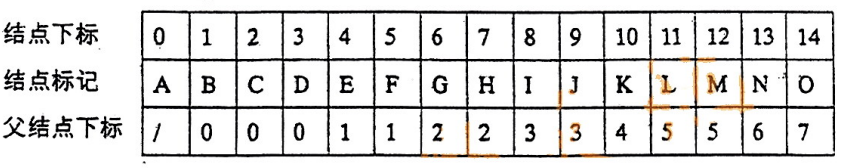
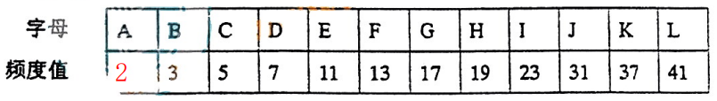

# 2005重庆邮电大学802数据结构真题

[TOC]

## 一、填空题

**1、** 在有 $n$ 个元素的顺序表中，若想在第 $i$ 个元素（ $1 \leq i \leq n+1$ ）之前插入一个元素时，需向表尾方向移动____________________元素。

**2、** 在一个循环队列中，队头指针指向队头元素的____________________。

**3、** 在双向链表中，每个结点有两个指针域，一个指向其____________________ 结点，另一个指向其 ____________________结点。

**4、** 设 $n$ 行 $n$ 列的下三角矩阵 $A$ 已压缩到一维数组 $s[1 \cdots \frac{n\times (n+1)}{2}]$ 中，若按行序为主存储，则元素 $A[i,j]$ 在 $S$ 中的存储位置是____________________。

**5、** 若某二叉树中有 $30$ 个叶结点，另有 $30$ 个结点仅有一个孩子结点，则该二叉树中总共有____________________个结点。

**6、** 具有 $n$ 个顶点的无向连通图至少有____________________ 条边。

**7、** 对于一个具有 $n$ 个顶点和 $e$ 条边的无向图，若采用邻接表表示，则所有邻接表中的结点总数为____________________ 。

**8、** 利用插入排序算法对 $n$ 个记录进行排序，最佳情况下，对关键字进行的比较次数为____________________ 次。

**9、** 在散列存储中装填因子的值越小，则____________________ 。

## 二、判断题

**10、** 线性表的唯一存储形式是数组。（）

**11、** 线性表的逻辑顺序与存储顺序总是一致的。（）

**12、** 二维数组是它的每个数据元素为一个线性表的线性表。（）

**13、** 每种数据结构都具备三个基本运算：插入、删除和查找。（）

**14、** 删除二叉排序树中的一个结点，再重新插入进去，一定能得到原来的二叉排序树。（）

**15、** 若一个叶结点是某二叉树的中序遍历序列的最后一个结点，则它也是该二叉树的前序遍历序列的最后一个结点。（）

**16、** 无向图用邻接矩阵表示后，该矩阵一定是对称矩阵。（）

**17、** 对任意一个图，从它的某个顶点出发进行一次深度优先或广度优先搜索遍历，可访问到该图的每一个结点。（）

**18、** 快速排序算法在每一趟排序中都能找到一个元素放到其最终位置上。（）

**19、** 理想情况下，在散列表中查找一个元素的时间复杂度为 $O(1)$ 。（）

## 三、选择题

**20、** 算法分析的目的是（）。

A. 找出数据结构的合理性

B. 研究算法中的输入和输出关系

C. 分析算法的效率以求改进

D. 分析算法的易读性和文档性

**21、** 一个栈的入栈序列是 $a,b,c,d,e$ ，则栈的不可能的输出序列是（）。

A. $edcba$

B. $decba$

C. $dceab$

D. $abcde$

**22、** 将两个各有 $n$ 个元素的有序表归并成一个有序表，最少需要比较（）次。

A. $n-1$

B. $n$

C. $2n-1$

D. $2n$

**23、** 对一棵二叉排序树进行（）遍历得到的结点序列是一个有序序列。

A. 前序

B. 中序

C. 后序

D. 层序

**24、** 某二叉树的前序遍历序列和后序遍历序列正好相反，则该二叉树一定是（）。

A. 空或只有一个结点

B. 完全二叉树

C. 二叉排序树

D. 高度等于结点数

**25、** 任何一棵无向连通图的最小生成树（）。

A. 有一棵或多棵

B. 只有一棵

C. 一定有多棵

D. 可能不存在

**26、** 下列排序算法中（）算法占用的辅助空间最多。

A. 堆排序

B. $shell$ 排序

C. 快速排序

D. 归并排序

**27、** 若数据表中每个元素已距其最终位置不远，则采用（）算法进行排序时间最省。

> 订正说明：源文作“己距”，据题意修正为“已距”。

A. 选择排序

B. 快速排序

C. 堆排序

D. 插入排序

**28、** 有一长度为 $12$ 的有序表，按二分查找法对该表进行查找，且查找每个元素的概率相同，则查找成功所需的平均比较次数为（）。

A. $\frac{35}{12}$

B. $\frac{37}{12}$

C. $\frac{39}{12}$

D. $\frac{43}{12}$

**29、** 如果要求一个线性表既能较快地查找，又能适应动态变化的要求，可以采用（）查找方法。

A. 二分

B. 顺序

C. 分块

D. 散列

## 四、问答题

**30、** 已知树的父结点表示如下，其中各兄弟结点是依次出现的，画出该树及对应的二叉树。

**31、** 根据下面的字母/频度表构造一棵 $Huffman$ 树，并给出各字母的 $Huffman$ 编码。

**32、** 若一个带权无向图的邻接矩阵如下图所示，画出该图，并按 $prim$ 算法构造出该图的一棵最小生成树（要有其构造步骤）。

**33、** 如果只想得到一个有 $n$ 个元素的序列中第 $k$ 个最小元素之前的部分排序序列，最好采用什么排序方法？为什么？如有这样的一个序列： `{57,40,38,11,13,34,48,75,25,6,19,9,7}` 得到其第 $4$ 个最小元素之前的部分序列 `{6,7,9,11}` ，使用所选择的算法实现时，需执行多少次比较？

> 订正说明：源文作“如由这样的一个序列”，据题意修正为“如有这样的一个序列”。

## 五、算法设计题

**34、** 设有一个双向链表，每个结点中除有 $prior$ 、 $data$ 和 $next$ 三个域外，还有一个访问频度域 $freq$ ，在链表被启用前，所有结点的 $freq$ 域的值均为零。每当双链表上进行 $Locate(L,X)$ 运算时，令元素值为 $X$ 的结点中的 $freq$ 的值加 $1$ ，并使此链表中结点保持按访问频度递减的顺序排列。试设计实现 $Locate(L,X)$ 运算的算法。

**35、** 假设图采用邻接表存储，试设计一个算法利用深度优先搜索法求出无向图中通过给定顶点 $v$ 的简单回路。

