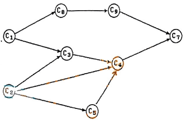

# 2007重庆邮电大学802数据结构真题

[TOC]

## 一、选择题

**1、** 循环队列 $Q$ 空队列时 $front=rear=0$ ，则 $Q$ （最多元素为 $m-1$ 个，存放的数组大小为 $m$ ）为满队列的条件是（）。

A. $Q.front==Q.rear$

B. $Q.front!=Q.rear$

C. $Q.front==(Q.rear+1)\%m$

D. $Q.front!=(Q.rear+1)\%m$

**2、** 若某栈的输入序列为 $1,2,3,\cdots,n$ ，输出序列的第一个元素为 $n$ ，则第 $i$ 个输出元素为（）。

A. $i$

B. $n-i$

C. $n-i+1$

D. 都有可能

**3、** 在数据结构中，与所使用的计算机无关的是数据的（）结构。

A. 逻辑

B. 存储

C. 逻辑和存储

D. 物理

**4、** 若长度为 $n$ 的线性表采用顺序存储结构，在其第 $i$ 个位置插入一个元素的时间复杂度为（）。 ( $1 \leq i \leq n+1$ )

A. $O(0)$

B. $O(1)$

C. $O(n)$

D. $O(n^2)$

**5、** 将两个各有 $n$ 个元素的有序表归并成一个有序表，其最少的比较次数可以只有（）。

> 订正说明：源文作“最少得比较次数”，据题意修正为“最少的比较次数”。

A. $2n-1$

B. $n$

C. $2n$

D. $n-1$

**6、** 若广义表 $X$ 满足 $Head(X)=Tail(X)$ ，则 $X$ 为（）。

A. $()$

B. $(())$

C. $((),())$

D. $((),(),())$

**7、** 设结点 $x$ 和结点 $y$ 是二叉树 $T$ 中的任意两个结点，若在先根序列中 $x$ 在 $y$ 之前，而在后根序列中 $x$ 在 $y$ 之后，则 $x$ 和 $y$ 的关系是（）。

A. $x$ 是 $y$ 的左兄弟

B. $x$ 是 $y$ 的右兄弟

C. $x$ 是 $y$ 的祖先

D. $x$ 是 $y$ 的后代

**8、** 在非空 $m$ 阶 $B-$ 树上，除根结点以外的所有其他非终端结点（）。

A. 至少含有 $\left \lceil \frac{m}{2} \right \rceil$ 棵子树

B. 至多含有 $\left \lceil \frac{m}{2} \right \rceil$ 棵子树

C. 至少含有 $\left \lfloor \frac{m}{2} \right \rfloor$ 棵子树

D. 至多含有 $\left \lfloor \frac{m}{2} \right \rfloor$ 棵子树

**9、** 某二叉树的先序序列和后序序列正好相反，则该二叉树一定是（）的二叉树。

A. 空或只有一个结点

B. 高度等于其结点数

C. 任一结点无左孩子

D. 任一结点无右孩子

**10、** 一个栈的输入序列为 $12345$ ，则下列序列中是栈的输出序列的是（）。

A. $23415$

B. $54132$

C. $31245$

D. $14253$

**11、** $3$ 个结点可构成（）个不同形态的二叉树。

A. $2$

B. $3$

C. $4$

D. $5$

**12、** 设存储循环队列的数组的下标范围是 $0 \cdots n-1$ ，初始空队列 $front$ 和 $rear$ 都是 $0$ ，则某时刻队列的长度可用（）计算。

A. $rear-front$

B. $rear-front+1$

C. $(rear-front+1)\%n$

D. $(rear-front+n)\%n$

**13、** 若用数组 $A[1 \cdots n]$ 作为栈 $S_1,S_2$ 共有的空间。对于任何一个栈，只有在数组 $A$ 全满时才不能进行入栈操作。那么空间利用率最高的设置方式是（）。

> 订正说明：源文题干末有编者批注“（选项 $A[0]$ 改成 $A[1]$）”，属于修订备注而非题面，已删除。

A. $S_1$ 以 $A[1]$ 作为栈底，而 $S_2$ 以 $A[\frac{n}{2}]$ 作为栈底，同方向增长

B. $S_1$ 以 $A[1]$ 作为栈底，而 $S_2$ 以 $A[n]$ 作为栈底，相对方向增长

C. $S_1$ 以 $A[\frac{n}{2}-1]$ 作为栈底，而 $S_2$ 以 $A[\frac{n}{2}]$ 作为栈底，反向增长

D. $S_1$ 以 $A[\frac{n}{2}]$ 作为栈底，而 $S_2$ 以 $A[n]$ 作为栈底，同方向增长

**14、** 在解决计算机主机与打印机之间速度不匹配问题时通常设置一个打印数据缓冲区，主机将要输出的数据依次写入该缓冲区，而打印机则依相同次序从该缓冲区中取出数据打印。则该缓冲区作为数据结构是一个（）结构。

A. 栈

B. 队列

C. 哈希表（ $Hash\ Table$ ）

D. 线性表

**15、** 设计一个判别表达式中左、右括号是否配对出现的算法，采用（）数据结构最佳。

A. 栈

B. 队列

C. 顺序结构线性表

D. 链式结构线性表

**16、** 时间复杂度基本不受待排序序列初始状态的影响，为 $O(n\log _2 n)$ ，排序效果稳定的是（）。

A. 简单选择排序

B. 直接插入排序

C. 归并排序

D. 快速排序

**17、** 如一个序列已经基本有序，则采用（）算法最节省时间。

A. 插入排序

B. 归并排序

C. 快速排序

D. 选择排序

**18、** 对有 $n$ 个记录的有序表采用二分查找，其复杂度为（）。

A. $O(\log_2 n)$

B. $O(n\log_2 n)$

C. $O(n)$

D. $O(n^2)$

**19、** 一个具有 $n$ 个顶点的无向完全图的边数为（）。

A. $\frac{n\times(n+1)}{2}$

B. $\frac{n\times (n-1)}{2}$

C. $n\times (n-1)$

D. $n\times (n+1)$

**20、** 用 $Dijkstra$ 算法（单源最短路径）求 $1$ 号顶点到 $3$ 号顶点的最短路径，最先求出的最短路径是（）。

A. $1$ 号顶点到 $5$ 号顶点

B. $1$ 号顶点到 $4$ 号顶点

C. $1$ 号顶点到 $3$ 号顶点

D. $1$ 号顶点到 $2$ 号顶点


## 二、填空题

**21、** 两个串相等的准确含义是____________________ 。

**22、** 采用特殊字符作为串的结束，串`S="Yes.IGotA"`需要至少长度为____________________ 。

**23、** 将一个 $A[1 \cdots 20][1 \cdots 20]$ （下标均从 $1$ 开始计）的矩阵，按行序为主序存放，每个元素占 $2$ 个存储单元，并且 $A[1][1]$ 的存储地址是 $1000$ ，则 $A[20][2]$ 的地址是____________________ 。

> 订正说明：源文作“按行序为主序放”，据题意补为“存放”。

**24、** 用顺序存储的方法将完全二叉树中的所有结点逐层存放在数组 $R[1 \cdots n]$ （下标从 $1$ 开始计）中，若结点 $R[i]$ 有右子女，则 $R[i]$ 的右子女结点的下标是____________________ 。

**25、** 具有 $17$ 个结点的完全二叉树的高度（单一结点的树高度为 $1$ ）为____________________ 。

**26、** 设高度为 $h$ 的二叉树上只有度为 $0$ 和度为 $2$ 的结点，则此二叉树中所包含的结点数至少为____________________ 。

> 订正说明：源文作“结点数为”，据题意补“至少”（度为 $1$ 的结点不存在时结点数最少为 $2h-1$，与 2006 年同型题“至少有”表述一致）。

**27、** 某表达式二叉树按先序遍历的结果为 $*a+-bcd$ ，令 $a=2,b=6,c=4,d=2$ ，则表达式的值等于____________________ 。

**28、** 高度（空树高度为 $0$ ）为 $5$ 的 $AVL$ 树，其结点数最少是____________________ 。

**29、** 一棵树 $T$ 采用二叉链表 $BT$ 存储，如果树 $T$ 中某结点为叶子结点，则在二叉链表 $BT$ 中所对应的结点一定满足____________________ 。

**30、** （约定：如果可能的话，将编号小的写在前面）请给出下图唯一的拓扑序列（拓扑排序结果）____________________ 。

> 订正说明：目视图中的顶点标注，图中缺少解析答案涉及的顶点 $C_6$；且该图不附加“编号小的写在前面”约定时拓扑序列并不唯一，题面“唯一的拓扑序列”与图况不符，保留原文供自行判断。



**31、** 使用压缩存储方式存储下三角矩阵时需要____________________ 个数据元素大小的空间。

> 订正说明：源文未指明下三角矩阵的阶数/行列范围，无法据题意补全，保留原文。

**32、** 已知一个无向图的邻接矩阵表示，计算第 $j$ 个结点的度的方法是____________________ 。

**33、** 设图 $G$ 采用邻接表存储，则图的深度优先遍历算法（访问每个顶点一次）的时间复杂度是____________________ 。

**34、** $G$ 为无向图，如果从 $G$ 的某个顶点出发，进行一次广度优先搜索，即可访问图的每个顶点，则该图一定是____________________ 图。

**35、** 快速排序算法的思想是____________________ 。

## 三、问答题

**36、** 用选择排序方法对序列 $(65,38,97,76,13,27)$ 按从小到大的顺序进行排序，写成排序过程与结果。

**37、** 计算下列程序段中的 `x++`语句的频度，分析此程序段的时间复杂度。

```c
for(int i=1;i<n;i++)
{
    y=y+1;
    for(int j=0;j<=(2*n);j++)
        x++;
}
```

**38、** 设 $Hash$ 函数为 $H(K)=K\ mod\ 7$ ，哈希表的地址空间大小为 $11$ ，开始时哈希表为空，用二次探测法（单方向往右查找）解决冲突，请画出依次插入键值 $23,14,9,6,30,18$ 后的哈希表。

**39、** 已知图的邻接表存储结构，从 $v_5$ 顶点出发得到的深度优先遍历序列和广度优先遍历序列是什么？ $v_3$ 的度是多少？


**40、** 某待排序初始序列为`Zhao,Qian,Sun,Li,Zhou,Wu,Zheng,Wang`。请建立相应的初始堆。

**41、** 已知某二叉树的中序遍历序列为 $CBEGDFA$ ，前序遍历序列为 $ABCDEGF$ ，请画出该二叉树，并给出后序遍历序列。

**42、** 将数据集 `{4,5,6,7,12}`中的每个数据作为权值，构造一棵哈夫曼（ $huffman$ ）树，并求出其带权路径长度。

**43、** 从顶点 $1$ 出发，按照 $Prim$ 算法找出下图中的最小生成树。给出处理步骤。


## 四、算法阅读与算法实现题

**44、** 已知 $LinkedList$ 是已定义的链表类型， $Linkedstack$ 是已定义的链式栈类型，并使用常见英文符号等表达其运算。阅读下列算法，首先简要分析、解释该算法实现方法，然后写出其完整的功能。

```c
void produce_list(LinkedList *head)
{
    Linkedstack ls;
    LinkedList p;
    DataType x;
    InitStack(&ls);
    p=*head;
    while(p!=NULL)
    {
        Push(&ls,p->data);
        p=p->next;
    }
    p=head;
    while(!EmptyStack(&ls))
    {
        Pop(&ls,&x);
        p->data=x;
        p=p->next;
    }
}
```

**45、** 某二叉树使用二叉链表存储，通过中序遍历打印结点数据可得到从大到小的数据序列，请编写一个函数将此二叉树进行变换以得到一棵二叉排序树（提示：可通过将所有结点的左右子树交换得到，请定义必要的数据结构）。
