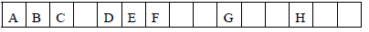
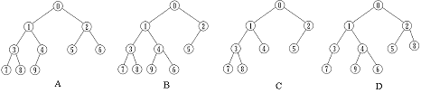
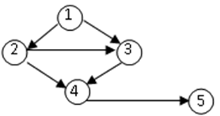
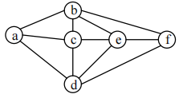
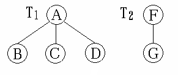
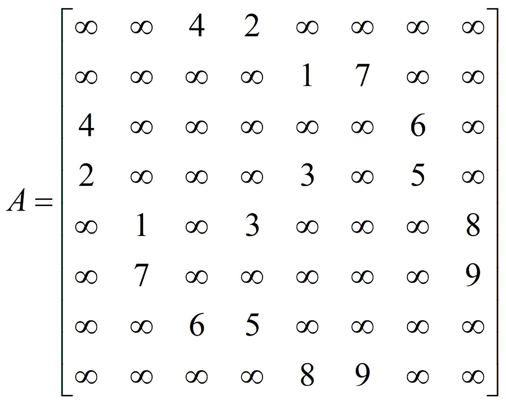

# 2017重庆邮电大学802数据结构真题

[TOC]

## 一、选择题

**1、** 下面程序段的时间复杂度是（）。

A. $O(n)$

B. $O(m+n+1)$

C. $O(m+n)$

D. $O(m \times n)$

```c
for(i=0;i<n;i++)
    for(int j=1;j<m;j++)
        A[i][j]=0;
```

**2、** 链表不具有的特点是（）。

A. 可随机访问任一元素

B. 插入、删除不需要移动元素

C. 不必事先估计存储空间

D. 所需空间与线性表长度成正比

**3、** 若某栈的输入序列为 $1,2,3,\cdots,n$ ，输出序列的第一个元素为 $n$ ，则第 $2$ 个输出元素为（）。

A. $1$

B. $n-1$

C. $n$

D. 都有可能

**4、** 判定一个循环队列 $Q$ （最多元素为 $m$ 个）为满队列的条件是（）。

A. $Q.front==Q.rear$

B. $Q.front!=Q.rear$

C. $Q.front==(Q.rear+1)\% m$

D. $Q.front!=(Q.rear+1)\% m$

**5、** 设有两个串 $T$ 和 $P$ ，求 $P$ 在 $T$ 中首次出现的位置的串运算称作（）。

A. 联结

B. 求子串

C. 字符定位

D. 子串定位

**6、** 将一个 $A[10][10]$ （下标从 $0$ 开始计算）的矩阵按行优先顺序存放，每个元素占 $4$ 个存储单元，并且 $A[0][5]$ 的存储地址是 $1020$ ，则 $A[7][2]$ 的地址是（）。

A. $1000$

B. $1020$

C. $1108$

D. $1288$

**7、** 一棵含有 $18$ 个结点的二叉树的高度至少为（）。

A. $3$

B. $4$

C. $5$

D. $6$

**8、** 已知某非空二叉树采用顺序存储结构，树中结点的数据信息按完全二叉树的层次序列依次存放在一个一维数组中，即



则该二叉树的后序遍历序列为（）。

A. $G,D,B,E,F,H,C,A$

B. $G,B,D,E,H,C,F,A$

C. $G,D,B,H,E,F,C,A$

D. $B,G,D,E,H,C,F,A$

> 订正说明：源文数组图位于选项之后，据题意移至“即”字之后与题干衔接。

**9、** 在下列树中，（）是完全二叉树。



**10、** 有 $n$ 个球队参加的某联赛按单循环方式进行比赛，那么共需要进行（）场比赛。

A. $\frac{n(n-1)}{2}$

B. $n$

C. $n\times (n-1)$

D. $n+1$

**11、** 下列排序算法中，时间复杂度不受数据初始状态影响，恒为 $O(n \times \log_2 n)$ 的是（）。

A. 快速排序

B. 冒泡排序

C. 直接选择排序

D. 堆排序

**12、** 若长度为 $n$ 的线性表采用顺序存储结构，在其第 $i$ 个位置插入一个元素时间复杂度为（）( $1 \leq i \leq n+1$ )。

> 订正说明：源文作“线性表表采用”，衍字“表”，据题意修正。

A. $O(0)$

B. $O(1)$

C. $O(n)$

D. $O(n^2)$

**13、** 任何一个无向连通图的最小生成树（）。

A. 只有一棵

B. 有一棵或多棵

C. 一定有多棵

D. 可能不存在

**14、** 具有 $n$ 个结点的满二叉树，其叶子结点有（）个。

A. $\frac{n}{2}$

B. $\frac{n-1}{2}$

C. $\frac{n+1}{2}$

D. $\frac{n}{2}-1$

**15、** 下列排序方法中不稳定的是（）。

A. 归并排序

B. 快速排序

C. 气泡排序

D. 直接插入排序

**16、** 如下图，哪一项是该图的拓扑排序（）？

A. $1,3,2,4,5$

B. $1,2,3,4,5$

C. $1,2,4,3,5$

D. $1,2,3,5,4$



**17、** 在所有排序方法中，关键字比较的次数与记录的初始排列次序无关的是（）。

A. 希尔排序

B. 起泡排序

C. 插入排序

D. 选择排序

**18、** 若用一个大小为 $6$ 的数组来实现循环队列，且当前 $rear$ 和 $front$ 的值分别为 $0$ 和 $3$ 。当从队列删除两个元素，再加入一个元素后， $rear$ 和 $front$ 的值分别为（）。

A. $1$ 和 $5$

B. $2$ 和 $4$

C. $4$ 和 $2$

D. $5$ 和 $1$

**19、** 已知一个图如下所示，从顶点 $a$ 出发进行深度优先遍历可能得到的序列为（）。

A. $acefbd$

B. $acbdfe$

C. $acbdef$

D. $acdbfe$



**20、** 若无向图 $G$ 有 $7$ 个顶点，至少需要（）条边，才能保证该图一定是连通图（边可依附任两顶点，但无重复边和自环）。

A. $6$

B. $16$

C. $31$

D. $42$

## 二、填空题

**21、** 有向图 $G$ 用邻接矩阵 $A[1 \cdots n,1 \cdots n]$ 存储，其第 $i$ 行的所有非 $0$ 元素的个数等于顶点 $i$ 的____________________ 。

**22、** 设栈 $S$ 和队列 $Q$ 的初始状态皆为空，元素 $a_1,a_2,a_3,a_4,a_5$ 和 $a_6$ 依次通过一个栈，一个元素出栈后即进入队列 $Q$ ，若 $6$ 个元素出队列的顺序是 $a_3,a_5,a_4,a_6,a_2,a_1$ 则栈 $S$ 至少应该容纳____________________ 个元素。

**23、** 在一棵二叉树中，度为 $0$ 的结点的个数为 $n_0$ ，度为 $1$ 的结点的个数为 $n_1$ ，则该二叉树共有____________________ 个结点。

**24、** 某二叉树的先序遍历序列是 $ABDGCEFH$ ，中序遍历序列是 $DGBAECHF$ ，那么该二叉树的后序遍历序列是____________________ 。

**25、** 表长为 $n$ 的线性表，当在任何位置上删除一个元素的概率相等时，删除一个元素需移动元素的平均个数为____________________ 。

**26、** $6$ 阶 $B-$ 树（ $B-Tree$ ）中，每个结点至多包含 $5$ 个关键码，除根和叶结点外，每个结点至少包含____________________ 个关键码。

**27、** 已知完全二叉树的第 $10$ 层（根结点为第 $1$ 层）总共只有 $5$ 个结点，则其叶子结点数是____________________ 。

**28、** 用顺序存储的方法将完全二叉树中的所有结点逐层存放在数组 $R[0,\cdots,n-1]$ （下标从 $0$ 开始计）中，结点 $R[i]$ 若有双亲节点，则双亲结点的下标是____________________ 。

**29、** 某表达式二叉树按后序遍历的结果为 `a,b,c,d,-,*,+,e,f,/,-` ，令 $a=6,b=3,c=4,d=2,e=5,f=1$ ，则该表达式的值等于____________________ 。

> 订正说明：源文题后有编者批注“题目已修改为后序，原为先序”，属于修订备注而非题面，已删除（题干保留“后序”表述）。

**30、** $G$ 为无向图，如果从 $G$ 的某个顶点出发进行一次遍历，即可访问图的每个顶点，则该图一定是____________________ 图。

## 三、问答题

**31、** 现有森林如下图，请画出对应的二叉树。



**32、** 已知某字符串 $S$ 中共有 $8$ 种字符，各种字符分别出现 $1$ 次、 $2$ 次、 $7$ 次、 $5$ 次、 $4$ 次、 $3$ 次、 $4$ 次和 $9$ 次，对该字符串用 `{0,1}` 进行前缀编码。

（1）请画出对应的 $Huffman$ 树，并给出各字符的前缀编码；

（2）请问该字符串 $S$ 的编码有多少位？

**33、** 设一个无向网 $G$ 的邻接矩阵 $A$ 如下：

（1）请根据给定的邻接矩阵 $A$ 画出网 $G$ 的图（ $G$ 中顶点用 $v_i$ 表示）；

（2）如果对某个顶点的邻接点的访问顺序按序号从小到大排列，请写出从顶点 $v_1$ 出发，按“深度优先”和“广度优先”搜索方法遍历网 $G$ 所得到的顶点序列；

（3）从顶点 $v_1$ 出发，按照最小生成树的 $Prim$ 算法，画出网 $G$ 的一棵最小生成树。



**34、** 对一组关键字： $49,38,65,97,76,13,27$ 采用快速排序方法进行排序，用第一关键字作支点/参考值（ $pivot$ ），请写出快速排序的第一趟的交换过程。

**35、** 设 $Hash$ 函数为 $H(K)=K \ mod \ 7$ ，哈希表的地址空间为 $0,1,2,3,4,5,6$ ，开始时哈希表为空，用二次探测再散列法解决冲突，请画出依次插入键值 $9,14,16,6,23,12,18$ 后的哈希表。

**36、** 已知关键字序列为 $40,35,25,36,70,56$ ，依次将各元素插入到一棵初始为空的二叉排序树，画出对应的二叉排序树。

**37、** 已知初始序列（ $52,80,63,44,48,91$ ），写出直接插入排序的各趟排序的结果。

## 四、算法设计分析题

**38、** 试写一算法，对带头结点的单链表实现就地逆置。

（1）结点结构定义如下：

（2）先给出算法思想，再描述具体算法，必要时请给予注释说明；

```c
typedef struct node//结点类型定义
{
    int data;//结点的数据域
    struct node *next;//结点的指针域
} ListNode,*LinkList;
```

**39、** 给定某一二叉树的根结点，请写一个算法判断该树是否为平衡二叉树。

（1）二叉树用二叉链表表示，定义如下：

（2）先给出算法思想，再描述算法，必要时给予注释说明

```c
typedef struct tnode
{ 
    int key; 
    struct tnode *lchild,*rchild; 
}BinNode,*bitree;
```

