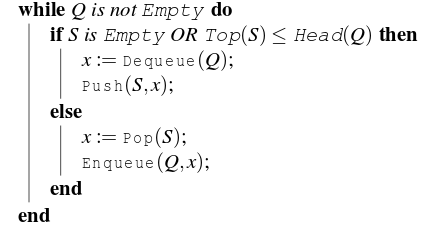
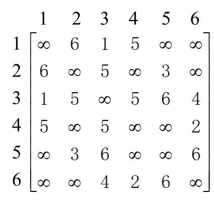
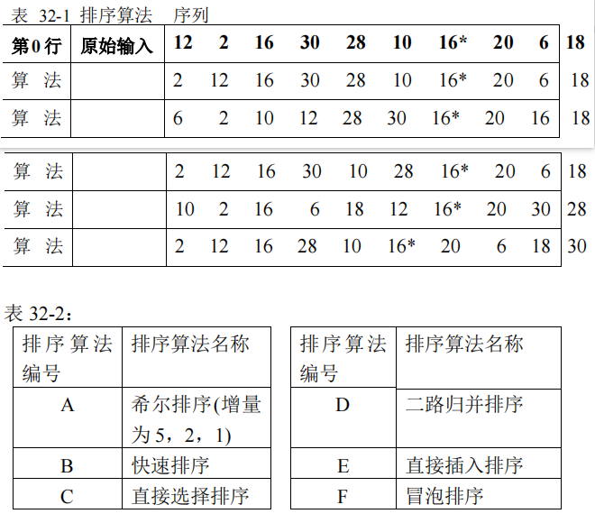

# 2021重庆邮电大学802数据结构真题

[TOC]

## 一、选择题

**1、** 设 $N$ 是描述问题规模的非负整数，下列程序段的时间复杂度是（）。

A. $O(\log N)$

B. $O(N)$

C. $O(N\log N)$

D. $O(N^2)$

```c
static int fun(int N)
{
    if(N==1) 
        return 0;
    return 1+fun(N/2);
}
```

**2、** 一些随机产生的数采用线性链表存储，在下面这些排序方法中，（）的时间复杂度是最小的。

A. 插入排序

B. 快速排序

C. 堆排序

D. 归并排序

**3、** 一个栈的输入序列为 $a,b,c,d,e$ ，则下列序列不可能是栈的输出序列的是（ ）。

A. $b,c,d,a,e$

B. $e,d,a,c,b$

C. $b,c,a,d,e$

D. $a,e,d,c,b$

**4、** 实现一个队列需要（ ）个栈。

A. $1$

B. $2$

C. $3$

D. $4$

**5、** 下面（ ）是一棵满二叉树的结点个数。

> 订正说明：源文作“一颗满二叉树”，据题意修正量词为“一棵”。

A. $8$

B. $13$

C. $14$

D. $15$

**6、** 若 $X$ 是二叉中序线索树中一个有左孩子的结点，且 $X$ 不为根，则 $X$ 的前驱为（）。

A. $X$ 的双亲

B. $X$ 的右子树中最左的结点

C. $X$ 的左子树中最右的结点

D. $X$ 的左子树中最右的叶子结点

> 订正说明：源文选项 C、D 完全重复（均为“$X$ 的左子树中最右的结点”），系抄录脱漏；据此类题的常规干扰项设计，将 D 恢复为“$X$ 的左子树中最右的叶子结点”（正确答案仍为 C，中序前驱是左子树最右结点，不必是叶子）。

**7、** 下列序列中，哪一个是堆（ ）？

A. $75,65,30,15,25,45,20,10$

B. $75,65,45,10,30,25,20,15$

C. $75,45,65,30,15,25,20,15$

D. $75,45,65,10,25,30,20,15$

**8、** 一棵 $Huffman$ 树共有 $203$ 个结点，对其 $Huffman$ 编码，共能得到（ ）个不同的码字。

A. $100$

B. $102$

C. $200$

D. $203$

**9、** 下面说法错误的是（ ）。

A. 一个有 $n$ 个顶点和 $n$ 条边的无向图一定是有环的。

B. 建立十字链表的时间复杂度和建立邻接表是相同的。

C. 邻接表只能用于有向图的存储，邻接矩阵对于有向图和无向图的存储都适用。

D. 在某些图的应用问题中，如果需要找到表示同一条边的两个结点，那么采用邻接多重表比邻接表作为存储结构更为适宜。

> 订正说明：源文作“储存结构”，据题意修正为规范术语“存储结构”。

**10、** 图的广度优先遍历算法中使用队列作为其辅助数据结构，那么在算法执行过程中每个顶点进队次数最多为（ ）。

A. $1$

B. $2$

C. $3$

D. $4$

**11、** 设一个有向图 $G=(V,E)$ ，其中

$V=$ `{` $v_1,v_2,v_3,v_4,v_5,v_6$ `}` ，

$E=$ `{` $ < v_1,v_2 >,< v_2,v_3 >,< v_3,v_6 >,< v_4,v_2 >,< v_4,v_5 >, < v_5,v_6 > $ `}` ，

不属于该图的拓扑排序有序序列是（ ）。

> 订正说明：源文作“不属于于该图”，衍字“于”，据题意修正。

A. $v_1,v_2,v_3,v_4,v_5,v_6$

B. $v_1,v_4,v_2,v_3,v_5,v_6$

C. $v_4,v_5,v_1,v_2,v_3,v_6$

D. $v_4,v_1,v_2,v_3,v_5,v_6$

**12、** 判断一个有向图是否存在回路，除可利用拓扑排序方法外，还可以用（ ）。

A. 求关键路径的方法

B. 求最短路径的方法

C. 广度优先遍历的方法

D. 深度优先遍历的方法

**13、** 设有一个二叉排序树（二叉查找树），其结点上存储有数字 $1$ 到 $100$ 。现在需要查找数字 $55$ ,下面（ ）序列不可能是查找过程中访问过的结点序列。

A. `{10,75,64,43,60,57,55}`

B. `{90,12,68,34,62,45,55}`

C. `{9,85,47,68,43,57,55}`

D. `{79,14,72,56,16,53,55}`

**14、** 在顺序表 `{2、5、7、10、14、15、18、23、35、41、52}` 中，用二分法查找关键码 $12$ 需做（ ）次关键码比较。

A. $2$

B. $3$

C. $5$

D. $4$

**15、** 一棵 $3$ 阶 $B-$ 树中有 $2047$ 个关键字，包括叶结点层，该树的最大深度为（ ）。

A. $11$

B. $12$

C. $13$

D. $14$

## 二、填空题

**16、** 一棵深度为 $k$ 的平衡二叉树，其每个非终端结点的平衡因子均为 $0$ ，则该树共有____________________个结点。

**17、** Let $Q$ denote a queue containing sixteen numbers and $S$ be an empty stack. $Head(Q)$ returns the element at the head of the queue $Q$ without removing it from $Q$ . Similarly $Top(S)$ returns the element at the top of $S$ without removing it from $S$ . Consider the algorithm given below.

The maximum possible number of iterations of the while loop in the algorithm is ____________________.



**18、** 对于模式串 $aabaac$ ，给出其 $next$ 数组：____________________。

**19、** 现有按中序遍历二叉树的结果为 $abc$ ，有____________________种不同形态的二叉树可以得到这一遍历结果。

**20、** 设一棵二叉树有 $20$ 个叶子结点，则在该树中有 $2$ 个孩子的结点个数为____________________。

**21、** 设 $G$ 是一个非连通无向图，有 $10$ 条边，则该图的顶点数至少有____________________个。

**22、** 顺序查找 $3$ 个元素的顺序表，若查找第 $1$ 、第 $2$ 和第 $3$ 个元素的查找概率分布是 $\frac{1}{2}$ 、 $\frac{1}{3}$ 和 $\frac{1}{6}$ ，则查找任一元素的平均查找长度为____________________。

> 订正说明：源文作“则则查找”，衍字“则”，据题意修正。

**23、** 散列函数有一个共同的性质，即函数值应当以____________________取其值域的每个值。（请在最大概率、最小概率、平均概率、同等概率这些术语中选择正确的进行填空）。

**24、** 假设某算法在输入规模为 $n$ 时的计算时间为 $T(n)=n^2$ 。在某台计算机上实现并完成该算法的时间为 $t$ 秒。现有另一台计算机，其运行速度为第一台计算机的 $64$ 倍，那么在这台计算机上用同一算法在 $t$ 秒内能解输入规模____________________的问题。

**25、** 表达式 `a * b - c - d $ e $ f - g - h * i` 中，运算符的优先级由高到低依次为 `-,*,$` ，均右结合，则相应的后缀式是____________________。

## 三、综合应用题

**26、** 假设称正读和反读都相同的字符序列为“回文”，例如， $abba$ 和 $abcba$ 是回文， $abcde$ 和 $ababab$ 则不是回文，下面代码判别读入的一个以 `@` 为结束符的字符序列是否是“回文”。请给出缺失的 $5$ 行代码。

```c
Status SymmetryString(char* p)
{
    Queue q;
    if(!InitQueue(q)) 
        return 0;
    Stack s;
    InitStack(s);
    ElemType e1,e2;
    while(___________(1)__________)
    {
        Push(s,*p);
        EnQueue(q,*p);
        ___________(2)__________;
    }
    while(!StackEmpty(s))
    {
        ___________(3)__________;
        ___________(4)__________;
        if(___________(5)__________)
            return FALSE;
    }
    return OK;
}
```

**27、** 阅读下面代码：

假设当 $N=3500$ ，上述代码运行 $1$ 秒。那么，当 $N=35000$ 时，该代码的运行时间最接近下面哪个时间？请给出简单的分析过程。

A. $10\ seconds$

B. $20\ seconds$

C. $1\ minute$

D. $2\ minutes$

E. $1\ hour$

F. $2\ hours$

```c
int count=0;
int N=a.length;
sort(a);
for(int i=0;i<N;i++) 
{
    for(int j=i+1;j<N;j++) 
    {
     if(BinarySearch(a,a[i]+a[j])) 
            count++;
    }
}
```

**28、** 将关键字序列 `{23,14,9,6,30,12,18}` 散列存储到散列表中，散列表的存储空间是一个下标从 $0$ 开始的一维数组，散列函数为 $H(Key)=Key \ MOD\ 7$ ，处理冲突采用线性探测法，要求装填（载）因子为 $0.7$ 。

请画出所构造的散列表。

**29、** 已知一棵二叉树的先序序列： $ABDGJEHCFIKL$ ，中序序列： $DJGBEHACKILF$ 。

（1）画出此二叉树的形态。

（2）画出此二叉树的后序线索树。

（3）采用孩子兄弟表示法来存储该二叉树，请画出此二叉树的存储结构。

（4）画出与此二叉树对应的森林。

**30、** 考虑下列 $36$ 个字符( $symbol$ )的序列： `F C F C E C A C B D E D F E A B F B A F F C D C B E D F F F C C D E E F`

下面表 $30-1$ 给出了为上述字符序列编码的四种变长编码方式，即 $CODE1$ 、 $CODE2$ 、 $CODE3$ 、 $CODE4$ ；表 $30-2$ 给出了编码特点，即 $A$ 、 $B$ 、 $C$ 、 $D$ ，请给出这 $4$ 种编码方式所具有的编码特点。（填写该编码方式具有的编码特点编号即可，不用给出具体分析过程）。

$CODE1$ ：____________________

$CODE2$ ：____________________

$CODE3$ ：____________________

$CODE4$ ：____________________


**31、** 图 $G$ 的邻接矩阵如下图所示：

（1）求从顶点 $1$ 出发的广度优先搜索序列；

（2）根据 $prim$ 算法，求图 $G$ 从顶点 $1$ 出发的最小生成树，要求表示出其每一步生成过程。



> 订正说明：源文作“邻接矩阵如下边所示”，据题意修正为“如下图所示”（邻接矩阵以图形式附后）；“出发的的最小生成树”衍字“的”，据题意删去。

**32、** 表 $32-1$ 中，第 $0$ 行是待排序序列的原始输入( `12 2 16 30 28 10 16* 20 6 18` )；其他各行是 $5$ 种排序算法得到的某个中间步骤的内容。表 $32-2$ 列出了 $6$ 种排序算法。请按行序直接给出每行对应排序算法的编号。每个编号至多使用一次。

> 订正说明：源文作“每个编号只使用一次”，与“表 $32-2$ 列 $6$ 种算法、待配对行只有 $5$ 行”矛盾，据题意改为“至多使用一次”（必有一种算法不被选用）；另表 $32-1$ 第 $1$ 行序列经验算与插入排序、选择排序两种算法的结果均相容，匹配不唯一，保留原图供自行判断。



## 四、算法分析与设计题

**33、** 如果一个序列是一个先单调递增后单调递减的序列，那么它称为双调序列。设计一个尽可能高效的算法，找到由 $N$ 个数组成的一个双调序列中最大的关键值。要求：

（1）描述算法的基本设计思想；

（2）根据设计思想，采用 $C$ 或 $C++$ 语言描述算法，关键之处给出注释；

（3）说明你所设计的算法的时间复杂度和空间复杂度。

**34、** 设有一个正整数序列组成的有序单链表（按递增有序，且允许有相等的整数存在），请设计一个用最小的时间和最小空间的算法实现下列功能：

(a) 确定在序列中比正整数 $x$ 大的数有几个（相同的数只计算一次，如序列 `{3,5,6,6,8,10,11,13,13,16,17,20,20}` 中比 $10$ 大的数有 $5$ 个）；

(b) 将单链表中比正整数 $x$ 小的数按递减次序排列；

(c) 将正整数比 $x$ 大的偶数从单链表中删除。

要求：

（1）描述算法的基本设计思想；

（2）根据设计思想，采用 $C$ 或 $C++$ 语言描述算法，关键之处给出注释；

（3）说明你所设计的算法的时间复杂度和空间复杂度。

提示：节点定义供参考

```c
typedef struct node {
    int data;
    struct node *next;
} LNode,*LinkList;
```

提示：算法定义形式供参考

```c
void FunctionExam(LinkList L1, int x) 
{ 
    ...... 
}
```

