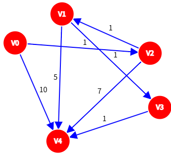

# 2024重庆邮电大学802数据结构真题（回忆版）

[TOC]

## 一、程序阅读题

**1、** 有一个整数 $n$ ，其中 $n$ 为 $2$ 的幂。程序通过如下代码计算 $count$ 的值，并返回。请分析并给出该代码的时间复杂度。

```c
int get_count(int n)
{
    int count=0;
    int x=2;
    while(x<n/2)
    {
        x*=x;
        count++;
    }
    return count;
}
```

**2、** 下面给出一段关于链表操作的代码片段（带头结点），请将这些代码片段按正确的顺序排序，使其实现将结点 $s$ 插入到结点 $p$ 之前的功能（假设 $p$ 既不是头结点也不是尾结点），并分析时间复杂度。代码片段如下：

```c
void insertBefore(Node *head,Node *p,Node *s)
{
    if(______________)    return ;
    Node *prev=head;
    while(______________)
        prev=prev->next;
    if(_______)
    {
        s->next=p;
        ____________;
    }
}
```

① $prev -> next != p \&\& prev -> next !=NULL$

② $prev -> next = s$

③ $head==NULL || p==NULL || s==NULL$

④ $prev ->next == p$

**3、** 合并两个非递减的链表为一个非递增链表（不带头结点），以下是部分代码，请补全代码使其正确实现功能，假设链表的长度分别为 $n$ 和 $m$ ，分析这段代码的时间复杂度。

```c
Node* mergeAndReverse(Node *La,Node *Lb)
{
    Node *Lc=NULL;//非递增链表的头指针
    Node *hc=NULL;//临时指针，用于构建链表
    
    while(_____①_____)
    {
        Node *p=NULL;
        if(_____②_____)
        {
            p=La;
            La=La->next;
        }
        else
        {
            p=Lb;
            Lb=Lb->next;
        }
        _____③_____;
        _____④_____;
    }
    while(La!=NULL)
    {
        Node *p=La;
        La=La->next;
        p->next=Lc;
        Lc=p;
    }
    while(Lb!=NULL)
    {
        Node *p=Lb;
        Lb=Lb->next;
        p->next=Lc;
        Lc=p;
    }
    return Lc;
}
```

**4、** 请补全下面拓扑排序算法中的代码，假设顶点数为 $\left | V \right |$ ，边数为 $\left | E \right |$ ，分析这段代码的时间复杂度。

```c
bool Topologicalsort(Graph G)
{
    InitStack(S);
    for(int i=0;i<G.vexnum;i++)
    {
        if(indegree[i]==0)
            _____①_____;
    }
    int count=0;
    
    while(_____②_____)
    {
        _____③_____;
        print[count++]=i;
        for(p=G.vertices[i].firstarc;_____④_____;p=p->nextarc)
        {
            int v=p->adjvex;
            if(!(--indegree[v]))
                Push(S,v);
        }
    }
    
    if(count<G.vexnum)
        return false;
    else return true;
}
```

**5、** 描述以下递归代码的功能。

```c
int func(TreeNode *root)
{
    if(root==NULL)
        return 0;
    if(root->left==NULL&&root->right==NULL)
        return 1;
    return func(root->left)+func(root->right);
}
```

## 二、填空题

**6、** 设循环队列的表长为 $n$ , $f$ 指向元素的前一个位置， $r$ 指向最后一个元素的位置。该循环队列的长度为____________________。

**7、** 将中缀表达式 $a + b - a *(( c + d ) / e - f ) + g$ 转换为后缀表达式。

**8、** 给定字符串 $abcaabbabcab$ ，求其对应的 $next$ 数组。

|串|a|b|c|a|a|b|b|a|b|c|a|b|
|---|---|---|---|---|---|---|---|---|---|---|---|---|
|下标 $i$|1|2|3|4|5|6|7|8|9|10|11|12|
|next[i]| | | | | | | | | | | | |

> 订正说明：源文表格提取后被压平为“abcaabbabcab下标i123456789101112next[i]”，据题意重建为三行待填表格（串长 $12$，与下标 $1 \cdots 12$ 对应）。

**9、** 在哈夫曼树中，已知有 $1247$ 个结点，叶子结点的个数为____________________。

**10、** 对序列 `{1,2,3,4,5,6,7}` 进行顺序插入构建平衡二叉树，平衡因子为 $0$ 的结点个数为____________________。

**11、** 给定一个二维数组 $A[10][15]$ ， $A[0][0]$ 的地址为 $644$ ，行优先存储，每个元素占用一个地址空间， $A[4][5]$ 的地址为____________________。

**12、** 已知一棵树有 $2011$ 个结点，其中 $116$ 个叶结点，则对应二叉树中右子树为空的结点数量为____________________。

> 订正说明：源文作“其中 $116$ 个叶结点，其中对应二叉树”，第二个“其中”致语句不通，据题意修正为“则对应二叉树”（孩子兄弟表示法下右子树为空即“无右兄弟”：每个非叶结点恰有一个最右孩子，加上根结点自身，故答案为 $1+(2011-116)=1896$）。

**13、** 设森林 $F$ 中有三棵树，第一，第二，第三棵树的结点个数分别为 $M_1$、$M_2$ 和 $M_3$ 。与森林 $F$ 对应的二叉树根结点的左子树上的结点个数是____________________。

**14、** 已知一棵完全二叉树的第六层有 $8$ 个叶结点，树根位于第一层，求树的最多结点数____________________。

## 三、综合应用题

**15、** 设数组 `S[]={93,946,372,9,146,151,301,485,236,372,43,892}` 。

> 订正说明：源文数组因空格处被拆成多段行内代码（作 `S[]={93,946,` 372 `,9,…}`），据源文数据合并为完整一段（元素个数与各值不变）。

（1）采用最低位优先（ $LSD$ ）基数排序将 $S$ 排列成升序序列。写出每一趟排序的结果。

（2）增量等于 $5$ 时进行希尔排序，写出第一趟排序的结果。

（3）以第一个元素为轴进行快速排序，写出第一趟排序结果。

（4）构造小根堆，写出调整后的小根堆。

**16、** 设散列函数 `H(key)=key MOD 11` ，用线性探测再散列法解决冲突。对关键序列 `（13,28,72,5,16,18,7,11,24）` 在地址空间为 $0-10$ 的散列区中建散列表，画出此表，并求等概率情况下查找成功和查找失败时的平均查找长度。

**17、** 一棵二叉树的先序、中序和后序序列如下，其中有部分未标出：

先序序列： `_ _ C D E _ G H I _ K`

中序序列： `C B _ _ F A _ J K I G`

后序序列： `_ E F D B _ J I H _ A`

（1）根据所给序列补全先序、中序、后序序列。

（2）构造二叉树。

（3）画出二叉树的中序线索链表。

**18、** 使用弗洛伊德算法，计算下面图的最短路径，给出每一步的最短路径矩阵 $D^{(i)}$ 以及保存中转点的矩阵 $path^{(i)}$ 。



**19、** 设某通信信息由若干字母组成，字母以及其出现的次数如下表所示。采用赫夫曼（ $Huffman$ ）编码算法对上述序列编码，给出相应的 $Huffman$ 树，以及每个字符的 $Huffman$ 码。

|字符|a|b|c|d|e|f|g|
|---|---|---|---|---|---|---|---|
|出现频率|2|5|6|8|13|19|36|

> 订正说明：源文表格提取后被压平为“字符abcdefg出现频率2568131936”，据题意重建；频率数字串按 $7$ 个字母需拆为 $7$ 个值，取 $2,5,6,8,13,19,36$。

**20、** 对 `["Jan","Feb","Mar","Apr","May","Jun","Jul","Aug","Sep","Oct","Nov","Dec"]` 的月份集合，执行以下操作：

> 订正说明：源文中 `"Sep”` 的后引号为中文右引号，据题意修正为英文引号。

（1）构造二叉排序树，并计算查找成功的平均查找长度。

（2）对月份简写进行排序后，利用折半查找，计算查找成功的平均查找长度。

（3）构造二叉平衡树，并计算查找成功的平均查找长度。

## 四、算法设计与分析题

**21、** 编写代码及思想，判断一棵树是否为二叉排序树，结构体已给出。

```c
typedef struct BiTNode{
    int data;//数据域，存储结点值
    struct BiTNode *lchild;//指向左子树的指针
    struct BiTNode *rchild;//指向右子树的指针
}BiTNode,*BiTree;
```

**22、** 编写代码及思想，判断在无向图中是否存在长度为 $k$ 的路径。（使用邻接表表示图）

**23、** 编写代码及思想，计算二叉树的繁荣度。（即每一层的结点数乘以该层的层数）

